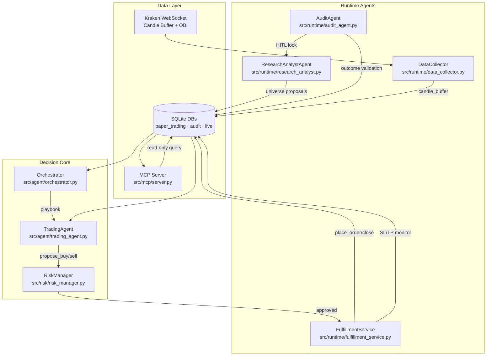
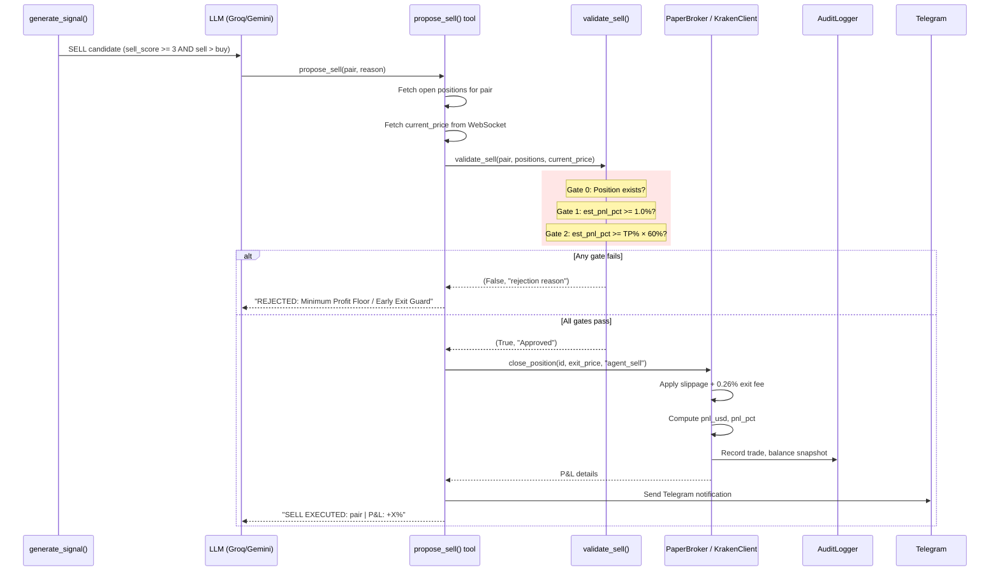
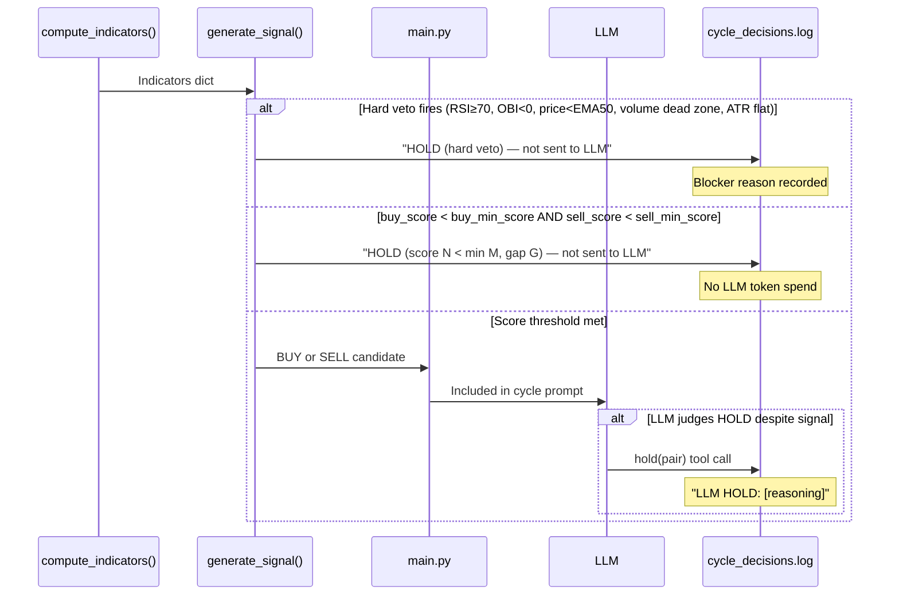

# Kryptos — AI Crypto Trading Agent

> An autonomous, institutional-grade AI crypto trading agent for Kraken. Paper-trades with a $1,000 virtual balance. Every decision — including every HOLD — is logged with full LLM reasoning. Controlled via a natural-language CLI.

**New to Kryptos?** See [SETUP.md](SETUP.md) for a step-by-step install guide or run `./setup.sh` for automated setup.

---

## Table of Contents

1. [Features](#features)
2. [Quick Start — Paper Trading](#quick-start--paper-trading)
3. [Telegram Setup](#telegram-setup)
4. [Agent Architecture](#agent-architecture)
5. [How the Decision Cycle Works](#how-the-decision-cycle-works)
6. [Technical Indicators](#technical-indicators)
7. [BUY Signal — Complete Reference](#buy-signal--complete-reference)
8. [SELL Signal — Complete Reference](#sell-signal--complete-reference)
9. [HOLD Logic](#hold-logic)
10. [Sequence Diagrams](#sequence-diagrams)
11. [Defence Mechanisms](#defence-mechanisms)
12. [Market Sentiment in Practice](#market-sentiment-in-practice)
13. [Trading Pairs — Full Reference](#trading-pairs--full-reference)
14. [Kryptos CLI](#kryptos-cli)
15. [MCP Server — Read-Only State Query Interface](#mcp-server--read-only-state-query-interface)
16. [Database Storage](#database-storage)
17. [Risk Rules](#risk-rules)
18. [Guardrails & Trade Rejection Analysis](#guardrails--trade-rejection-analysis)
19. [Paper vs Live Mode](#paper-vs-live-mode)
20. [Backtesting & Live Readiness](#backtesting--live-readiness)
21. [File Structure](#file-structure)
22. [Configuration (`config.yaml`)](#configuration-configyaml)
23. [Documentation Index](#documentation-index)
24. [Known Behaviours](#known-behaviours)

---

## Features

- **AI-powered decisions** — any LLM with tool-calling support (Groq/Qwen, Gemini, Ollama, etc.) decides BUY/SELL/HOLD; signal scores and portfolio context injected at runtime
- **28-point confluence scoring** — RSI, MACD, Bollinger Bands, EMA 9/21/50, ATR, ADX, OBV, BB squeeze release, RSI divergence, candlestick patterns, Fear & Greed, OBI; no single indicator triggers a trade
- **Capital-first risk rules** — 5% stop-loss, ATR-adjusted take-profit (5–25%), max 20% per trade; enforced by deterministic Python — the LLM cannot override
- **19 BUY signal contributors, 4 SELL signal contributors** — every contributor documented with exact weight and trigger condition (see [BUY Signal](#buy-signal--complete-reference) / [SELL Signal](#sell-signal--complete-reference))
- **Minimum profit floor** — 1.0% PNL required to close a position; prevents net losses from exit fees
- **Circuit breaker (graduated)** — 3 consecutive stop-losses pauses all new buys: 1st fire → 1h, 2nd → 2h, 3rd+ → 4h
- **Global kill switch** — −7% portfolio drawdown triggers emergency market-sell of all open positions
- **Drawdown recovery mode** — when daily P&L ≤ −3%, restricts new buys to BTC/ETH/BNB at half position size until recovery
- **Cycle-top on-chain guard** — fetches MVRV Z-Score + NUPL from CoinGlass; blocks Tier 3/4 buys at macro cycle peaks
- **BTC dominance macro overlay** — rising BTC dominance (alt rotation out) caps Tier 3 alts at 50% and Tier 4 memes at 30% position size
- **Tier-based slippage simulation** — BTC 0.05%, L1s 0.05–0.10%, alts 0.20%, memes 0.40%; round-trip friction for BONK is 8× BTC
- **Partial take-profit** — automatically closes 50% of position at 50% of TP target; raises SL to breakeven on remainder
- **Trailing stop** — per-pair configurable (3–8% activation, 5–8% trail); profitable exits not counted toward circuit breaker
- **Dynamic take-profit** — TP levels adjust per trade using ATR × 2.0 and Bollinger Band width; 4-level priority chain
- **Profit factor auto-escalation** — underperforming pairs (PF < 1.0) automatically face tighter buy gates; PF < 0.7 → +2 to minimum score
- **Correlation guard** — 7 pair clusters; max 2 open per cluster; 50% size penalty at 1 open (prevents correlated blow-ups)
- **Post-Only Maker limit orders** — live mode uses limit chasing (60-second window) for Kraken maker fees; falls back to market order on timeout
- **Order Book Imbalance (OBI) gate** — live bid/ask pressure blocks entry when selling pressure dominates
- **Full audit trail** — every cycle, signal, LLM decision, risk verdict, trade, and balance snapshot logged to SQLite
- **Natural-language CLI** — ask `show last 5 BTC trades with reasoning` or `why did it hold ETH?` in plain English
- **Paper and live mode parity** — identical interface and feature set between `PaperBroker` and `KrakenClient`
- **Telegram alerts** — trade fills, errors, daily summary, hourly heartbeat, 6-hour P&L report; optional
- **Healthcheck webhook** — pings a URL (e.g. healthchecks.io) after every successful cycle for uptime monitoring

---

## Quick Start — Paper Trading

```bash
# Step 1: Install
git clone https://github.com/vipulbms/crypto-trader-agent.git
cd crypto-trader-agent
./setup.sh           # automated setup (see SETUP.md for manual steps)

# Step 2: Set your LLM API key in .env
echo "GROQ_API_KEY=your_key" >> .env

# Step 3: Run
source .venv/bin/activate
python main.py --paper
```

The agent connects to the Kraken public WebSocket, back-fills 300 candles (75 hours of 15-min data) per pair, waits for 220 candles to warm up all indicators, then runs its first decision cycle. All data is written to `data/paper_trading.db` and `data/audit.db`.

Check status at any time:
```bash
python kryptos.py status
python kryptos.py positions
```

---

## Telegram Setup

Kryptos can send real-time trade alerts, daily summaries, and hourly heartbeats to a Telegram chat. This is optional — the agent runs fine without it.

### 1. Create a Bot

1. Open Telegram and message **@BotFather**
2. Send `/newbot` and follow the prompts to name your bot
3. BotFather replies with a token like `7123456789:ABCdef...` — copy it

### 2. Get Your Chat ID

1. Send any message to your new bot to start the conversation
2. Visit `https://api.telegram.org/bot<TOKEN>/getUpdates` in a browser
3. Find `"chat":{"id":xxxxxxxxx}` in the JSON — that number is your chat ID

> If the result is empty, send another message to the bot and refresh the page.

### 3. Set Environment Variables

Add both values to your `.env` file:

```bash
echo "TELEGRAM_BOT_TOKEN=7123456789:ABCdef..." >> .env
echo "TELEGRAM_CHAT_ID=xxxxxxxxx"              >> .env
```

### 4. Verify

```bash
python kryptos.py test-telegram
```

You should receive a test message within a few seconds.

### What You Receive

| Event | Content |
|---|---|
| Trade opens | Pair, direction, entry price, size, SL/TP levels |
| Trade closes | Exit price, P&L (USD + %), exit reason |
| Partial TP | Fraction closed, remaining position |
| Daily summary | Total P&L, win rate, open positions (midnight SGT) |
| Hourly heartbeat | Balance, hourly P&L delta, cycle count, circuit breaker state |
| 6-hour P&L report | Running P&L since midnight with pair breakdown |
| Error alert | Exception type and message for unhandled errors |
| Kill switch | Emergency market-sell triggered at −7% drawdown |
| Drawdown recovery | Entry (≤ −3%) and exit (> −1.5%) of recovery mode |
| Cycle-top guard | Activation / deactivation when MVRV + NUPL cross threshold |

### Disabling Notifications

Set `notifications.telegram_enabled: false` in `config.yaml`, or simply omit the environment variables — the notifier silently no-ops when the token is missing.

---

## How the Decision Cycle Works

Every 15 minutes, the agent runs a complete decision cycle. Here is every step in order:

1. **`check_stops_and_tp()`** — runs before anything else. For every open position: update highest price seen → raise trailing SL if activated → check partial TP → check full SL/TP. Any position that hits its level is closed automatically. The LLM never sees this.

2. **WebSocket candle buffer** — Kraken public WebSocket delivers real-time 15-min candles into a 300-candle rolling buffer per pair. OBI (Order Book Imbalance) is captured from the live orderbook ticker.

3. **`compute_indicators()`** — calculates RSI(14), MACD(12/26/9), Bollinger Bands(50,2), EMA-9/21/50, ATR(14), ADX(14), OBV, BB width series, RSI series, OHLC series (for candlestick patterns), volume SMA(20).

4. **Macro injections** — `main.py` fetches Fear & Greed Index, BTC dominance, MVRV Z-Score/NUPL (CoinGlass, 24h cache), and adaptive ATR floor (rolling p25 over 200 candles). All injected into each pair's indicator dict before scoring.

5. **`generate_signal()`** — confluence scoring per pair (0–28 pts). Hard vetoes run first. If any veto fires: the pair is immediately assigned HOLD and is NOT sent to the LLM. Pairs meeting `buy_min_score` or `sell_min_score` are flagged BUY or SELL.

6. **`build_cycle_prompt()`** — only BUY and SELL pairs are included in the LLM context (HOLD pairs filtered out — saves ~540 tokens/cycle). Portfolio state, macro regime, BTC dominance, cycle-top warning, and per-pair signal blocks are injected.

7. **LLM call** — single Groq/Gemini/Ollama call per cycle. The LLM calls tool functions: `propose_buy(pair, usd_amount)`, `propose_sell(pair, reason)`, or `hold(pair)`. It may propose up to `max_buys_per_cycle` (7) buys.

8. **`propose_buy()` / `propose_sell()`** tool execution — Python tools fetch live price, call `RiskManager.validate_buy()` or `validate_sell()`, then call the broker if approved. The LLM receives a `REJECTED: <reason>` string if any gate fails.

9. **`PaperBroker.place_order()` / `close_position()`** — applies tier-based slippage (0.05–0.40%), maker fee (0.16% entry / 0.26% exit), records the trade to SQLite, updates cash balance.

10. **`AuditLogger`** — writes every cycle, signal score, LLM decision + raw output, risk verdict, fill, and post-trade balance snapshot to `data/audit.db`. Full JSON LLM record written to `logs/agent-llm-prompts.log`.

> **The LLM proposes; Python decides. The risk manager cannot be overridden by prompt engineering.**

### Architecture Overview



---

## Agent Architecture

Kryptos is a multi-agent system. Six independent runtime processes co-exist around a shared SQLite database. Each agent has a single responsibility; none can override another's decisions without going through the shared DB and hard Python guards.

### Agent Inventory

| Agent | File | Trigger | Role |
|---|---|---|---|
| **TradingAgent** | `src/agent/trading_agent.py` | Every cycle (every 30 min) | Single LLM call per cycle; evaluates all BUY/SELL candidates and calls `propose_buy` / `propose_sell` / `hold` tools |
| **Orchestrator** | `src/agent/orchestrator.py` | Every cycle, before LLM call | Classifies current market regime into a playbook (`momentum` / `ranging` / `risk_off`); result is injected into `CycleContext` for TradingAgent |
| **ResearchAnalystAgent (RAA)** | `src/runtime/research_analyst.py` | Background loop (`poll_interval_minutes`) | Evaluates the crypto universe for pair additions/removals; runs a single batch LLM call to assess all candidates at once |
| **AuditAgent** | `src/runtime/audit_agent.py` | Background loop (every 6h / 24h rollup) | Validates RAA proposals against actual trade outcomes; enforces HITL lock after repeated failures; computes playbook performance and signal accuracy |
| **FulfillmentService** | `src/runtime/fulfillment_service.py` | HTTP server on `127.0.0.1:8090` | REST wrapper around the broker (paper or live); accepts `POST /fill`, monitors SL/TP every 60 s; the only process that writes to broker tables |
| **DataCollector** | `src/runtime/data_collector.py` | Standalone asyncio process | Subscribes to Kraken WS v2 OHLC + order book; populates `candle_buffer` and `orderbook_snapshots`; REST backfills on startup |
| **MCP Server** | `src/mcp/server.py` | HTTP server on `127.0.0.1:8092` | Read-only query interface; six tools expose portfolio, signals, regime, universe, and persistence state; used by dashboards and the RAA itself |

---

### Agent Communication Map

```
main.py
  │
  ├─ run_cycle()
  │     │
  │     ├─ [1] check_stops_and_tp()          ← PaperBroker / KrakenClient (SL/TP hits)
  │     │
  │     ├─ [2] compute_indicators()           ← WebSocket candle buffer
  │     │       + macro injections            ← CoinGecko / CoinGlass / alternative.me
  │     │
  │     ├─ [3] generate_signal()              ← signals.py (28-pt scorer)
  │     │
  │     ├─ [4] Orchestrator.select_playbook() ← regime_state + DB agent_state
  │     │       → writes playbook to DB
  │     │
  │     ├─ [5] CycleContext.from_config()     ← active persona + playbook + open positions
  │     │
  │     ├─ [6] build_cycle_prompt()           ← BUY+SELL pairs + risk_state + portfolio block
  │     │
  │     └─ [7] TradingAgent.run_cycle()
  │             │
  │             ├─ LLM call (single, all pairs)
  │             │
  │             ├─ propose_buy()  → RiskManager.validate_buy() → broker.place_order()
  │             ├─ propose_sell() → RiskManager.validate_sell() → broker.close_position()
  │             └─ hold()         → audit log only

ResearchAnalystAgent  (independent process, runs every N minutes)
  │
  ├─ fetch_candidates()           ← Kraken Ticker + CoinGecko Trending APIs
  ├─ compute_persistence_score()  ← liquidity + momentum + volume + social [0.0–2.5]
  ├─ _run_llm_batch_universe_decision()
  │       └─ single LLM call with pre-injected ticker/persistence data
  │              → LLM calls universe_decision tool per candidate
  ├─ _apply_llm_decision()        ← enforces meme-block + HITL lock (hard Python guards)
  └─ writes to universe / trend_persistence / universe_events / hitl_queue tables

AuditAgent  (independent process, 6h + 24h rollups)
  │
  ├─ run_24h_validation_window()  ← reads universe_events + paper_trades
  ├─ evaluate_proposal_outcome()  → PASS / FAIL_PUMP_DETECTION / FLAT
  ├─ enforce_hitl_lock()          → locks RAA substitution tool after ≥3 FOUNDATIONAL_REPLACEMENT_BLOCK
  ├─ check_confidence_reset()     → rolling std-dev > 3σ triggers confidence_reset_count
  ├─ run_24h_rollup()             → writes playbook_performance + risk_decision_outcomes
  └─ run_6h_rollup()              → writes signal_accuracy per (pair, driver)

FulfillmentService  (HTTP on 127.0.0.1:8090)
  │
  ├─ POST /fill                   ← order placement (buy or close)
  ├─ GET  /positions              ← open positions snapshot
  ├─ GET  /balance                ← cash + portfolio total
  └─ _sltp_monitor_loop()         ← runs every 60 s; calls broker.check_stops_and_tp()

DataCollector  (standalone asyncio process)
  │
  ├─ Kraken WS v2 ohlc + book    → candle_buffer table (UNIQUE on pair+ts)
  ├─ REST backfill on startup     → INSERT OR IGNORE (preserves newer WS rows)
  └─ /health endpoint             ← liveness probe on port 9100

MCP Server  (HTTP on 127.0.0.1:8092, read-only)
  ├─ get_portfolio_state          ← paper_balance + paper_positions
  ├─ get_signal_snapshot          ← agent_state JSON
  ├─ get_regime_state             ← playbook + regime + ADX + BTC dominance
  ├─ get_agent_status             ← persona + uptime + cycle count
  ├─ get_universe_state           ← active pairs with tier + daily win rate
  └─ get_persistence_scores       ← per-pair 14-day win rate proxy
```

---

### Decision Delegation

The key principle: **the LLM proposes; Python decides; the DB records.**

| Decision | Owner | Delegated To | Hard Python Guard? |
|---|---|---|---|
| Which pairs to evaluate (universe) | RAA (LLM batch call) | `_apply_llm_decision()` | Yes — meme-block, HITL lock |
| Whether a RAA proposal succeeded | AuditAgent | `evaluate_proposal_outcome()` | Yes — confidence reset, HITL lock enforcement |
| Which playbook to run this cycle | Orchestrator | `select_playbook()` — deterministic rules | No LLM; pure regime math |
| Which persona governs this cycle | `CycleContext.from_config()` | Reads `config.yaml` + `agent_state.active_persona_override` | Yes — ConfigError on invalid |
| BUY/SELL/HOLD per pair | TradingAgent (LLM) | `propose_buy()` / `propose_sell()` tools | Yes — `validate_buy()` 12 gates, `validate_sell()` 3 gates |
| Order placement and SL/TP | FulfillmentService / PaperBroker | `place_order()` / `close_position()` | Yes — overdraw guard, slippage, fee |
| Automatic SL/TP/trailing exits | `check_stops_and_tp()` | Runs BEFORE LLM each cycle | Yes — LLM is bypassed entirely |
| Signal scoring (0–28 pts) | `generate_signal()` | Deterministic Python + config weights | Yes — hard vetoes override any score |

---

### Data Flow: A Full Cycle

```
┌─────────────────────────────────────────────────────────────────┐
│  INPUTS (fetched at cycle start, injected before scoring)       │
│                                                                  │
│  Kraken WS       → candle_buffer (300 candles × 28 pairs)       │
│  alternative.me  → fear_greed_index (cached 1h)                 │
│  CoinGecko       → btc_dominance_pct (cached 24h)               │
│  CoinGlass       → mvrv_z_score, nupl (cached 24h)              │
│  DB agent_state  → active_persona_override, playbook            │
│  DB paper_trades → profit_factor per pair (last 30d)            │
└───────────────────────────┬─────────────────────────────────────┘
                            │
                            ▼
┌─────────────────────────────────────────────────────────────────┐
│  SIGNAL PIPELINE  (src/analysis/)                               │
│                                                                  │
│  compute_indicators() → RSI, MACD, BB, EMA, ATR, ADX, OBV,     │
│                         patterns, feed_status, winsorized_vol    │
│                                                                  │
│  generate_signal()    → confluence score 0–28                   │
│                         hard vetoes → HOLD (never sent to LLM)  │
│                         BUY/SELL if score ≥ buy/sell_min_score  │
└───────────────────────────┬─────────────────────────────────────┘
                            │  BUY + SELL pairs only
                            ▼
┌─────────────────────────────────────────────────────────────────┐
│  ORCHESTRATOR  (src/agent/orchestrator.py)                      │
│                                                                  │
│  regime_state + ADX median + daily_pnl_pct + kill_switch        │
│  → playbook: "momentum" | "ranging" | "risk_off"                │
│  → written to DB agent_state                                    │
└───────────────────────────┬─────────────────────────────────────┘
                            │
                            ▼
┌─────────────────────────────────────────────────────────────────┐
│  CYCLE CONTEXT  (src/core/cycle_context.py)                     │
│                                                                  │
│  CycleContext.from_config()                                     │
│  → persona: conservative | medium | high                        │
│  → persona_config: buy_min_score, max_position_pct, etc.        │
│  → playbook (from Orchestrator)                                 │
│  → open_positions snapshot                                      │
│  → btc_dominance_trend                                          │
└───────────────────────────┬─────────────────────────────────────┘
                            │
                            ▼
┌─────────────────────────────────────────────────────────────────┐
│  TRADING AGENT  (src/agent/trading_agent.py)                    │
│                                                                  │
│  build_cycle_prompt() → pipe-format signal blocks, portfolio,   │
│                         risk constraints, macro overlays         │
│  Single LLM call → tool calls: propose_buy / propose_sell / hold│
│                                                                  │
│  propose_buy()  → RiskManager.validate_buy()  (12 gates)        │
│                   → broker.place_order() if approved            │
│  propose_sell() → RiskManager.validate_sell() (3 gates)         │
│                   → broker.close_position() if approved         │
│  hold()         → audit log only                                │
└───────────────────────────┬─────────────────────────────────────┘
                            │
                            ▼
┌─────────────────────────────────────────────────────────────────┐
│  OUTPUTS                                                         │
│                                                                  │
│  audit.db            ← every cycle, signal, LLM decision, fill  │
│  paper_trading.db    ← positions, trades, balance, agent_state  │
│  agent-llm-prompts.log ← full JSON LLM record per cycle         │
│  Telegram            ← trade fills, errors, heartbeat, alerts   │
└─────────────────────────────────────────────────────────────────┘

                    ↑ written concurrently ↑

┌─────────────────────────────────────────────────────────────────┐
│  BACKGROUND AGENTS  (independent processes)                     │
│                                                                  │
│  ResearchAnalystAgent → universe proposals → DB                 │
│  AuditAgent           → outcome validation → DB                 │
│  FulfillmentService   → HTTP order API + SL/TP monitor          │
│  DataCollector        → Kraken WS → candle_buffer               │
│  MCP Server           → read-only HTTP query interface          │
└─────────────────────────────────────────────────────────────────┘
```

---

### ResearchAnalystAgent — Universe Management

**File:** `src/runtime/research_analyst.py`  
**Purpose:** Continuously evaluates the broader crypto universe to propose pair additions and removals. The main trading loop only trades pairs in the active universe; RAA is the gatekeeper.

**Cycle steps:**
1. Fetch candidate pairs from Kraken Ticker + CoinGecko Trending
2. `compute_persistence_score()` — composites liquidity, momentum, volume, and social signals into a `[0.0–2.5]` score
3. Pre-inject ticker data and persistence scores into a single LLM user message
4. `_run_llm_batch_universe_decision()` — one LLM conversation, all candidates; LLM calls `universe_decision` tool once per candidate
5. `_apply_llm_decision()` — applies hard guards before committing:
   - **Meme-block:** MEME-tier pairs cannot displace FOUNDATIONAL pairs
   - **HITL lock:** if AuditAgent has locked the substitution tool, `universe_decision` calls are rejected
6. Any candidate the LLM skips gets a synthetic `HOLD + LLM_NO_DECISION` audit row

**Persona gates** (applied before the LLM call):
- `conservative` persona: no speculative alt additions; forced HOLD on all Tier 3/4 candidates
- `medium` persona: ADX ≥ 20 + RSI not overbought required
- `high` persona: only social/volume floor enforced

**Self-reflection loop** (`run_self_reflection_loop()`): reads last 50 `audit_feedback` rows; LLM identifies failure patterns; updates `ps_threshold_override` to tighten or loosen acceptance criteria dynamically.

---

### AuditAgent — Outcome Validation

**File:** `src/runtime/audit_agent.py`  
**Purpose:** Validates RAA proposals post-hoc. Tracks playbook performance and signal accuracy. Acts as the disciplinary layer — it can lock RAA out of making substitution decisions.

**Key operations:**

| Operation | Frequency | What it does |
|---|---|---|
| `run_24h_validation_window()` | Every cycle | Checks universe ADD_PAIR events against actual 24h trade outcomes |
| `evaluate_proposal_outcome()` | Per event | PASS / FAIL_PUMP_DETECTION / FLAT based on alpha vs. baseline |
| `check_confidence_reset()` | Every cycle | Rolling 5-outcome std-dev > 3σ → `confidence_reset_count += 1` |
| `enforce_hitl_lock()` | Every cycle | ≥ 3 FOUNDATIONAL_REPLACEMENT_BLOCK violations in 24h → lock RAA substitution tool |
| `run_24h_rollup()` | Daily | Writes `playbook_performance` + `risk_decision_outcomes` from last 30d trades |
| `run_6h_rollup()` | Every 6h | Writes `signal_accuracy` per (pair, signal driver) from 30d win rate |
| `write_rejection_reprimand()` | On 422/MEME_BLOCK | Writes penalty row to `audit_feedback` so RAA self-reflection loop sees it |

**HITL lock state machine:**
```
RAA makes ≥ 3 FOUNDATIONAL_REPLACEMENT_BLOCK proposals in 24h
    → AuditAgent sets confidence_state.hitl_locked = True
    → RAA._apply_llm_decision() rejects all universe_decision calls with 423
    → 24h later: AuditAgent clears lock, resets violation count
    → Telegram alert sent on lock and unlock
```

---

### Orchestrator — Playbook Selection

**File:** `src/agent/orchestrator.py`  
**Purpose:** Maps the current market regime to a trading playbook. The playbook is injected into `CycleContext` and influences TradingAgent's LLM prompt and persona-gated size caps.

**Decision rules (evaluated in order):**

```python
if kill_switch or daily_pnl_pct <= -3.0:
    playbook = "risk_off"
elif adx_median >= 25 and regime == "trending_up":
    playbook = "momentum"
else:
    playbook = "ranging"
```

**Playbook effects on the system:**

| Playbook | LLM prompt hint | Position sizing | Affected agents |
|---|---|---|---|
| `momentum` | "Follow strong trends, buy breakouts" | Full configured size | TradingAgent, FulfillmentService |
| `ranging` | "Trade mean-reversion, respect BB levels" | Normal | TradingAgent |
| `risk_off` | "Capital preservation only; hold existing" | Recovery mode (10% cap, BTC/ETH/BNB only) | TradingAgent, RiskManager |

**Playbook bias from AuditAgent** (`get_playbook_bias()`): reads `playbook_performance` table; if a playbook has PF > 1.2, its `max_buys_per_cycle` multiplier is doubled for this cycle. This creates a closed feedback loop: AuditAgent's outcome data feeds back into Orchestrator's aggressiveness.

---

### FulfillmentService — Order Execution

**File:** `src/runtime/fulfillment_service.py`  
**Purpose:** HTTP service that wraps the broker. Decouples order placement from the decision cycle — any process (TradingAgent, a human dashboard, the Java API) can POST an order without importing the broker directly.

**Security model:**
- Binds to `127.0.0.1` only — all remote IPs return 403
- Bearer token required on all mutating endpoints (`FULFILLMENT_API_KEY` env var or config)
- All requests logged to `fulfillment_audit` table

**SL/TP monitor:** `_sltp_monitor_loop()` runs in the background every 60 seconds independently of the main cycle. This means SL/TP can fire between 30-minute trading cycles if price ticks through a level while FulfillmentService is running.

---

### TradingAgent — LLM Decision Maker

**File:** `src/agent/trading_agent.py`  
**Purpose:** The only component that calls the LLM. One call per cycle covers all actionable pairs. The LLM receives a fully structured prompt and responds with tool calls only — no free-text decisions are accepted.

**Tool schema available to the LLM:**

| Tool | Parameters | Effect |
|---|---|---|
| `propose_buy(pair, usd_amount)` | pair: str, usd_amount: float | Triggers `validate_buy()` → `place_order()` if approved |
| `propose_sell(pair, reason)` | pair: str, reason: str | Triggers `validate_sell()` → `close_position()` if approved |
| `hold(pair)` | pair: str | Logs decision; no broker action |

**What the LLM sees per actionable pair (pipe format):**
```
pair|SOL/USD|score|11/28|direction|BUY|rsi|27|adx|34|macd_hist|0.0042|bb_pos|0.03|regime|trending_up|price|142.50|tp_pct|16|sl_pct|5|max_buy_usd|180
```

**Fallback model:** if the primary model (`qwen/qwen3-32b`) times out or returns a tool-call error, the agent retries once with `llama-3.3-70b-versatile`. The fallback is logged and audited.

---

## Technical Indicators

All indicators are computed on **15-minute candles**. The agent requires 220 warm-up candles before the first trade.

### RSI — "Is the price tired?"

Measures price momentum on a 0–100 scale using Wilder's smoothed average of up-moves vs down-moves. Period: 14 candles.

| RSI Range | Meaning | Signal |
|---|---|---|
| < 30 (per-pair `rsi_oversold`) | Oversold — sellers exhausted | **+3 BUY** |
| 30–40 | Mild dip | **+1 BUY** |
| 40–60 | Neutral | 0 |
| > 60 (per-pair `rsi_overbought`) | Overbought | **+3 SELL** |
| ≥ 70 | Severely overbought | **Hard BUY veto** |

The hard veto at RSI ≥ 70 blocks any BUY regardless of other signals.

### MACD — "Which way is momentum heading?"

MACD line = EMA(12) − EMA(26). Signal line = EMA(9) of MACD. Histogram = MACD − Signal.
The agent tracks both the current histogram value and the previous candle's value to detect fresh turns.

| Condition | Signal |
|---|---|
| Histogram turned from negative → positive (fresh crossover) | **+3 BUY** — strongest momentum signal |
| Histogram > 0 (continuation, no fresh turn) | **+1 BUY** |
| MACD line above signal line | **+1 BUY** |
| Histogram < 0 | **+2 SELL** |

### Bollinger Bands — "Is the price on sale or overpriced?"

Upper = SMA(50) + 2×StdDev. Lower = SMA(50) − 2×StdDev. BB width = (Upper − Lower) / Price × 100.

| Condition | Signal |
|---|---|
| Price ≤ BB lower × (1 + `bb_buy_tolerance_pct`%) | **+2 BUY** — price at support |
| Price ≥ BB upper × (1 − `bb_sell_tolerance_pct`%) | **+2 SELL** — price at resistance |
| BB width < per-pair `bb_squeeze_threshold_pct` | All BB signals ignored (squeeze) |

Period: 50 candles (12.5 hours). Widened from BB(20) to reduce false signals during band-squeeze.

### BB Squeeze Release — "The spring is uncoiling"

A break-out signal that fires when compressed bands suddenly expand upward. Conditions (all must be true):
1. Prior 3 candles had BB width < `bb_squeeze_threshold_pct`
2. Current BB width > threshold × 1.2 (20% expansion)
3. Price > BB midband (upward expansion only — downward breakouts are rejected)

Score: **+2 BUY**

### EMA Trend Filters

| Condition | Signal |
|---|---|
| EMA(9) > EMA(21) | **+2 BUY** — short-term trend turning up |
| Price > EMA(50) | **+1 BUY** — medium-term trend support |
| Price < EMA(50) | **Hard BUY veto** — trend is against entry |

### ATR — "How bumpy is the road?"

Average True Range measures the typical price range per candle (period: 14). Used for:
- **Dynamic SL** — entry × (1 − 5%) as hard floor; ATR-based TP ceiling
- **Dynamic TP** — `entry + atr_multiplier (2.0) × ATR`; adjusted by BB width
- **Volume sizing** — position size inversely scales with ATR (volatile pairs get smaller positions)
- **ATR-based TP < `atr_tp_min_pct`** — hard BUY veto when market is too flat to cover fees

### ADX — "Is the trend strong or choppy?"

Average Directional Index (0–100). Measures trend *strength*, not direction. Period: 14.

| ADX Range | Meaning | Signal |
|---|---|---|
| > 40 | Strong, trending market | **+1 BUY** (trend worth following) |
| 20–40 | Moderate trend | 0 |
| < 20 | Ranging, choppy market | **−1 BUY** (soft penalty — not a hard veto) |

### OBV — "What is smart money doing on volume?"

On-Balance Volume accumulates directional volume: OBV += volume when price rises; OBV −= volume when price falls.
The agent compares OBV[now] vs OBV[now − `obv_trend_period`] candles ago.

| OBV Change | Signal |
|---|---|
| Rising > per-pair `obv_noise_threshold` | **+1 BUY** — accumulation confirmed |
| Falling | Distribution warning logged (no score penalty) |
| Flat (within noise floor) | Neutral |

Large caps (BTC/ETH/BNB/SOL) use a 0.2% noise floor. Meme coins (DOGE/WIF/PEPE/HYPE/JUP) use 2.0% — only genuine institutional accumulation counts.

### RSI Divergence — "Price and momentum disagree"

Detects when RSI and price are moving in opposite directions — a leading reversal signal.
The algorithm splits the last 20 candles (per-pair `rsi_divergence_lookback`) into two halves and finds swing extremes.

| Type | Price Move | RSI Move | Signal |
|---|---|---|---|
| **Regular Bullish** | Lower low | Higher low | **+2 BUY** — reversal likely |
| **Hidden Bullish** | Higher low | Lower low | **+1 BUY** — trend continuation |
| **Regular Bearish** | Higher high | Lower high | **+2 SELL** — reversal likely |

### Candlestick Patterns — "What story does the last candle tell?"

Three ATR-scale-agnostic patterns detected on the current candle + previous:

| Pattern | Condition | Signal |
|---|---|---|
| **Hammer** | Lower wick > 2× body, upper wick < 0.3× body, close > open | **+1 BUY** |
| **Bullish Engulfing** | Current bullish body fully covers prior bearish body | **+2 BUY** |
| **Doji at Support** | Body < 10% of ATR AND price ≤ BB lower × 1.005 | **+1 BUY** |

Patterns are additive bonuses — never standalone signals.

### Order Book Imbalance (OBI)

Computed from the live Kraken WebSocket ticker:

$$\text{OBI} = \frac{\text{BidVol} - \text{AskVol}}{\text{BidVol} + \text{AskVol}}$$

- **OBI < 0** — sell-side pressure dominates — **hard BUY veto**

### Fear & Greed Index

Fetched once per cycle from alternative.me. Injected into all pair signal calculations.

| Range | Label | Score |
|---|---|---|
| ≤ 25 | Extreme Fear | **+2 BUY** (stacks: +1 for Fear + +1 for Extreme) |
| 26–40 | Fear | **+1 BUY** |
| 41–60 | Neutral | 0 |
| ≥ 61 | Greed | 0 (prompt warns LLM to use caution) |

---

## BUY Signal — Complete Reference

### How a BUY Decision Happens (Summary)

1. `generate_signal()` scores the pair from 0–28 using all 19 contributors below
2. Hard vetoes are checked first — if any fires, maximum score is irrelevant; the pair is HOLD
3. If no veto AND `buy_score ≥ buy_min_score` (per-pair, default 5) → pair is flagged as **BUY candidate** and sent to the LLM
4. LLM calls `propose_buy(pair, usd_amount)` → `validate_buy()` runs 12 gates → broker executes if all pass

### Complete BUY Scoring Table

All weights are configurable in `config.yaml → signals:`.

| # | Contributor | Points | Exact Trigger Condition | Config Key |
|---|---|---|---|---|
| 1 | RSI Oversold | **+3** | RSI < per-pair `rsi_oversold` (default 30) | `rsi_oversold_score` |
| 2 | RSI Mild Dip | **+1** | 30 ≤ RSI < 40 | `rsi_mild_score` |
| 3 | MACD Histogram Turn Positive | **+3** | `macd_histogram` negative last candle, positive this candle | `macd_hist_turn_score` |
| 4 | MACD Histogram Positive | **+1** | `macd_histogram` > 0 (but no fresh turn) | `macd_hist_pos_score` |
| 5 | MACD Crossover | **+1** | MACD line > signal line | `macd_crossover_score` |
| 6 | Price at BB Lower | **+2** | price ≤ bb_lower × (1 + bb_buy_tolerance_pct%) | `bb_lower_score` |
| 7 | EMA Short Uptrend | **+2** | EMA(9) > EMA(21) | `ema_short_score` |
| 8 | Price Above EMA(50) | **+1** | price > EMA(50) | `ema_medium_score` |
| 9 | Fear & Greed: Fear | **+1** | fear_greed_index ≤ 40 | `fear_greed_fear_score` |
| 10 | Fear & Greed: Extreme Fear | **+1** | fear_greed_index ≤ 25 (stacks with #9) | `fear_greed_extreme_score` |
| 11 | ADX Strong Trend | **+1** | adx_14 > 40 | `adx_strong_score` |
| 12 | ADX Ranging Penalty | **−1** | adx_14 < 20 (soft penalty, not a veto) | `adx_weak_penalty` |
| 13 | RSI Regular Bullish Divergence | **+2** | Price lower low + RSI higher low over `rsi_divergence_lookback` candles | `rsi_divergence_bullish_weight` |
| 14 | RSI Hidden Bullish Divergence | **+1** | Price higher low + RSI lower low | `rsi_divergence_hidden_weight` |
| 15 | OBV Accumulation | **+1** | OBV[now] > OBV[now − period] by > `obv_noise_threshold` | `obv_trend_weight` |
| 16 | BB Squeeze Release | **+2** | Prior 3 candles squeezed + current expansion > 1.2× threshold + price > bb_mid | `bb_squeeze_release_weight` |
| 17 | Hammer Candle | **+1** | Lower wick > 2× body, upper wick < 0.3× body, bullish close | `hammer_weight` |
| 18 | Bullish Engulfing Candle | **+2** | Current bullish body engulfs prior bearish body | `engulfing_weight` |
| 19 | Doji at BB Lower Support | **+1** | Body < 10% of ATR AND price ≤ bb_lower × 1.005 | `doji_support_weight` |

**Maximum possible BUY score: 28 points**

To score 28, every single contributor would need to fire simultaneously — this never happens in practice. A realistic strong BUY is 8–14 points.

### Hard BUY Vetoes

**Any single veto immediately assigns HOLD — the pair is never sent to the LLM regardless of score.**

| Veto # | Condition | Why |
|---|---|---|
| **V1** | RSI ≥ 70 | Severely overbought — reversal risk too high |
| **V2** | OBI < 0 (sell pressure > buy pressure) | Real-time orderbook says sellers dominate |
| **V3** | price < EMA(50) | Price is below medium-term trend — against the trend |
| **V4** | volume < rolling volume floor (p15 of last 200 candles, or `volume_sma_20 × min_volume_ratio`) | Dead zone — no liquidity to sustain a move |
| **V5** | ATR-derived TP < `atr_tp_min_pct` floor | Market too flat — reward won't cover round-trip fees (~0.62% BTC / ~1.32% BONK) |

### Minimum BUY Score Per Pair

The default `buy_min_score` is 5 (at least two signals must align). Pairs with poor historical performance have higher gates.

**Tier 1 & 2 (L1 infrastructure):**

| Pair | Min Score | Reason |
|---|---|---|
| BTC/USD | 5 | Large cap, reliable signals |
| ETH/USD | 5 | Proven winner |
| BNB/USD | 5 | Proven winner |
| SOL/USD | 6 | High volatility — require stronger confluence |
| XRP/USD | 5 | Default |
| ADA/USD | 5 | Default |
| LTC/USD | 5 | Default |
| AVAX/USD | 5 | Default |

**Tier 3 (speculative alts):**

| Pair | Min Score | Reason |
|---|---|---|
| TRX/USD | 5 | Default |
| SUI/USD | 5 | Default |
| HYPE/USD | 5 | Default |
| UNI/USD | 6 | Underperformer in backtest |
| INJ/USD | 7 | High stop-loss rate |
| TON/USD | 5 | Default |
| OP/USD | 7 | Underperformer — requires strong signal |
| ARB/USD | 6 | Default |
| TIA/USD | 8 | High volatility, poor win rate |
| RENDER/USD | 6 | Default |
| FET/USD | 6 | Default |
| STX/USD | 6 | Default |
| PENDLE/USD | 7 | DeFi yield complexity |
| ONDO/USD | 6 | Default |

**Tier 4 (meme coins):**

| Pair | Min Score | Reason |
|---|---|---|
| DOGE/USD | 5 | Proven winner in backtests |
| WIF/USD | 7 | Low win rate — needs strong signal |
| JUP/USD | 7 | High-beta SOL ecosystem |
| PEPE/USD | 8 | Extreme volatility — requires very strong signal |
| BONK/USD | 9 | Hardest threshold — extreme noise pair |

### Profit Factor Auto-Escalation

Every cycle, the agent queries the last 30 days of closed trades per pair and computes: `profit_factor = gross_wins_usd / gross_losses_usd`.

If the pair has ≥ 10 trades and is underperforming, `buy_min_score` is raised automatically for that cycle:

| Profit Factor | Adjustment | Example (PEPE, base min=8) |
|---|---|---|
| PF ≥ 1.0 | No change | min = 8 |
| 0.7 ≤ PF < 1.0 | **+1** to min score | min = 9 |
| PF < 0.7 | **+2** to min score | min = 10 (almost never buys) |

This automatically tightens entry during a losing streak without manual config changes.

### Worked BUY Combination Examples

**Example 1 — Minimum Valid BUY (ETH, score = 5)**
```
RSI = 28.5 (oversold)          → +3
MACD histogram just turned +   → +3
                               ─────
Total: 6 pts ≥ buy_min_score 5 → BUY candidate ✓
```

**Example 2 — Strong BUY (SOL, score = 11)**
```
RSI = 27.0 (oversold)          → +3
MACD histogram turned +        → +3
Price at BB lower              → +2
EMA9 > EMA21                   → +2
Fear & Greed = 22 (extreme)    → +2
                               ─────
Total: 12 pts ≥ buy_min_score 6 → BUY candidate ✓
```

**Example 3 — Meme Coin BUY (BONK, min score = 9)**
```
RSI = 26.0 (oversold)          → +3
MACD histogram turned +        → +3
Bullish engulfing candle       → +2
Price at BB lower              → +2
Fear & Greed = 20 (extreme)    → +2
OBV rising (> 2% noise floor)  → +1
                               ─────
Total: 13 pts ≥ buy_min_score 9 → BUY candidate ✓
Note: BONK requires 9 of 28 max — even a meme coin needs real confluence
```

---

## SELL Signal — Complete Reference

### How a SELL Decision Happens (Summary)

There are **two completely independent sell paths**:

1. **Automatic exits** — `check_stops_and_tp()` runs every cycle BEFORE the LLM. Stop-loss, trailing stop, partial TP, and full TP are all automatic. The LLM plays no role.
2. **Agent-initiated sell** — when `generate_signal()` emits a SELL for an open position, the LLM may call `propose_sell()`. This goes through `validate_sell()` before execution.

### 7.1 — SELL Signal Scoring

| # | Contributor | Points | Exact Trigger Condition |
|---|---|---|---|
| 1 | RSI Overbought | **+3** | RSI > per-pair `rsi_overbought` (default 65–75) |
| 2 | MACD Histogram Negative | **+2** | `macd_histogram` < 0 (bearish momentum) |
| 3 | Price at BB Upper | **+2** | price ≥ bb_upper × (1 − `bb_sell_tolerance_pct`%) |
| 4 | RSI Regular Bearish Divergence | **+2** | Price higher high + RSI lower high over `rsi_divergence_lookback` candles |

**Maximum SELL score: 9 points**

**A SELL signal is emitted when:** `sell_score ≥ sell_min_score (3)` AND `sell_score > buy_score`

The second condition is critical — the agent will not emit SELL if the pair simultaneously has a strong BUY score. Both momentum vectors must agree.

**Per-pair `rsi_overbought` thresholds** (most pairs 72–75, TRX = 65):

| Pairs | rsi_overbought |
|---|---|
| BTC/ETH/BNB/SOL/AVAX/UNI | 75 |
| XRP/ADA/LTC/SUI/HYPE/INJ/TON/OP/ARB/TIA/WIF/JUP/PEPE/BONK | 72 |
| RENDER/FET | 70 |
| STX/PENDLE/ONDO | 70–74 |
| TRX | 65 (most sensitive — exits earliest) |
| DOGE | 72 |

### 7.2 — propose_sell() Pre-flight

When the LLM decides to sell an open position, it calls `propose_sell(pair, reason)`. The tool:

1. Fetches all open positions for `pair` from the broker
2. Fetches `current_price` from the live WebSocket
3. Calls `validate_sell(pair, positions, current_price)` → receives `(approved, reason, 0.0)`
4. If **REJECTED**: returns the rejection string directly to the LLM — no retry, no override possible
5. If **APPROVED**: calls `close_position()` for each position, logs to audit DB, sends Telegram notification

The LLM receives feedback on every rejected sell attempt. It cannot bypass `validate_sell()`.

### 7.3 — validate_sell() Gates

Gates run in order. First failure returns immediately.

| Gate | Condition for REJECTION | Error Returned to LLM |
|---|---|---|
| **Gate 0** | No open positions exist for this pair | `"No open positions to sell"` |
| **Gate 1 — Minimum Profit Floor** | `est_pnl_pct < min_profit_floor_pct (1.0%)` | `"Minimum Profit Floor Guardrail: Projected PNL is {X:+.2f}%, which is below the 1.0% required to cover exchange fees."` |
| **Gate 2 — TP Proximity Guard** | `est_pnl_pct < take_profit_pct × (early_sell_min_tp_proximity_pct / 100)` | `"Early Exit Guard: P&L {X:+.2f}% is below {Y:.1f}% ({60}% of {Z}% TP target). Let the trade run."` |
| **All passed** | — | `"Approved"` |

**Estimated P&L formula:**
```
est_pnl_pct = ((current_price - entry_price) / entry_price) × 100
```

**Gate 2 threshold examples:**

| TP Target | 60% Proximity Threshold | Agent can early-exit when P&L ≥ |
|---|---|---|
| 8% (BTC/LTC) | 4.8% | 4.8% |
| 12% (ETH/BNB/XRP) | 7.2% | 7.2% |
| 16% (SOL/TON/OP/ARB) | 9.6% | 9.6% |
| 20% (DOGE/WIF/JUP/PEPE) | 12.0% | 12.0% |
| 25% (BONK) | 15.0% | 15.0% |

The 60% proximity threshold is configurable via `trading.early_sell_min_tp_proximity_pct` in `config.yaml`. Reduced from 80% in release #138 to avoid asymmetric trapping.

### 7.4 — The Triple-Condition Rule

For the LLM to legitimately call `propose_sell()`, **all three conditions must be true simultaneously**:

| # | Condition | How Enforced |
|---|---|---|
| 1 | SELL signal score ≥ 3 (RSI overbought, MACD negative, BB upper, or bearish divergence) | Signal engine determines this before LLM call |
| 2 | Position P&L ≥ `min_profit_floor_pct` (1.0%) | `validate_sell()` Gate 1 (hard block) |
| 3 | Position at ≥ 60% of TP target | `validate_sell()` Gate 2 (hard block) |

Conditions 2 and 3 are enforced in Python — the LLM cannot instruct `propose_sell()` to skip them.

### 7.5 — Automatic Exits (No LLM Involvement)

`check_stops_and_tp()` runs at the **START** of every cycle, before any LLM decision. Every open position is checked:

```
Step 1: Update highest_price_seen
         if current_price > highest_price_seen:
             highest_price_seen = current_price

Step 2a: Trailing SL raise (if trailing_stop.enabled = true)
          if gain_pct >= activate_after_pct (e.g. 3%):
              new_sl = highest_price_seen × (1 − trail_pct / 100)
              if new_sl > current sl_price:
                  raise sl_price to new_sl

         OR

Step 2b: Breakeven SL (if breakeven_stop.enabled = true — mutually exclusive with 2a)
          if current_price >= entry_price × (1 + trigger_pct / 100):
              if sl_price < entry_price:
                  move sl_price to entry_price

Step 3: Partial Take-Profit (if partial_take_profit.enabled = true, fires ONCE per position)
         if partial_exited == 0:
             trigger_price = entry_price × (1 + tp_pct × 50% / 100)
             if current_price >= trigger_price:
                 close 50% of volume at current_price
                 mark partial_exited = 1
                 optionally raise SL to entry (breakeven)

Step 4: Full SL / TP check
         if current_price <= sl_price:
             if trailing_stop.enabled AND sl_price > original hard floor:
                 exit_reason = "trailing_stop"
             else:
                 exit_reason = "stop_loss"
             close entire position at sl_price

         elif current_price >= tp_price:
             exit_reason = "take_profit"
             close entire position at tp_price
```

### 7.6 — close_position() P&L Math

Every exit (automatic or agent-initiated) goes through `close_position()`. Here is the exact calculation:

| Step | Formula | Notes |
|---|---|---|
| 1 | `fill_price = exit_price × (1 − slippage)` | Tier-based: BTC 0.05%, alts 0.20%, memes 0.40% |
| 2 | `gross_out = fill_price × volume_closed` | Revenue before fees |
| 3 | `fee_usd = gross_out × 0.0026` | Exit fee: 0.26% (Kraken maker simulation) |
| 4 | `net_out = gross_out − fee_usd` | Proceeds credited to wallet |
| 5 | `cost_basis = usd_value × (volume_closed / total_volume)` | Pro-rata entry cost (entry fee NOT in `usd_value`) |
| 6 | `pnl_usd = net_out − cost_basis` | Realized profit or loss |
| 7 | `pnl_pct = (pnl_usd / cost_basis) × 100` | Return as percentage |

**Worked example — BTC/USD full TP:**
```
Entry:  0.5 BTC at $42,000 = $21,000 cost_basis
TP hit at: $45,360 (8% above entry)
Tier 1 slippage: 0.05%

fill_price  = 45,360 × 0.9995 = 45,337.32
gross_out   = 45,337.32 × 0.5 = 22,668.66
fee_usd     = 22,668.66 × 0.0026 = 58.94
net_out     = 22,609.72
cost_basis  = 21,000.00
pnl_usd     = +1,609.72
pnl_pct     = +7.66%  (vs 8% configured TP — ~0.34% round-trip friction)
```

**Total round-trip friction = entry slippage + entry fee + exit slippage + exit fee:**
- BTC (Tier 1): 0.05% + 0.16% + 0.05% + 0.26% = **0.52%**
- BONK (Tier 4): 0.40% + 0.16% + 0.40% + 0.26% = **1.22%**

BONK needs a ≥ 1.3% net gain just to break even on fees. This is exactly why BONK requires `buy_min_score = 9`.

### 7.7 — Exit Reason Taxonomy

Every trade close is tagged with one of these six values in the database:

| `exit_reason` | What Triggers It | P&L Direction | Counts Toward Circuit Breaker? |
|---|---|---|---|
| `take_profit` | `check_stops_and_tp()` — price ≥ tp_price | Positive | No |
| `partial_take_profit` | `check_stops_and_tp()` — price at 50% of TP; closes 50% volume | Positive | No |
| `stop_loss` | `check_stops_and_tp()` — price ≤ original hard floor (entry × 0.95) | Negative | **YES** |
| `trailing_stop` | `check_stops_and_tp()` — price ≤ raised SL (above original floor) | Usually positive | No |
| `agent_sell` | `propose_sell()` approved by `validate_sell()` | ≥ 1.0% (floor enforced) | No |
| `backtest_end` | `force_close_all()` at final candle (mark-to-market) | Variable | No |

The distinction between `trailing_stop` and `stop_loss` is critical: the circuit breaker only counts `stop_loss` exits. A trailing stop that fires after the SL has been raised above entry (a profitable protective exit) is **not** a loss and **does not penalise the circuit breaker**.

---

## HOLD Logic

HOLD is the default outcome — BUY and SELL are active choices, not HOLD.

There are three paths to HOLD:

### Path 1: Hard-Veto HOLD

A hard blocker condition fires during `generate_signal()`. The pair is immediately assigned HOLD and **never sent to the LLM**. The reason is logged in `logs/cycle_decisions.log`.

Hard veto conditions:
- RSI ≥ 70
- Price < EMA(50)
- Volume < volume floor
- ATR-based TP below min floor
- OBI < 0 (sell pressure dominates)

Example log entry:
```
── SOL/USD  $140.52  → HOLD  VETOED ──
  RSI=72.10
  REASONS:
    ✗ RSI 72.1 >= 70 — overbought, no entry
  VERDICT: HOLD (hard veto) — not sent to LLM
```

### Path 2: Score-Miss HOLD

No hard veto fires, but `buy_score < buy_min_score` AND `sell_score < sell_min_score`. The pair does not make the threshold and is **not sent to the LLM** (saves ~20 tokens/pair per cycle — ~540 tokens/cycle across 27 pairs).

Example log entry:
```
── BTC/USD  $65,000  → HOLD  score=4/28 (need 5)  gap=1 ──
  VERDICT: HOLD (score 4 < min 5, gap 1) — not sent to LLM
```

### Path 3: LLM HOLD

The pair makes the BUY or SELL threshold and IS sent to the LLM. The LLM reviews the full context (portfolio balance, open positions, regime, all pair scores) and determines that — despite the signal — HOLD is the right decision.

Example: a BUY-scoring pair might be held if: the portfolio already has 3 correlated alts open, the regime is bearish, or the LLM judges the risk-reward unfavourable given current conditions.

The LLM calls the `hold(pair)` tool or simply does not call `propose_buy()` for that pair.

---

## Sequence Diagrams

### BUY Flow

```mermaid
sequenceDiagram
    participant WS as Kraken WebSocket
    participant IND as compute_indicators()
    participant SIG as generate_signal()
    participant MAIN as main.py
    participant LLM as LLM (Groq/Gemini)
    participant TOOL as propose_buy() tool
    participant RISK as validate_buy()
    participant BROKER as PaperBroker / KrakenClient
    participant AUDIT as AuditLogger

    WS->>IND: 300-candle buffer + OBI
    MAIN->>IND: Fear&Greed, BTC dominance, MVRV/NUPL, adaptive ATR floor
    IND->>SIG: RSI, MACD, BB, EMA, ATR, ADX, OBV, patterns
    SIG->>SIG: Score 0-28 pts; check hard vetoes
    alt Hard veto fires
        SIG->>AUDIT: Log HOLD (vetoed) — not sent to LLM
    else buy_score >= buy_min_score
        SIG->>MAIN: BUY candidate
        MAIN->>LLM: build_cycle_prompt (BUY+SELL pairs only)
        LLM->>TOOL: propose_buy(pair, usd_amount)
        TOOL->>RISK: validate_buy(pair, amount, price, portfolio)
        alt Gate rejected (circuit breaker / cash / cluster / etc.)
            RISK-->>TOOL: (False, "reason", 0)
            TOOL-->>LLM: "REJECTED: reason"
        else All 12 gates pass
            RISK-->>TOOL: (True, "Approved", capped_amount)
            TOOL->>BROKER: place_order(pair, buy, capped_amount)
            BROKER->>AUDIT: Record fill, balance snapshot
            BROKER-->>TOOL: Fill details
            TOOL-->>LLM: "BUY EXECUTED: pair | filled X @ $Y"
        end
    else buy_score < buy_min_score
        SIG->>AUDIT: Log HOLD (score miss) — not sent to LLM
    end
```

### SELL Flow (Agent-Initiated)



### HOLD Flow



### Automatic Stop-Loss / Take-Profit Flow

```mermaid
sequenceDiagram
    participant MAIN as main.py (cycle start)
    participant BROKER as check_stops_and_tp()
    participant DB as paper_trading.db
    participant AUDIT as AuditLogger
    participant CB as Circuit Breaker

    loop Every open position
        MAIN->>BROKER: check_stops_and_tp(pair, current_price)
        
        BROKER->>DB: Update highest_price_seen if new high
        
        alt trailing_stop.enabled AND gain >= activate_after_pct
            BROKER->>DB: Raise sl_price to highest × (1 - trail_pct%)
            note over DB: SL ratchets up; never moves down
        else breakeven_stop.enabled AND gain >= trigger_pct
            BROKER->>DB: Move sl_price to entry_price
        end
        
        alt partial_tp.enabled AND partial_exited == 0
            alt current_price >= entry × (1 + tp_pct × 50%)
                BROKER->>BROKER: close_position(50% volume, "partial_take_profit")
                BROKER->>DB: mark partial_exited = 1; optionally raise SL to entry
                BROKER->>AUDIT: Record partial close
            end
        end
        
        alt current_price <= sl_price
            alt sl_price > original hard floor (trailing raised it)
                BROKER->>AUDIT: exit_reason = "trailing_stop"
            else sl at hard floor
                BROKER->>AUDIT: exit_reason = "stop_loss"
                BROKER->>CB: record_stop_loss() — check consecutive count
                CB-->>MAIN: Circuit breaker state updated
            end
            BROKER->>BROKER: close_position(100% volume, exit_reason)
        else current_price >= tp_price
            BROKER->>BROKER: close_position(100% volume, "take_profit")
            BROKER->>AUDIT: Record full TP
        end
    end
```

---

## Defence Mechanisms

This section explains every protection the system uses to preserve capital, avoid over-trading, and guard against specific market conditions.

### A. Dynamic Take-Profit

Static TP percentages (e.g. 8% for BTC) are the fallback. In normal operation, the agent calculates a trade-specific TP using:

$$\text{TP}\_\text{pct} = \left(\frac{\text{atr\_multiplier} \times \text{ATR}}{\text{entry\_price}}\right) \times 100$$

The BB width adjustment additionally expands the TP target during high-volatility breakouts.

**4-Level Priority Chain (first available wins):**

1. **Adaptive ATR floor** — injected by `main.py` each cycle: rolling p25 ATR% over the last 200 candles × 0.8. Ensures the floor adapts as the pair's volatility regime changes.
2. **Per-pair `atr_tp_min_pct`** — static per-pair floor baked into `config.yaml` (e.g. BTC = 0.14%, BONK = 0.50%).
3. **Global `dynamic_tp.atr_tp_min_pct`** — fallback for any pair without a per-pair override (default 0.30%).
4. **`trading.min_profit_floor_pct`** — absolute floor (1.0%) — TP is never set below this.

The calculated TP is logged as `[DYNAMIC_TP]` in `logs/agent.log` on every buy order.

### B. Partial Take-Profit

Reduces exposure on winning trades without leaving them entirely. Fires **once per position only** (guarded by `partial_exited` column in DB).

**How it works:**
1. When `current_price ≥ entry × (1 + tp_pct × 0.50)` (50% of the way to full TP):
2. Close **50%** of the position volume at current price
3. Remaining 50% stays open with the original SL/TP
4. Optionally: SL for the remainder is raised to `entry_price` (breakeven protection)

**Example:**
```
BTC entry: $42,000 | TP: $45,360 (8%) | Partial TP trigger: $43,680 (4%)
At $43,680: close 0.25 BTC, keep 0.25 BTC
SL on remaining 0.25 BTC raised from $39,900 to $42,000 (breakeven)
If BTC falls back: remaining exits at breakeven (no loss)
If BTC reaches $45,360: remaining exits at full TP
```

### C. Trailing Stop

A ratcheting stop-loss that locks in gains as the price rises. Per-pair configuration:

| Pair | Activate After | Trail % | Notes |
|---|---|---|---|
| BTC/ETH/BNB | 3.0% gain | 5.0% trail | Conservative — slow movers |
| SOL/XRP/ADA/LTC/AVAX | 3.0% gain | 5.0% trail | Standard |
| SUI | 4.0% gain | 6.0% trail | High-vol L1 |
| DOGE/HYPE/WIF/JUP/TIA/PENDLE/BONK | 5.0% gain | 7.0% trail | Meme/volatile — wider room |
| PEPE | 6.0% gain | 8.0% trail | Extreme meme — widest trail |
| RENDER/FET/STX | 4.0% gain | 6.0% trail | AI/L2 tokens |

**Mechanics:**
- Once gain ≥ activate_after: `new_sl = highest_price_seen × (1 − trail_pct / 100)`
- SL can only move **up** — never down
- If trailing SL is hit: `exit_reason = "trailing_stop"` (not counted toward circuit breaker)
- If original hard floor (entry × 0.95) is hit before trailing activates: `exit_reason = "stop_loss"` (counted)

### D. Hard Stop-Loss + Circuit Breaker + Kill Switch

Three layered protections against catastrophic loss:

**Layer 1 — Hard Stop-Loss (5% per trade)**

Every position has a hard stop-loss at `entry_price × 0.95`. This fires automatically via `check_stops_and_tp()` every cycle. It cannot be disabled, moved, or overridden by the LLM.

Flash crash guard: if the price dropped > 15% in a single candle, the SL is not triggered (avoids stop-loss hunting on wicks).

**Layer 2 — Circuit Breaker (graduated)**

When 3 consecutive `stop_loss` exits occur:

| Fire Count (within 24h) | Pause Duration | Effect |
|---|---|---|
| 1st fire | 1 hour | All `propose_buy()` calls rejected for 1h |
| 2nd fire | 2 hours | Escalated pause |
| 3rd+ fire | 4 hours | Maximum pause |

The circuit breaker resets its fire counter every 24 hours. `trailing_stop` exits are NOT counted — only genuine `stop_loss` exits trigger it.

**Layer 3 — Daily Loss Limit (10%) + Kill Switch (−7%)**

- **10% daily loss limit**: If realized P&L for the UTC day falls to −10% of the start-of-day balance, all new BUYs are blocked for the rest of the day. Existing positions continue to managed normally.
- **−7% kill switch**: If portfolio value drops 7% below the start-of-day value at any point, **all open positions are force-closed** at market price and all new BUYs are blocked.

Start-of-day balance is DB-persisted (`agent_state` table) so it survives agent restarts and midnight UTC rollovers.

### E. Meme Coin Protections

Tier 4 meme coins (DOGE, WIF, JUP, PEPE, BONK) receive multiple additional layers of protection:

| Protection | Standard Pair | Meme Coin | Example |
|---|---|---|---|
| Minimum buy score | 5 | 7–9 | BONK requires 9/28 pts |
| Slippage (entry + exit) | 0.05% | 0.40% | BONK round-trip ≈ 1.22% vs BTC 0.52% |
| Caution factor (bearish regime) | 0.6–1.0 | 0.20–0.40 | BONK gets 20% of normal position size in bearish market |
| BTC dominance rising cap | None | 0.30× | In rising BTC dom + bearish: BONK = 30% of already-reduced size |
| OBV noise threshold | 0.2–0.5% | 2.0% | Only genuine 2%+ OBV moves count as accumulation |
| RSI divergence lookback | 20 candles | 15 candles | Shorter window for faster-moving memes |

**Why is BONK's effective buy rate so low?**

In a bearish + rising BTC dominance environment:
```
Normal base size: $200 (20% of $1,000)
× bearish caution factor (0.20):       = $40
× BTC dominance Tier 4 cap (0.30):     = $12
--- Plus ---
buy_min_score baseline: 9 (backtest config)
+ profit factor escalation (if PF < 0.7): +2 → min becomes 11
```

BONK effectively goes dormant during bad macro conditions — by design.

### F. Correlation Guard — Pair Grouping

Correlated pairs move together during market stress. Holding multiple positions in the same cluster amplifies drawdown.

**7 Correlation Clusters:**

| Cluster Name | Pairs | Principle |
|---|---|---|
| `large_cap_l1` | BTC, ETH, BNB, SOL | ~0.85 correlation; core macro cycle |
| `memecoins` | DOGE, HYPE, WIF, PEPE, BONK | Meme sentiment co-moves |
| `alt_l1` | SUI, AVAX, INJ, TIA | Newer L1s; risk-off co-moves |
| `payment_legacy` | XRP, TRX, ADA, LTC | Payment/legacy layer |
| `eth_ecosystem` | OP, ARB, UNI, PENDLE | ~0.85–0.90 ETH-beta |
| `ai_tokens` | RENDER, FET | ASI/AI narrative co-moves |
| `solana_ecosystem` | JUP, STX | SOL-adjacent |

**Rules:**
- Maximum **2 positions simultaneously open** within any cluster
- When cluster already has **1 open position**: proposed position size × 0.50 (50% size penalty)
- When cluster already has **2 open positions**: BUY is **blocked** regardless of signal score

This means you can never hold PEPE + BONK + WIF simultaneously — only 2 of the 3 meme coins can be open at the same time.

### G. Macro Overlays

Three macro-level protections that override signal scores:

**G1. Drawdown Recovery Mode**

Triggered when daily P&L ≤ −3%.

| State | Active | Restrictions |
|---|---|---|
| Normal | daily P&L > −1.5% | All 27 pairs eligible; 20% max position |
| **Recovery** | daily P&L ≤ −3% | **Only BTC/ETH/BNB; 10% max position** |
| Hysteresis band | −3% to −1.5% | Stays in recovery until −1.5% exit threshold |

The hysteresis band prevents thrashing: the agent won't exit and re-enter recovery mode repeatedly during a choppy day.

Telegram alerts: ⚠️ on entry, ✅ on exit.

**G2. Cycle-Top On-Chain Guard**

Fetches BTC `MVRV Z-Score` and `NUPL` from CoinGlass once per cycle (24h cache).

| Condition | Threshold | Effect |
|---|---|---|
| MVRV Z-Score > 7.0 AND NUPL > 0.70 | Both must exceed | Tier 3 + Tier 4 BUY signals downgraded to HOLD; `validate_buy()` hard-blocks them |
| Either below threshold | Guard inactive | No effect |

Historical context: MVRV Z > 7 has historically indicated BTC cycle peaks (2017, 2021). NUPL > 0.70 means >70% of BTC supply is in unrealized profit — a classic distribution signal.

Telegram alert when guard activates/deactivates.

**G3. BTC Dominance Macro Filter**

BTC dominance measures BTC's share of total crypto market cap (fetched from CoinGecko, 2h cache). When BTC dominance is rising, capital is rotating from alts into BTC — a headwind for speculative positions.

| BTC Dom Trend | + Regime | Effect |
|---|---|---|
| Rising | Bearish | Tier 3 alts: position size × 0.50; Tier 4 memes: × 0.30 |
| Falling | Any | No reduction — altseason favourable |
| Flat | Any | No reduction |

Trend is computed by comparing current BTC% vs 3 days ago (min 0.5pp change required for classification).

---

## Market Sentiment in Practice

Kryptos layers three sources of market sentiment on top of technical signals. Each layer can independently reduce position size or block a trade entirely. Here is how they interact in a live cycle.

### The Three Sentiment Layers

| Layer | Source | Cache | Effect |
|---|---|---|---|
| **Fear & Greed Index** | Alternative.me API | 1h in-memory | +1 / +2 BUY score contribution |
| **BTC Dominance Trend** | CoinGecko Global API | In-memory per cycle | Tier 3/4 position size caps |
| **Cycle-Top Guard** | CoinGlass MVRV Z-Score + NUPL | 24h in `agent_state` DB | Hard block on Tier 3/4 buys |

### Layer 1 — Fear & Greed Index

The Fear & Greed Index (0–100) measures overall crypto market sentiment and contributes directly to the BUY confluence score:

| Index Value | Classification | BUY Score Contribution |
|---|---|---|
| ≤ 25 | Extreme Fear | +2 (contrarian buy signal) |
| 26–40 | Fear | +1 |
| 41–100 | Neutral / Greed | 0 |

> The index contributes **to** but never **alone** determines a BUY. A pair still needs to meet `buy_min_score` (5–9 depending on the pair) from multiple sources.

### Layer 2 — BTC Dominance Trend

When Bitcoin's market dominance rises, capital rotates out of altcoins into BTC (risk-off). The agent detects this and applies size caps per tier:

| BTC Dom Trend | Effect on Tier 3 (Speculative Alts) | Effect on Tier 4 (Memes) |
|---|---|---|
| Rising | Capped at **50%** of computed size | Capped at **30%** of computed size |
| Falling | No reduction — altseason favourable | No reduction |
| Flat | No reduction | No reduction |

Trend is compared vs 3 days ago; requires ≥ 0.5pp change to classify as `rising` or `falling`. Non-core Tier 2 alts also face a 0.70× multiplier when dominance is rising.

**Example**: SOL/USD (Tier 2) proposes a `$200` buy. BTC dominance is rising. Bearish `caution_factor = 0.5` already applies. The sector rotation multiplier (`0.7` for non-core Tier 2) further reduces it: `$200 × 0.5 × 0.7 = $70`.

### Layer 3 — Cycle-Top On-Chain Guard

Two on-chain metrics flag a macro cycle peak:

| Metric | Danger Threshold | Interpretation |
|---|---|---|
| MVRV Z-Score | ≥ 7.0 | Market historically overvalued vs realised value |
| NUPL | ≥ 0.75 | Net unrealised profit in euphoria zone |

When **both** thresholds are simultaneously breached:

- Prompt shows a `[CYCLE TOP WARNING]` block visible to the LLM
- All Tier 3 and Tier 4 raw BUY signals are downgraded to **HOLD before the LLM is called**
- `RiskManager.validate_buy()` hard-blocks Tier 3/4 proposals even if the LLM proposes them
- Only Tier 1 (BTC) and Tier 2 L1s (ETH, BNB, SOL, etc.) remain eligible

A Telegram alert is sent on guard activation and deactivation. If CoinGlass is unavailable, the guard silently disables (no false block). CoinGlass 5xx errors trigger a 1-hour back-off before retry.

### Worked Example — Three Layers Combined

**Setup**: 14:00 UTC. BTC dominance has risen 1.2pp in 3 days. MVRV Z-Score = 7.8, NUPL = 0.81. Fear & Greed = 32 (Fear).

1. **Fear & Greed = 32** → +1 BUY score added to all pairs in `generate_signal()`
2. **BTC dominance rising** → Tier 3/4 size caps activated
3. **MVRV + NUPL both above danger threshold** → Cycle-top guard activates; Tier 3/4 BUY signals downgraded to HOLD

**WIF/USD (Tier 4 meme, `buy_min_score = 6`)**:
- `generate_signal()` scores 7/28 → classifies as BUY
- Cycle-top guard downgrades signal → **HOLD**
- WIF never reaches the LLM prompt
- No trade placed

**ETH/USD (Tier 2 L1, `buy_min_score = 5`)**:
- `generate_signal()` scores 9/28 → BUY
- Cycle-top guard does **not** apply to Tier 1/2
- Proposed size `$200`; bearish caution 0.5 → `$100`; BTC dominance rising Tier 2 multiplier 0.7 → `$70`
- LLM calls `propose_buy("ETH/USD", 70)`
- Risk manager validates all 12 gates → **approved**, trade placed at `$70`

---

## Trading Pairs — Full Reference

All 27 active pairs. Stop-loss is always **5%** for all pairs.

### Tier 1 — Macro Reserve

The most liquid, lowest-friction pair. Used for capital preservation in recovery mode.

| Pair | TP% | Min Score | Caution (Bearish) | Tier | Slippage | OBV Noise | Trailing: Activate / Trail |
|---|---|---|---|---|---|---|---|
| **BTC/USD** | 8% | 5 | 0.80 | 1 | 0.05% | 0.2% | 3% / 5% |

RSI oversold: 30 | RSI overbought: 75 | BB squeeze: 0.7% | Min volume ratio: 0.50

### Tier 2 — DeFi / L1 Infrastructure

Established layer-1 blockchains and DeFi infrastructure. Lower noise, proven track records.

| Pair | TP% | Min Score | Caution (Bearish) | Tier | Slippage | OBV Noise | Notes |
|---|---|---|---|---|---|---|---|
| **ETH/USD** | 12% | 5 | 1.00 | 2 | 0.05% | 0.2% | Proven winner — buy the dip |
| **BNB/USD** | 12% | 5 | 1.00 | 2 | 0.05% | 0.2% | Proven winner — buy the dip |
| **SOL/USD** | 16% | 6 | 0.60 | 2 | 0.05% | 0.2% | High volatility — stronger confluence needed |
| **XRP/USD** | 12% | 5 | 0.80 | 2 | 0.05% | 0.5% | News-driven spikes |
| **ADA/USD** | 12% | 5 | 0.60 | 2 | 0.10% | 0.5% | Moderate; dead zone 57% — lower volume ratio |
| **LTC/USD** | 12% | 5 | 0.80 | 2 | 0.10% | 0.5% | BTC proxy; RSI lookback 25 (slow mover) |
| **AVAX/USD** | 12% | 5 | 0.60 | 2 | 0.10% | 0.5% | High-vol L1 |

RSI overbought: 72–75 for all Tier 2. Trailing: 3% activate / 5% trail (global default).

### Tier 3 — Speculative Altcoins

Higher volatility, thinner liquidity. Tighter buy gates. Higher slippage (0.20%) applied.

| Pair | TP% | Min Score | Caution (Bearish) | Notes |
|---|---|---|---|---|
| **TRX/USD** | 12% | 5 | 0.80 | Payment layer; RSI OB 65 (most sensitive) |
| **SUI/USD** | 20% | 5 | 0.35 | High-beta L1; trailing 4% / 6% |
| **HYPE/USD** | 20% | 5 | 0.40 | High-vol DeFi; OBV noise 2.0%; trailing 5% / 7% |
| **UNI/USD** | 12% | 6 | 0.50 | DeFi blue chip; underperformer — raised gate |
| **INJ/USD** | 20% | 7 | 0.35 | High stop-loss rate — needs strong signal |
| **TON/USD** | 16% | 5 | 0.60 | Telegram blockchain; clean RSI cycles |
| **OP/USD** | 16% | 7 | 0.50 | Optimism L2; underperformer |
| **ARB/USD** | 16% | 6 | 0.50 | Largest ETH L2 by TVL |
| **TIA/USD** | 20% | 8 | 0.35 | Celestia modular; OBV noise 1.0%; trailing 5% / 7% |
| **RENDER/USD** | 16% | 6 | 0.50 | AI GPU compute; trailing 4% / 6% |
| **FET/USD** | 16% | 6 | 0.45 | ASI Alliance AI; trailing 4% / 6% |
| **STX/USD** | 16% | 6 | 0.50 | Bitcoin L2 (Stacks); trailing 4% / 6% |
| **PENDLE/USD** | 20% | 7 | 0.40 | DeFi yield protocol; trailing 5% / 7%; OBV noise 1.0% |
| **ONDO/USD** | 16% | 6 | 0.50 | RWA tokenisation; RSI OB 70 |

Slippage: 0.10–0.20% (see per-pair config). All Tier 3 trailing: 3–5% activate / 5–7% trail.

### Tier 4 — Meme / Momentum-Only

Maximum noise, maximum volatility, highest protection requirements. All have 0.40% slippage and OBV noise threshold 2.0%.

| Pair | TP% | Min Score | Caution (Bearish) | BTC Dom Rising Cap | Notes |
|---|---|---|---|---|---|
| **DOGE/USD** | 20% | 5 | 1.00 | 0.30× | Proven winner — buy the dip even in bearish |
| **WIF/USD** | 20% | 7 | 0.40 | 0.30× | Solana meme; RSI lookback 15 |
| **JUP/USD** | 20% | 7 | 0.35 | 0.30× | Jupiter DEX (Solana); trailing 5% / 7% |
| **PEPE/USD** | 20% | 8 | 0.25 | 0.30× | Extreme meme; RSI lookback 15; trailing 6% / 8% |
| **BONK/USD** | 25% | 9 | 0.20 | 0.30× | Extreme SOL meme; hardest gate; trailing 5% / 7% |

DOGE is an exception: `caution_factor_bearish = 1.00` — backtest showed it performs well even in downtrends. All other Tier 4 memes face heavy position reductions in bad macro conditions.

---

## Kryptos CLI

`kryptos.py` is the primary interface. It manages the agent process, answers questions in natural language, and displays trade data from the SQLite databases.

### Interactive REPL

```bash
python kryptos.py           # paper mode (default)
python kryptos.py --live    # live trading DB
```

```
kryptos> show me today's report
kryptos> why did it hold ETH this week?
kryptos> what is my win rate over the last 14 days?
kryptos> show last 5 BTC trades with full reasoning
kryptos> when is the next decision cycle?
kryptos> agent status
kryptos> exit
```

### Direct Subcommands

```bash
python kryptos.py start --paper
python kryptos.py stop
python kryptos.py status
python kryptos.py report [--days 7] [--pair BTC/USD] [--detailed]
python kryptos.py trades [--days 14] [--count 20]
python kryptos.py decisions [--pair ETH/USD] [--type HOLD] [--days 7] [--detailed]
python kryptos.py metrics [--days 30]
python kryptos.py summary [--date 2026-03-29]
python kryptos.py positions
python kryptos.py balance
python kryptos.py log [--lines 50]
python kryptos.py daily                # full daily P&L report (today)
python kryptos.py review [--days 7]    # N-day performance review with verdict
python kryptos.py drivers [--days 30] [--top 10]  # signal driver analysis
```

The `kryptos.py report` output includes:

- Per-pair P&L table (win rate, total P&L, trades)
- Exit reason breakdown (count + total P&L per reason, colour-coded)
- Profit factor table (per-pair PF, n_trades, status)
- Portfolio balance snapshot

---

## MCP Server — Read-Only State Query Interface

Kryptos exposes a lightweight HTTP server (`src/mcp/server.py`) implementing the Model Context Protocol (MCP) over plain HTTP. It binds exclusively to `127.0.0.1:8092` — external connections are rejected. All DB access is read-only (`?mode=ro`).

### Starting the server

```bash
# Paper mode — reads paper_trading.db
python src/mcp/server.py --mode paper

# Live mode — reads live_trading.db
python src/mcp/server.py --mode live

# Custom port
python src/mcp/server.py --mode paper --port 8093

# Custom config path
python src/mcp/server.py --mode paper --config /path/to/config.yaml
```

### Health check

```bash
curl http://127.0.0.1:8092/health
# → ok
```

### Available tools (POST /mcp)

Send `{"tool": "<name>"}` to `/mcp`. All responses are pipe-separated strings for easy parsing.

| Tool | Returns |
|------|---------|
| `get_portfolio_state` | `cash\|X\|total_usd\|X\|open_positions\|N\|pairs\|A,B` |
| `get_signal_snapshot` | Per-pair signals from last cycle; semicolon-separated |
| `get_regime_state` | `playbook\|X\|regime\|X\|adx_median\|N\|btc_dom_trend\|X\|daily_pnl_pct\|N\|vel_circuit\|0` |
| `get_agent_status` | `persona\|X\|mode\|paper\|cycles_today\|N\|last_cycle_ts\|T\|uptime_secs\|N` |
| `get_universe_state` | Per-pair tier/TP/min-score config; semicolon-separated |
| `get_persistence_scores` | Per-pair 14-day win rate + profit factor; semicolon-separated |

```bash
# Example — query portfolio state
curl -s -X POST http://127.0.0.1:8092/mcp \
  -H "Content-Type: application/json" \
  -d '{"tool": "get_portfolio_state"}'
# → {"result": "cash|850.23|total_usd|1102.45|open_positions|2|pairs|BTC/USD,ETH/USD"}

# Example — query agent status
curl -s -X POST http://127.0.0.1:8092/mcp \
  -H "Content-Type: application/json" \
  -d '{"tool": "get_agent_status"}'
# → {"result": "persona|medium|mode|paper|cycles_today|12|last_cycle_ts|1745123456.0|uptime_secs|3600"}
```

### Configuration

```yaml
mcp:
  port: 8092      # default; override with --port
```

---

## Database Storage

The agent uses three local SQLite databases (in the `data/` directory) to maintain state, history, and a complete audit trail.

### `audit.db` — Complete Audit Trail

Every cycle, signal, LLM decision, risk verdict, order, fill, and error is recorded. Never modified — append-only.

| Table | What it stores |
|---|---|
| `audit_cycles` | Every agent loop iteration (cycle ID, start/end times, session_id) |
| `audit_signals` | Per-pair RSI, MACD, BB, score, signal verdict per cycle |
| `audit_llm_decisions` | Full LLM reasoning text + tool call + raw output |
| `audit_risk_checks` | Risk manager verdict (approved / rejected / reduced) + reason |
| `audit_orders` | Every order sent to broker |
| `audit_fills` | Fill price, fee, slippage per order |
| `audit_position_events` | SL/TP hits, trailing stop raises, partial TP |
| `audit_balance_snapshots` | Portfolio value snapshots (post-trade) |
| `audit_errors` | Exceptions and system errors |

### `paper_trading.db` — Paper Virtual State

| Table | What it stores |
|---|---|
| `paper_wallet` | Current cash balance |
| `paper_positions` | Open positions: entry price, volume, SL/TP levels, `partial_exited`, `highest_price_seen` |
| `paper_trades` | Closed trade history with P&L and `exit_reason` |
| `daily_pnl` | Realized P&L per UTC day (used for daily loss limit enforcement) |
| `agent_state` | Key-value store: `start_of_day_balance_YYYY-MM-DD`, `btc_dom_YYYY-MM-DD`, BTC dominance trend |

### `live_trading.db` — Live Trading State

Same schema as paper but tracks real Kraken positions. Also contains `agent_state` for live SOD balance persistence and midnight UTC rollovers.

---

## Risk Rules

All rules enforced by deterministic Python (`RiskManager`) — the LLM cannot override any of them.

### validate_buy() — 12 Gates in Call Order

| Gate | Condition for BLOCK | Notes |
|---|---|---|
| 1 | Daily loss ≥ `daily_loss_limit_pct` (10%) | No new buys for rest of UTC day |
| 2 | Kill switch: portfolio down ≥ 7% today | Force-close all positions + halt |
| 3 | Circuit breaker open | Graduated 1h/2h/4h pause after 3 consecutive SLs |
| 4 | Drawdown recovery mode active + pair not in [BTC/ETH/BNB] | Recovery restricts to 3 major pairs only |
| 5 | Cycle-top guard active + pair is Tier 3 or Tier 4 | MVRV Z > 7 AND NUPL > 0.70 |
| 6 | Cash reserve < `min_cash_reserve_pct` (5%) | Minimum liquidity preserved |
| 7 | Deployable cash < `min_order_usd` ($20) | Prevents dust orders |
| 8 | Max open positions (10) reached AND cash exhausted | Safety ceiling; cash guards are primary |
| 9 | Correlation cluster already has 2 open positions for this pair's cluster | Max 2 per cluster |
| 10 | Flash crash guard: price dropped > 15% last candle | Avoids SL-hunting wicks |
| 11 | Fat finger: `amount > available_cash × 0.98` | Prevents insufficient-funds errors |
| 12 | 30% max position cap: `capped_amount = min(amount, portfolio × 0.30)` | Reduces but does not block |

### Risk Parameters Quick Reference

| Rule | Value | Notes |
|---|---|---|
| Stop-loss | **5%** below entry | Fixed; non-negotiable |
| Take-profit | **8–25%** per pair | ATR-adjusted per trade; per-pair override in config |
| Min profit floor | **1.0%** | Covers fees; validate_sell Gate 1 |
| TP proximity guard | **60%** of TP target | validate_sell Gate 2; configurable |
| Max position size | **20%** of cash (base) | Caution factor applies on top |
| Max open positions | **10** (safety ceiling) | Cash guards are primary gate |
| Cash reserve | **5%** minimum | Hard floor on available cash |
| Daily loss limit | **−10%** start-of-day | Blocks all new buys for UTC day |
| Kill switch | **−7%** portfolio drawdown | Emergency market-sell all positions |
| Circuit breaker | **3 consecutive SLs** → 1h/2h/4h pause | Graduated; resets every 24h |
| Min order | **$20** | Raised to cover realistic fee amounts |

---

## Guardrails & Trade Rejection Analysis

Every proposed BUY and SELL passes through a series of deterministic gates in `RiskManager`. This section explains each guardrail, real examples of rejections, and how to diagnose why trades are blocked.

### RiskManager Guardrails — Complete Reference

#### **1. RSI Veto (Overbought Entry Block)**
**Function:** `validate_buy()` — S15.2.1
- **Standard playbook:** RSI ≥ 70 → BLOCK (hard veto)
- **Momentum playbook:** RSI threshold raised to persona's `momentum_bypass_rsi` (e.g., 75–80) when ADX > persona's `momentum_bypass_adx`
- **Conservative persona:** Bypass never fires (bypass_adx=999)
- **Example rejection:**
  ```
  RSI veto: RSI 73 >= 70.0 (playbook=standard)
  ```
- **Real case:** BTC/USD breaks 20-period resistance, RSI pops to 74. LLM wants to buy the momentum breakout. Guard blocks → forces LLM to wait for a pullback (RSI < 70) before entry.

---

#### **2. Minimum Profit Floor Guard**
**Function:** `validate_sell()` — validates exit PNL
- **Threshold:** 1.0% (configurable per persona)
- **Why:** Kraken maker fee (0.26%) + taker fee (0.26%) + slippage (0.05%) ≈ 0.57% round-trip friction
- **Guard rule:** Do NOT close a position if `P&L < min_profit_floor_pct`; prevents fee bleed
- **Example rejection (most common — ~40–50% of all rejections):**
  ```
  REJECTED: Minimum Profit Floor Guardrail: Projected PNL is -2.09%, 
    which is below the 0.5% required to cover exchange fees.
  
  REJECTED: Minimum Profit Floor Guardrail: Projected PNL is -0.62%, 
    which is below the 0.5% required to cover exchange fees.
  ```
- **Real case:** Position entered at $100, now $98 (−2% PNL). MACD turns negative, LLM detects exit signal. Risk manager blocks → prevents locking in a net loss after fees.
- **Persona playbook adjustment:** Risk_off playbook raises effective floor to `1.0% × 1.5 = 1.5%` (only high-confidence exits permitted in adverse conditions).

---

#### **3. Early Exit Guard (TP Proximity)**
**Function:** `validate_sell()` — BR-20, configurable per pair
- **Threshold:** 60% of TP target (configurable: `early_sell_min_tp_proximity_pct`)
- **Why:** Prevents exiting too early and leaving money on the table; forces discipline
- **Example rejection (2nd most common — ~30–35% of rejections):**
  ```
  REJECTED: Early Exit Guard: P&L +0.98% is below 4.8% (60% of 8.0% TP target). 
    Let the trade run.
  
  REJECTED: Early Exit Guard: P&L +6.42% is below 12.0% (60% of 20.0% TP target). 
    Let the trade run.
  ```
- **Real case:** BTC/USD has 8% TP. 60% proximity = 4.8% target. Position up +0.98%, MACD reverses, LLM exits. Guard blocks → forces position to either hit SL or reach 4.8%+ before closing. Position eventually hits 5.2% TP and fills at take-profit orders automatically.
- **Exception:** Automatic SL and TP exits bypass this guard entirely.

---

#### **4. Circuit Breaker (Graduated Backoff)**
**Function:** `is_circuit_open()` — #143, graduated 1h/2h/4h pauses
- **Trigger:** 3 consecutive stop-losses within `tier_reset_hours` (24h)
- **Pause duration (graduated):**
  - Fire 1 (3 consecutive SLs in last 24h) → 1 hour pause
  - Fire 2 (another 3 consecutive SLs) → 2 hour pause
  - Fire 3+ → 4 hour pause
- **Why:** Consecutive stops indicate a regime shift or broken signals. Forcing a pause prevents revenge trading and cascade losses.
- **Example:**
  - 14:00 UTC: Position SL'd on SOL/USD (SL #1)
  - 14:30 UTC: Position SL'd on INJ/USD (SL #2)
  - 15:00 UTC: Position SL'd on RENDER/USD (SL #3) → **Circuit breaker trips for 1 hour**
  - All new BUY proposals from 15:00–16:00 UTC are rejected with:
    ```
    REJECTED: Circuit breaker active — 3 consecutive stop-losses. Resumes in 45 min.
    ```
- **Recovery:** If a profitable exit (not SL) occurs before circuit expires, the streak is broken immediately and the circuit resets.

---

#### **5. Daily Loss Limit (Kill Switch)**
**Function:** `validate_buy()` — `daily_loss_limit_pct`
- **Threshold:** −10% portfolio loss from start-of-day balance (configurable)
- **Why:** Hard stop to prevent emotional decisions; forces a reset day
- **Example:** Portfolio starts at $1,000. After 4 trades, down to $898 (−10.2%). All new buys blocked for the rest of UTC day.
- **Resets:** At midnight UTC every day.

---

#### **6. Cycle-Top Guard (On-Chain Peak Detection)**
**Function:** `set_cycle_top_state()` + `validate_buy()` — #205
- **Requires:** `risk.cycle_top_guard.enabled: true` + CoinGlass API key
- **Trigger:** MVRV Z-Score > 7.0 AND NUPL > 0.70 (on-chain cycle peak)
- **Effect:** Tier 3 (speculative alts) and Tier 4 (meme pairs) buys are blocked
- **Example:**
  ```
  REJECTED: Cycle top guard active — Tier 4 BUYs blocked (MVRV 7.3, NUPL 0.75)
  ```
- **Real case:** On-chain metrics hit peak. LLM proposes buying BONK/USD (Tier 4 meme). Guard blocks → forces HOLD. Later that day, market pulls back 12% and BONK dumps 18%. Guard prevented a large drawdown.
- **Tier 1/2 (BTC, ETH, large-cap alts) are NOT blocked** — only speculative pairs face the guard.

---

#### **7. Drawdown Recovery Mode**
**Function:** `is_in_drawdown_recovery()` + `validate_buy()` — #182
- **Trigger:** Daily P&L ≤ −3% (configurable)
- **Restrictions:** Only BTC/USD, ETH/USD, BNB/USD permitted; position size capped at 10% (vs normal 30%)
- **Exit hysteresis:** Mode disables when P&L > −1.5% (prevents oscillation in −3% to −1.5% band)
- **Example rejection:**
  ```
  REJECTED: Drawdown recovery mode (-3.5% daily P&L) — only BTC/USD, ETH/USD, BNB/USD permitted
  ```
- **Real case:** Down −3.2% at 10:00 UTC. LLM proposes buying PEPE/USD (speculative). Guard blocks → only majors allowed. Later, LLM buys BTC/USD at $100 position (half normal). Recovery mode exits at −1.3% P&L as market recovers. Total day P&L: −1.8% (much better than −6%+ without the guard).

---

#### **8. Min Cash Reserve**
**Function:** `validate_buy()` — Guard 3
- **Threshold:** Minimum 5% of portfolio must remain as cash (configurable: `min_cash_reserve_pct`)
- **Why:** Ensures liquidity for SL exits and margin buffer
- **Example rejection:**
  ```
  REJECTED: Insufficient cash reserve ($8.50 <= min $50.00)
  ```
- **Real case:** Portfolio $1,000, reserve floor $50. After 3 large buys, cash = $45. Trying to buy a 4th position → BLOCK. Forces wait for a position to close before new entries.

---

#### **9. Deployable Cash Below Min Order**
**Function:** `validate_buy()` — Guard 0.5
- **Calculation:** `deployable = available_cash - min_reserve`
- **Threshold:** Deployable must be ≥ `min_order_usd` ($20)
- **Why:** Prevents dust orders that don't justify per-trade fees
- **Example rejection:**
  ```
  REJECTED: Deployable cash $12.50 below min_order_usd $20.00
  ```
- **Real case:** Portfolio $1,000, reserve $50. After large buys, cash = $60. Deployable = $60 − $50 = $10. Below $20 floor → BLOCK.

---

#### **10. Max Open Positions (Safety Ceiling)**
**Function:** `validate_buy()` — Guard 2
- **Threshold:** 10 simultaneous open positions (configurable: `max_open_positions`)
- **Note:** Cash guards (min reserve, deployable, 30% cap) are primary gates. This is a safety net for rare edge cases.
- **Example rejection:**
  ```
  REJECTED: Max open positions reached (10/10)
  ```
- **When triggered:** Only when caution-factor positions have consumed all 10 slots before cash is exhausted (rare in normal operation).

---

#### **11. Correlation Cluster Guard**
**Function:** `validate_buy()` — Guard 2a, #139
- **Logic:** Pairs are grouped into correlation clusters (e.g., "Solana" = SOL/WIF/JUP)
- **Rules:**
  - Max 2 open positions per cluster
  - If 1 position open in cluster → 50% size penalty applied
- **Example rejection:**
  ```
  REJECTED: Cluster 'Solana' already has 2 open (SOL/USD, JUP/USD) — max 2.
  ```
- **Real case:** You have SOL/USD open (+3% P&L, trending up). LLM spots a strong WIF/USD signal. Cluster has SOL, so WIF can enter but at 50% size. If JUP/USD was also open → BLOCK (2 already in cluster).

---

#### **12. Flash Crash Guard**
**Function:** `validate_buy()` — Guard 2
- **Trigger:** Current price dropped > 15% from baseline price in the last candle
- **Why:** Detects broken order books or extreme wicks; avoids SL-hunting fills
- **Example rejection:**
  ```
  REJECTED: Flash Crash Guard triggered: Price ($48,000) dropped 26.1% below baseline.
  ```
- **Real case:** BTC spike-wicks to $48k (24% drop in seconds), then recovers. Guard blocks the entry → avoids a fill on a wick that fills against you.

---

#### **13. Fat Finger Guard**
**Function:** `validate_buy()` — Guard 2, two layers
- **Layer 1 (Token volume):** Estimated token quantity < `max_token_volume_per_trade` (500k tokens)
- **Layer 2 (Safe allocation):** Proposed USD < 98% of available cash (2% buffer for slippage/fees)
- **Example rejection (Layer 2 — most common):**
  ```
  REJECTED: Risk Guard triggered: Proposed USD ($5,000) exceeds the 98% safe 
    available balance buffer ($5,100).
  ```
- **Real case:** You have $5,100 cash. LLM proposes $5,000 buy. Guard blocks → forces spacing to prevent overdraw if slippage is worse than expected.

---

#### **14. Minimum Order Size**
**Function:** `validate_buy()` — Guard 1
- **Threshold:** $20 minimum (configurable: `min_order_usd`)
- **Why:** Liquidity floor; prevents orders too small to move the book
- **Example rejection:**
  ```
  REJECTED: Proposed USD ($15.00) is below minimum order size ($20.00).
  ```
- **Real case:** After caution-factor sizing, position calculates to $18. Below $20 → BLOCK, prevents a low-impact, high-friction order.

---

#### **15. Profit Factor Auto-Escalation (Dynamic Score Adjustment)**
**Function:** `get_effective_min_score()` — S15.2.2, #183
- **Logic:** Underperforming pairs automatically face higher buy gates
  - Profit Factor < 0.7 (severe) → `buy_min_score += 2`
  - Profit Factor < 1.0 (warning) → `buy_min_score += 1`
- **Exception:** Suspended when playbook='momentum' + persona flag enables suspension (S15.2.2)
- **Example:** INJ/USD has 30 closed trades over 30 days, PF = 0.65. Base `buy_min_score = 5`. Effective = 5 + 2 = **7 (harder to trigger)**.
- **Rationale:** If a pair is losing money, require stronger confluence before the next buy.

---

#### **16. Reallocation Cap Guard**
**Function:** `check_reallocation_cap()` — S15.1.2
- **Logic:** Limits position turnover per persona in a 6-hour window
  - Conservative: 0% (always blocked)
  - Medium: 20% of portfolio per 6h
  - High: 30% of portfolio per 6h
- **Example:** Medium persona, $1,000 portfolio. 6h cap = $200. Already reallocated $150. Trying to close $100 for reallocation → **BLOCKED** ($150 + $100 > $200 limit).
- **Why:** Prevents churn-driven fee bleed from constant position turnover.

---

#### **17. Velocity Circuit Breaker**
**Function:** `check_velocity_circuit()` — S15.3.1
- **Trigger:** Hourly loss rate exceeds persona's `velocity_circuit_breaker_pct` (e.g., 3%)
- **Effect:** Halt all buys for persona's `velocity_halt_hours` (e.g., 4h), persisted to DB
- **Example:** Portfolio $1,000, lost $35 in the last hour (3.5% > 3% threshold) → circuit trips for 4 hours.
- **Why:** Catches rapid cascading losses before portfolio is decimated.

---

### Top Rejection Reasons (Ranked by Frequency)

**Analysis of 1,108 trading cycles:**

| Rank | Reason | % of Rejections | Root Cause |
|------|--------|-----------------|-----------|
| 1 | **Minimum Profit Floor** | ~40–50% | Position P&L below 0.5% (would lock loss after fees) |
| 2 | **Early Exit Guard** | ~30–35% | P&L < 60% of TP (exiting too early) |
| 3 | **Min Order Size** | ~3–5% | Caution factor sizing below $20 floor |
| 4 | **Deployable Below Min** | ~3–5% | Remaining cash exhausted after reserve |
| 5 | **Max Open Positions** | ~0.5–1% | 10 positions already open (rare) |
| 6 | **Circuit Breaker** | ~0.1–0.5% | 3 consecutive stop-losses within pause window |
| 7 | **Correlation Cluster** | ~0.2–0.5% | 2+ related pairs already open |
| 8 | **Flash Crash Guard** | <0.1% | Price spike-wick > 15% |
| 9 | **Others** | <0.1% | Daily loss limit, cycle-top, drawdown recovery, etc. |

### Diagnosing High Rejection Rates

If your logs show high rejection counts, here's where to tune:

**1. Minimum Profit Floor rejections (40%+)**
- **Symptom:** Many "Projected PNL is -0.5%" rejections
- **Root cause:** Pair TP% too low; fees eating profits
- **Fix:** Raise `take_profit_pct` in `config.yaml → trading.pairs[]` by +2–3%

**2. Early Exit Guard rejections (30%+)**
- **Symptom:** Many "+1.5% is below 4.8%" rejections
- **Root cause:** LLM exiting too early; trend still intact
- **Fix:** Raise `early_sell_min_tp_proximity_pct` from 60% to 70–80%, OR tune exit signals (reduce MACD decay weight)

**3. Min Order Size rejections (3–5%)**
- **Symptom:** Many "$15 below $20" rejections
- **Root cause:** Caution factors too aggressive, OR deployable cash low
- **Fix:** 
  - Reduce `caution_factor_bearish` from 0.5 → 0.4 for underperformers
  - Raise `min_cash_reserve_pct` from 5% → 3% (deploy more capital)
  - Reduce `max_open_positions` to 5–7 to free up position slots

**4. Deployable Below Min rejections (3–5%)**
- **Symptom:** "$10 below $20" even with good cash balance
- **Root cause:** Portfolio fragmented into many tiny positions
- **Fix:**
  - Close underperforming positions manually
  - Reduce `max_open_positions` to force consolidation
  - Raise `min_order_usd` from $20 → $30 to force bigger, fewer trades

**5. Command to audit rejections programmatically:**
```bash
# Count all rejection reasons in order
grep "REJECTED:" logs/agent.log | cut -d: -f3- | sort | uniq -c | sort -rn | head -10

# Track over time (hourly)
grep "REJECTED:" logs/agent.log | grep "2026-05-19 1[4-6]:" | wc -l
```

---

### Research Analyst Agent (RAA) Guardrails

The Research Analyst Agent autonomously evaluates the broader crypto universe to propose pair additions and removals. Unlike the trading agent's deterministic risk gates, RAA guardrails are **LLM-driven assessments** filtered through a hardened proposal validation pipeline. This section documents the 4 active guardrails that control universe composition.

#### **RAA-G1: MEME-BLOCK (Hard Guard)**

**Function:** `check_meme_block()` in `src/runtime/research_analyst.py`

**Type:** Hard Guard (cannot be overridden by RAA LLM or any proposal)

**Trigger:** Pair matches meme-coin detection heuristics:
- Name contains: "doge", "shib", "pepe", "floki", "bonk", "wif", "hype", etc.
- Ticker matches meme-coin registry (CoinGecko category='meme-coin')
- Community-driven asset with no fundamental utility

**Guard behavior:**
- Rejects the pair immediately before LLM-driven scoring runs
- Returns status `MEME_BLOCK` with confidence 0.0
- Logs:
  ```
  [RAA] Pair BONK/USD rejected — MEME_BLOCK (hard guard, cannot override)
  ```

**Impact on universe table:**
- Meme pairs are NEVER added to the `universe` table via RAA proposals
- Meme pairs in active trading list are NOT removed by RAA (backward-compatible protection)
- If a pair becomes classified as meme (e.g., sentiment shift), existing open positions are allowed to close naturally

**Real case:**
- RAA's LLM scores DOGE/USD at 8.8/10.0 confidence (strong fundamentals). MEME_BLOCK triggers → pair rejected immediately. Rationale: volatile risk profile, regulatory uncertainty, lower institutional custody optionality.
- LLM notes: "Popular memecoin, but extreme volatility." System response: BLOCK (not subject to LLM override).

**Configuration:**
```yaml
raa:
  meme_block:
    enabled: true
    categories: ["meme-coin"]  # CoinGecko categories
    keyword_patterns: ["doge", "shib", "pepe", "floki", "bonk", "wif", "hype"]
```

**When pairs are added/removed:**
- **Never added via RAA** if meme-block triggers
- Meme pairs in `trading.pairs[]` stay in universe indefinitely (no removal)

---

#### **RAA-G2: HITL-LOCK (Hard Guard)**

**Function:** `_is_substitution_locked()` + `enforce_hitl_lock()` in `src/runtime/research_analyst.py` + `src/runtime/audit_agent.py`

**Type:** Hard Guard (human-in-the-loop enforcement)

**Trigger:** FOUNDATIONAL_REPLACEMENT_BLOCK violations
- RAA proposes removing a core pair (BTC/ETH/BNB) without explicit human approval
- RAA proposes swapping out a pair that is currently profitable or near TP
- ≥3 FOUNDATIONAL_REPLACEMENT_BLOCK violations in 24h

**Guard behavior:**
- After ≥3 violations, `enforce_hitl_lock()` sets `_substitution_locked = True` in DB
- All subsequent `universe_decision` tool calls are rejected with HTTP 423 (Locked)
- RAA receives feedback:
  ```
  Tool call rejected: 'universe_decision' tool is LOCKED.
  Reason: ≥3 FOUNDATIONAL_REPLACEMENT_BLOCK violations in 24h.
  RAA will resume substitution authority after human review.
  ```
- Telegram alert sent to operator:
  ```
  ⚠️ RAA HITL Lock Engaged
  Reason: 3 risky substitution proposals in 24h
  Locked pairs: {list}
  Action: Review audit_feedback table. Run 'kryptos raa-unlock' when ready.
  ```

**Impact on universe table:**
- Locked pairs remain in `universe` with status='active'
- No additions or removals until HITL lock is cleared
- `audit_feedback` table records penalty with timestamp + reason

**Real case:**
- Cycle 1: RAA proposes swapping BTC/USD for SHIB/USD (PF scores heavily meme-biased). System: BLOCK (FOUNDATIONAL_REPLACEMENT_BLOCK)
- Cycle 2: RAA proposes removing ETH/USD (profitable, +15% P&L). System: BLOCK (FOUNDATIONAL_REPLACEMENT_BLOCK)
- Cycle 3: RAA proposes replacing SOL/USD with WIF/USD (both high-vol). System: BLOCK (FOUNDATIONAL_REPLACEMENT_BLOCK #3 → **HITL LOCK TRIGGERED**)
- Result: RAA cannot propose substitutions for 8 hours until human reviews and unlocks via `kryptos raa-unlock`

**Configuration:**
```yaml
raa:
  hitl_lock:
    enabled: true
    violation_threshold: 3       # lock after N violations
    violation_window_hours: 24   # look back N hours
    lock_duration_hours: 8       # auto-unlock after N hours OR manual override
```

**When pairs are added/removed:**
- No changes while lock is active
- After unlock, fresh proposals can resume

---

#### **RAA-G3: ALPHA-SPREAD GATE (Soft Guard)**

**Function:** `compute_alpha_spread()` + `apply_alpha_spread_gate()` in `src/runtime/research_analyst.py`

**Type:** Soft Guard (configurable threshold, soft rejection with feedback)

**Trigger:** Proposed pair's expected alpha spread is too wide
- Alpha spread = [max expected drawdown from entry to TP] minus [min expected drawdown from entry to SL]
- If spread < `alpha_spread_min_basis_points` (default 800 bps = 8.0%), proposal is soft-rejected

**Guard behavior:**
- Computes spread from 30-day historical volatility and ATR patterns
- Logs:
  ```
  [RAA] Pair XRP/USD alpha spread 420 bps (< 800 min) — soft reject
  Reasoning: Tight TP targets not justified by volatility regime
  ```
- Feedback loop: RAA sees rejection and can re-propose with justification OR wait for volatility to increase

**Impact on universe table:**
- Soft-rejected pairs are added to `universe` table with status='proposed' (pending)
- Grace period of `alpha_spread_grace_period_days: 7` allows time for volatility to expand
- After grace period expires, auto-remove if spread still below threshold
- If user manually forces pair into trading.pairs[], it overrides and is tracked separately

**Real case:**
- RAA evaluates ZEC/USD as candidate. Current ATR% = 0.65%, TP target = 12%. Implied spread = 650 bps (< 800 min).
- RAA's LLM scores confidence = 7.2/10.0 (decent). Alpha spread gate soft-rejects:
  ```
  Status: PROPOSED (soft reject)
  Alpha spread: 650 bps vs 800 bps min
  Feedback: Volatility regime too tight for 12% TP. Recommend 16% TP or wait for volatility to expand.
  Next check: 7 days
  ```
- User reviews and decides: "Lower TP to 10%, override alpha spread gate." Admin approves → pair added with custom `take_profit_pct: 10` in config.

**Configuration:**
```yaml
raa:
  alpha_spread_gate:
    enabled: true
    min_basis_points: 800      # 8.0% min spread
    grace_period_days: 7       # days before auto-removal if not resolved
    volatility_lookback: 30    # candles for ATR calculation
```

**When pairs are added/removed:**
- Added with status='proposed' initially (soft reject)
- Promoted to status='active' when spread improves or admin override
- Removed if spread remains low after grace period

---

#### **RAA-G4: UNIVERSE-AT-CAP GATE (Soft Guard)**

**Function:** `validate_universe_proposal()` + universe capacity check in `src/runtime/research_analyst.py`

**Type:** Soft Guard (soft rejection with auto-queue)

**Trigger:** Active universe size would exceed `max_universe_size` (default: 28 pairs)
- Substitution proposal adds new pair without removing expired pair
- Multiple addition proposals queue up faster than removals

**Guard behavior:**
- Soft-rejects the proposal with status='UNIVERSE_AT_CAP'
- Queues the proposal in `universe_proposals` table with timestamp
- Logs:
  ```
  [RAA] UNIVERSE_AT_CAP: Queue position 2/5 for AVAX/USD
  Active pairs: 28/28. One pair must exit before new entry.
  Next eligible removal: OP/USD (expires in 3 days)
  ```
- FIFO auto-promotion: When a pair is removed, next queued proposal auto-promotes

**Impact on universe table:**
- Queued proposals added to `universe_proposals` (not `universe`) with status='queued'
- No trading until promoted to `universe` with status='active'
- Auto-dequeue if pair is already being actively traded

**Real case:**
- Current universe: 28/28 capacity (BTC, ETH, BNB, SOL, XRP, TRX, DOGE, ADA, LTC, AVAX, SUI, HYPE, UNI, INJ, WIF, TON, OP, ARB, JUP, PEPE, TIA, RENDER, FET, STX, PENDLE, ONDO, BONK, MOVR)
- RAA proposes adding BLUR/USD (new DeFi protocol). System:
  ```
  Status: QUEUED (at-cap soft reject)
  Queue position: 1/3
  Note: OP/USD currently underperforming (PF 0.62). When OP is removed, BLUR will auto-promote.
  ```
- 2 hours later: OP/USD closed its last open position, removed from universe. BLUR/USD auto-promotes:
  ```
  Status: ACTIVE
  Added at: 2026-05-19 15:47 UTC
  Promotion reason: OP/USD retired; auto-dequeued BLUR from queue position 1
  ```

**Configuration:**
```yaml
raa:
  universe_at_cap:
    enabled: true
    max_universe_size: 28      # hard cap
    queue_max_depth: 5         # max queued proposals
    auto_promote_on_removal: true  # FIFO promotion
```

**When pairs are added/removed:**
- Queued pairs stay in `universe_proposals` with status='queued'
- Auto-promoted to `universe` when capacity opens
- Manual admin override available via `kryptos raa-force-add PAIR`

---

### Summary: RAA Guardrail Flow Diagram

```
RAA LLM Batch Decision
       ↓
[1] MEME_BLOCK? ──→ YES ──→ REJECT (status=MEME_BLOCK) ──→ Log, no DB entry
       ↓
      NO
       ↓
[2] HITL_LOCK? ──→ YES ──→ REJECT (status=LOCKED) ──→ Notify operator, no changes
       ↓
      NO
       ↓
[3] ALPHA_SPREAD? ──→ YES ──→ SOFT REJECT (status=PROPOSED) ──→ Add to universe with proposed, grace period
       ↓
      NO
       ↓
[4] UNIVERSE_AT_CAP? ──→ YES ──→ SOFT REJECT (status=QUEUED) ──→ Queue in proposals, FIFO auto-promote
       ↓
      NO
       ↓
    APPROVE ──→ (status=ACTIVE) ──→ Add to universe, enable trading after grace_period_hours
```

---

## Paper vs Live Mode

| Aspect | Paper (`--paper`) | Live (`--live`) |
|---|---|---|
| Kraken private API | Not required | Required (`KRAKEN_API_KEY` + `KRAKEN_API_SECRET`) |
| Order execution | `PaperBroker` — SQLite simulation | `KrakenClient` — ccxt + Kraken REST |
| Price feed | Public Kraken WebSocket (real prices) | Same WebSocket |
| Starting balance | $1,000 virtual | Actual Kraken balance |
| Order type | Market simulation | Post-Only Maker limit, 60s chase, market fallback |
| SL/TP enforcement | Polled each cycle at cycle start | Same polling, deferred until limit fill confirmed |
| Entry slippage | Per-pair tier (0.05%–0.40%) | Real fills |
| Exit slippage | Per-pair tier (0.05%–0.40%) | Real fills |
| Fee | 0.26% simulated (Kraken maker) | Real Kraken fees |
| Telegram alerts | `[PAPER]` prefix | `[LIVE]` prefix |
| Positions DB | `data/paper_trading.db` | `data/live_trading.db` |
| SOD balance | DB-persisted — survives restarts + midnight rollovers | Same |

**Paper mode uses real-time market prices** — it is not a replay. You see the same prices as a live trader, just with virtual money processing the fills.

---

## Backtesting & Live Readiness

```bash
python kryptos.py metrics --days 14
```

**READY FOR LIVE TRADING** requires ALL of:

| Criterion | Threshold |
|---|---|
| Win rate | ≥ 50% |
| Max drawdown | < 15% |
| Total P&L over 14 days | > 0 |
| Closed trades | ≥ 10 |

Run the backtest first:

```bash
python tests/test_backtest.py           # full 12-month candle history
python scripts/audit_rejections.py      # why trades were blocked (layer breakdown)
```

### H4 Trend Gate Analysis

Tests whether blocking BUY entries during 4-hour confirmed downtrends (EMA9 < EMA21 AND MACD histogram < 0) improves results. Runs two fast-backtest passes (no LLM) and prints a before/after comparison.

```bash
# Run full analysis (both passes, all 26 pairs)
python scripts/analyse_h4_gate.py --start-date 2025-10-01

# Summary output only (no per-pair breakdown)
python scripts/analyse_h4_gate.py --start-date 2025-10-01 --summary-only

# Baseline pass only (no gate — for profiling)
python scripts/analyse_h4_gate.py --start-date 2025-10-01 --baseline-only

# Also test blocking partial_down entries (EMA9 < EMA21, MACD still positive)
python scripts/analyse_h4_gate.py --start-date 2025-10-01 --block-partial
```

The script completes in ~6 minutes for a 16-month window. Re-run periodically (e.g. monthly) after adding new pairs or after significant strategy changes to check whether the H4 state / win-rate relationship shifts. Last run: **2026-04-12 — hypothesis NOT supported** (confirmed_down win rate 43.9% vs overall 41.4%; gate would worsen P&L by −$45.79).

---

## File Structure

```
crypto-trader-agent/
├── kryptos.py                        CLI entry point (REPL + NL + subcommands)
├── main.py                           Agent runner (background process)
├── config.yaml                       ALL tunable parameters — no hardcoded values in code
├── requirements.txt
├── .env                              API keys — never committed
├── .claude/
│   └── skills/
│       ├── add-pair/
│       │   └── SKILL.md             /add-pair skill — onboards new pairs across all files
│       ├── commit/
│       │   └── SKILL.md             /commit skill — stages, commits, pushes to GitHub
│       └── trading-rules/
│           └── SKILL.md             LLM trading constraints — loaded into SYSTEM_PROMPT at runtime
├── docs/
│   ├── business_requirements.md     Formal BRD — 8 FRs, 6 NFRs, bug table, setup guide
│   ├── codebase.md                  Developer reference — all modules, schema, config, patterns
│   ├── how_to_debug.md              Debug guide — trace any trade through 3 audit layers
│   ├── detailed_solution_design.md  Architecture — 10 sections, 9 Mermaid diagrams, 7 ADRs
│   ├── epics_stories_ac.md          11 Epics, 40+ Stories, Gherkin ACs, traceability matrix
│   └── sessions/                    Per-session change notes
├── history/                          12-month OHLCV candle JSON files (for backtesting)
├── logs/                             Created at runtime
│   └── agent.log                    Rotating log (100 MB max, 4 backups)
├── data/                             Created at runtime
│   ├── paper_trading.db
│   ├── live_trading.db
│   └── audit.db
├── scripts/
│   ├── analyse_h4_gate.py           H4 trend-gate hypothesis tester — two-pass fast backtest
│   ├── audit_rejections.py          Post-backtest diagnostic — why trades were blocked
│   ├── daily_report.py              Print daily P&L summary
│   └── review.py                    Candle and signal review tool
├── tests/
│   ├── test_backtest.py             Full strategy backtest against 12-month candle history
│   ├── test_circuit_breaker.py      Circuit breaker unit tests
│   ├── test_indicators.py           Indicator computation unit tests
│   ├── test_regime_and_dynamic_tp.py  Regime + dynamic TP unit tests
│   ├── test_risk_manager.py         Risk manager unit tests
│   └── trades_to_candle_converter.py  Convert Kraken trade CSVs to OHLCV candle JSON
└── src/
    ├── agent/
    │   ├── trading_agent.py          TradingAgent — single LLM call per cycle, tool dispatch
    │   ├── orchestrator.py           Orchestrator — regime → playbook classifier
    │   ├── prompts.py                SYSTEM_PROMPT + build_cycle_prompt() (pipe-format signal blocks)
    │   └── tools.py                  propose_buy / propose_sell / hold tool implementations
    ├── analysis/
    │   ├── indicators.py             RSI, MACD, BB, EMA, ATR, ADX, OBV, divergence, patterns
    │   ├── signals.py                28-pt confluence scorer; hard vetoes; HOLD/BUY/SELL assignment
    │   └── features.py               Regime detection, dynamic TP, exit timing, caution factor
    ├── cli/
    │   ├── commands.py               CLI command handlers (report, balance, positions, persona, etc.)
    │   ├── display.py                Rich terminal output
    │   ├── nl_parser.py              Natural-language input → structured intent
    │   └── agent_manager.py          Start/stop main.py subprocess from CLI
    ├── core/
    │   └── cycle_context.py          CycleContext dataclass — single data contract per cycle
    ├── exchange/
    │   ├── websocket_feed.py         Kraken WS v2 candle buffer + OBI ticker
    │   ├── paper_broker.py           PaperBroker — virtual order execution, SL/TP, slippage sim
    │   ├── kraken_client.py          KrakenClient — live Kraken REST, mirrors PaperBroker interface
    │   └── historical_feed.py        Historical candle loader for backtesting
    ├── mcp/
    │   └── server.py                 MCPServer — read-only HTTP on 127.0.0.1:8092 (6 tools)
    ├── notifications/
    │   └── notifier.py               Telegram alerts · healthcheck webhook · heartbeat
    ├── reports/
    │   ├── trade_report.py           P&L queries, signal driver report, profit factor
    │   ├── daily_report.py           Daily P&L summary (run_daily_report)
    │   ├── review_report.py          N-day performance review with verdict
    │   └── chart_generator.py        Equity curve and trade chart generation
    ├── risk/
    │   └── risk_manager.py           validate_buy() 12 gates · validate_sell() 3 gates · circuit breaker
    ├── runtime/
    │   ├── research_analyst.py       ResearchAnalystAgent — RAA universe management (background)
    │   ├── audit_agent.py            AuditAgent — outcome validation, HITL lock (background)
    │   ├── fulfillment_service.py    FulfillmentService — HTTP order API + SL/TP monitor (background)
    │   └── data_collector.py         DataCollector — Kraken WS → candle_buffer (background)
    ├── storage/
    │   ├── database.py               SQLite schema, get_connection(), get_connection_ro()
    │   └── audit_logger.py           Append-only audit trail — cycles, signals, trades, balance snapshots
    └── utils/
        ├── tz.py                     SGT timezone helpers
        ├── timing.py                 @timed decorator · cycle_id propagation
        ├── llm_logger.py             LLM request/response JSON logger (agent-llm-prompts.log)
        └── cycle_logger.py           RAA cycle report writer
```

---

## Configuration (`config.yaml`)

**Every parameter is in `config.yaml`. No hardcoded values exist in any source file.**

Key sections:

```yaml
trading:
  stop_loss_pct: 5                    # Fixed; non-negotiable
  min_profit_floor_pct: 1.0           # Min PNL to allow agent sell (covers fees)
  take_profit_pct: 8                  # Global default; overridden per pair
  allowed_take_profit_pcts: [5, 8, 12, 16, 20, 25]
  max_position_pct: 20                # 20% of available cash per trade
  max_open_positions: 10              # Safety ceiling; cash guards are primary gate
  cycle_interval_minutes: 30          # How often the agent runs
  early_sell_min_tp_proximity_pct: 60 # LLM cannot sell unless at 60% of TP target
  allowed_trading_hours:
    enabled: false                    # Time guard disabled; volume guard always active
    start_hour_utc: 06
    end_hour_utc: 04                  # Cross-midnight: 06:00–04:00 UTC

paper:
  starting_balance_usd: 1000
  slippage_pct: 0.0005                # Global fallback; per-pair slippage_pct overrides this
  maker_fee_pct: 0.26                 # Kraken maker fee simulation (0.26%)

indicators:
  rsi_period: 14
  rsi_oversold: 30
  rsi_overbought: 72                  # Global default; per-pair overrides (65–75)
  macd_fast: 12
  macd_slow: 26
  macd_signal: 9
  bb_period: 50
  bb_std: 2
  bb_buy_tolerance_pct: 0.005
  ema_fast: 9
  ema_medium: 21
  ema_slow: 50
  atr_period: 14
  candle_buffer_size: 300
  min_candles_to_start: 220
  obv_trend_period: 10                # Global; per-pair override available
  obv_noise_threshold: 0.001          # Global 0.1%; memes use 0.020 (2%)
  adx_period: 14

signals:
  buy_min_score: 5                    # Global; per-pair overrides (5–9)
  sell_min_score: 3
  rsi_divergence_lookback: 20         # Per-pair override: BTC/LTC=25, TRX/DOGE=15
  profit_factor_escalation:
    enabled: true
    lookback_days: 30
    min_trades: 10
    pf_warn_threshold: 1.0            # +1 to buy_min_score if PF < 1.0
    pf_severe_threshold: 0.7          # +2 to buy_min_score if PF < 0.7

llm:
  provider: openai_compat
  model: qwen/qwen3-32b
  base_url: https://api.groq.com/openai/v1
  fallback_model: llama-3.3-70b-versatile
  timeout_seconds: 60
  disable_thinking: true              # Groq qwen3: reasoning_effort=none + reasoning_format=hidden

risk:
  daily_loss_limit_pct: 10
  global_max_daily_loss_pct: 7.0      # Kill switch
  min_cash_reserve_pct: 5             # Minimum 5% cash floor
  min_order_usd: 20.0                 # $20 minimum order
  flash_crash_tolerance_pct: 15.0
  bearish_caution_factor: 0.5         # Global fallback; per-pair caution_factor_bearish overrides
  circuit_breaker:
    enabled: true
    consecutive_stops: 3
    pause_tiers_hours: [1, 2, 4]      # Graduated: 1h/2h/4h
  drawdown_recovery:
    enabled: true
    trigger_pct: -3.0                 # Enter recovery at -3% daily
    exit_pct: -1.5                    # Exit recovery at -1.5% (hysteresis)
    allowed_pairs: [BTC/USD, ETH/USD, BNB/USD]
    max_position_pct_override: 10

dynamic_tp:
  enabled: true
  atr_multiplier: 2.0
  atr_tp_min_pct: 0.30               # Global floor; per-pair atr_tp_min_pct overrides

trailing_stop:
  enabled: true
  activate_after_pct: 3.0            # Global default; per-pair overrides
  trail_pct: 5.0                     # Global default; per-pair overrides

partial_take_profit:
  enabled: true
  trigger_pct_of_tp: 50              # Fire at 50% of the way to full TP
  close_fraction: 0.5                # Close 50% of volume
  move_sl_to_breakeven: true

adaptive_atr_floor:
  enabled: true
  lookback: 200                      # Rolling window; per-pair adaptive_atr_floor_lookback overrides
  percentile: 25
  scale_factor: 0.8

notifications:
  telegram_enabled: true
  heartbeat_interval_minutes: 60
  healthcheck_url: ""                # e.g. https://hc-ping.com/your-uuid

storage:
  log_dir: logs                      # Where agent.log, agent-llm-prompts.log, kryptos-cli.log are written
  llm_debug_logging: false
```

### Per-Pair Config Fields

Every entry in `trading.pairs[]` supports these optional overrides:

```yaml
- pair: BONK/USD
  take_profit_pct: 25
  pair_tier: 4                        # 1=BTC, 2=major L1s, 3=speculative alts, 4=memes
  slippage_pct: 0.004                 # 0.4% — Tier 4 meme slippage
  buy_min_score: 9                    # Hard-gate override for this pair
  caution_factor_bearish: 0.20        # 20% of normal position in bearish regime
  rsi_oversold: 30
  rsi_overbought: 72
  atr_tp_min_pct: 0.50               # Pair-specific ATR TP floor
  obv_trend_period: 7                 # Faster OBV window for meme coins
  obv_noise_threshold: 0.020          # 2% noise floor — genuine accumulation only
  rsi_divergence_lookback: 15         # 15 candles for fast-moving memes
  bb_squeeze_threshold_pct: 0.5
  min_volume_ratio: 0.40
  adaptive_atr_floor_lookback: 200    # Per-pair rolling window
  trailing_stop_activate_pct: 5.0     # Override global 3.0%
  trailing_stop_trail_pct: 7.0        # Override global 5.0%
  correlation_cluster: memecoins      # For cluster guard
```

---
## Documentation Index

| Document | File | Contents |
|---|---|---|
| Business Requirements | [docs/business_requirements.md](docs/business_requirements.md) | Formal BRD — FRs, NFRs, bug resolution table, setup guide |
| Codebase Reference | [docs/codebase.md](docs/codebase.md) | Developer guide — all modules, schema, config reference, design patterns |
| Debugging Guide | [docs/how_to_debug.md](docs/how_to_debug.md) | Trace any trade through 3 audit layers; SQL snippets; live vs paper comparison |
| Detailed Solution Design | [docs/detailed_solution_design.md](docs/detailed_solution_design.md) | Architecture — 10 sections, 9 Mermaid diagrams, 7 ADRs |
| Epics, Stories & AC | [docs/epics_stories_ac.md](docs/epics_stories_ac.md) | User stories with Gherkin Acceptance Criteria, traceability matrix |
| Trading Rules SKILL | [.claude/skills/trading-rules/SKILL.md](.claude/skills/trading-rules/SKILL.md) | LLM hard constraints loaded into SYSTEM_PROMPT at agent startup |
| Add Pair SKILL | [.claude/skills/add-pair/SKILL.md](.claude/skills/add-pair/SKILL.md) | `/add-pair` skill — onboards a new trading pair across all required files |
| Commit SKILL | [.claude/skills/commit/SKILL.md](.claude/skills/commit/SKILL.md) | `/commit` skill — stages, commits, and pushes changes safely |
| Changelog | [CHANGELOG.md](CHANGELOG.md) | Per-session feature log |

Session-by-session development history lives in `docs/sessions/`.

---

## Known Behaviours

- **Realized P&L at TP is slightly below configured %** — round-trip friction: entry slippage + entry fee (0.16%) + exit slippage + exit fee (0.26%). BTC ≈ 0.52%; BONK ≈ 1.22%.
- **`usd_value` ≠ cash deducted** — `usd_value` in DB = entry cost only (fee excluded). Actual cash deducted = entry cost + entry fee.
- **`agent_sell` vs `take_profit`** — `exit_reason` in the DB distinguishes LLM-initiated sells from automatic TP hits. Small-gain exits = check for `exit_reason = agent_sell`.
- **`trailing_stop` ≠ `stop_loss`** — trailing stop exits (where SL was raised above entry) are profitable protective exits and do NOT count toward the circuit breaker. Only genuine `stop_loss` exits count.
- **SL/TP polled, not streamed** — in paper mode, SL/TP fire when `current_price` crosses the stored level at cycle start. Price can gap past SL/TP between 30-minute cycles.
- **Cycle interval: 30 minutes** — set in `config.yaml → trading.cycle_interval_minutes`.
- **HOLD pairs never sent to LLM** — only BUY and SELL signal pairs are included in the cycle prompt. ~540 tokens saved per cycle across 27 pairs.
- **LLM interaction log** — every cycle's full request/response is written to `logs/agent-llm-prompts.log` as JSON (request_id, session_id, model, prompts, tool_calls, token counts, estimated cost, latency). Useful for debugging model behaviour.
- **Heartbeat (live mode only)** — Telegram summary every 60 minutes: balance, hourly P&L, cycles, buys/sells, circuit breaker state.
- **DB-persisted SOD balance** — `_get_or_set_sod_balance()` is called at the start of every main loop iteration (both paper and live). Survives restarts and midnight UTC rollovers automatically.
- **qwen3-32b thinking mode disabled** — Groq's qwen3-32b requires `reasoning_effort=none` + `reasoning_format=hidden` for tool calling to work. Configured via `llm.disable_thinking: true`. Without these flags, every cycle falls back to llama.
- **Backtest uses `--no-llm` for speed** — `tests/test_backtest.py --no-llm` replaces the LLM with a deterministic rule engine (Signal=BUY → place_order). Runs in ~30 seconds vs ~2 hours for a full signal-calibration pass.
