# Kryptos: Detailed Solution Design

**Document Type:** Architecture & Solution Design  
**Role:** Solution Architect  
**Target Exchange:** Kraken  
**Reference:** [docs/business_requirements.md](business_requirements.md)

---

## 1. Conceptual Design
Kryptos is designed as a **Layered, Deterministic Swarm System**. The architecture purposefully restricts the Generative AI (LLM) to an "advisor" role while delegating execution, risk, and state management to hard-coded Python controllers.

*   **Ingestion Layer:** Retrieves live ticker, L2 Order Book Imbalance (OBI), and historical OHLCV data natively via WebSockets and REST (Kraken API).
*   **Quantitative Analyst Layer:** Transforms raw price action into normalized features (RSI, MACD, EMA 9/21/50, volume baselines, ATR).
*   **Cognitive Layer (LLM):** Consumes the normalized array and outputs JSON-structured tool calls (`propose_buy`, `propose_sell`, `hold`).
*   **Risk Firewall Layer ("The Veto"):** A synchronous gatekeeper that intercepts all LLM tool calls. It strictly enforces Minimum Profit Floors, Time-of-Day filtering, ATR-based absolute Stop-Losses, and Fat-Finger validation.
*   **Execution Layer:** Converts authorized intents into CCXT-compatible Limit Maker orders with 60-second chase logic.
*   **Data Access Layer (DAL):** Persists all signals, decisions, and positional states via SQLite for immediate crash recovery and deep point-in-time auditing.

---

## 2. Class Diagram

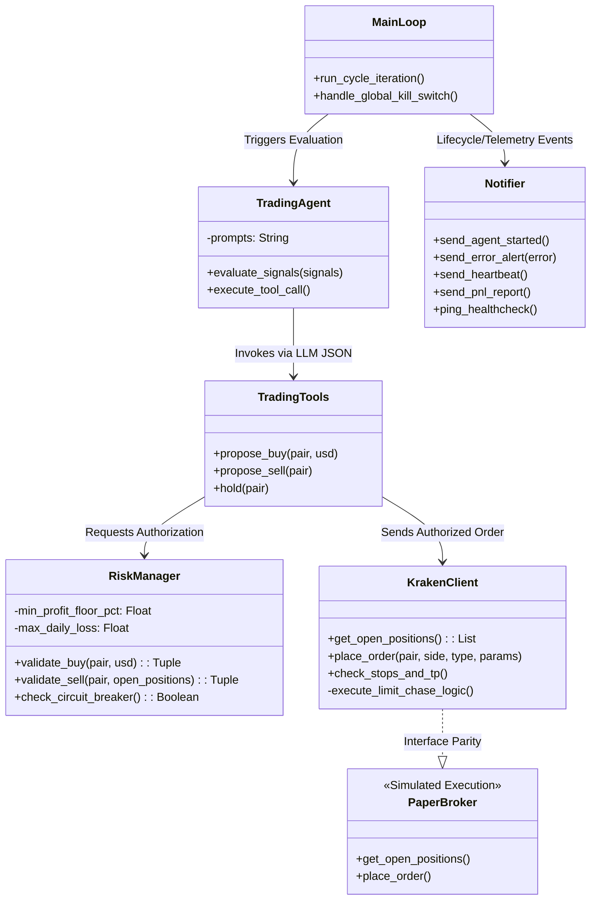

---

## 3. Important Technical Decisions

*   **ADR-001: SQLite over Heavyweight RDBMS.** 
    *   *Rationale:* Trading bots require zero-network-latency state persistence to ensure crash-recovery doesn't miss a beat. SQLite ensures ultra-fast disk writes. Data is segmented across `audit.db`, `live_trading.db`, and `paper_trading.db`.
*   **ADR-002: Maker-Only Execution with Chase Logic.** 
    *   *Rationale:* Taker fees (~0.26%) cause death-by-a-thousand-cuts. Executing purely via Maker limits (`postOnly=True`) captures lower fee tiers (0.16% or better). 60-second chase logic manages slippage opportunity costs.
*   **ADR-003: LLM Decoupling from Risk Constraints.** 
    *   *Rationale:* LLMs suffer from probabilistic hallucinations and cannot be trusted with Stop Losses. The Risk Manager is built as a deterministic Python overlay that actively rejects LLM intents bridging the agent-to-execution gap.
*   **ADR-004: Normalized AI State Injection.** 
    *   *Rationale:* Feeding the LLM raw OHLCV Arrays burns tokens and reduces reasoning clarity. We pre-process and feed Boolean/Scaled vectors (e.g. `Trend: Bullish, OBI: Positive`).

---

## 3a. LLM Architecture, Prompt Engineering & Trading Skill Design

This section provides a complete engineering deep-dive into how the Large Language Model (LLM) is integrated into Kryptos — from model selection to prompt construction, tool schema design, fallback handling, and the rationale behind every key design decision.

---

### 3a.1 Model Selection & Provider Abstraction

The LLM layer is fully provider-agnostic, configured via `config.yaml → llm:`:

```yaml
llm:
  provider: "ollama"              # "ollama" | "openai_compat"
  model: "qwen2.5:14b"           # Primary reasoning model
  fallback_model: "llama3.1:8b"  # Fallback if primary times out
  base_url: "http://localhost:11434"
  timeout_seconds: 120
  max_reasoning_chars: 500
  request_delay_seconds: 0
```

**Key Design Decision (ADR-005): Local LLM via Ollama — Model Choice is the Owner's Responsibility**
*   *Rationale:* A cloud LLM (e.g. OpenAI) introduces external network latency (200–800ms per call) and exposes your proprietary trading strategy to a third-party API. Ollama runs any compatible model locally on GPU, achieving sub-100ms inference for typical prompts with zero data leakage.
*   **Model Selection:** The specific model (e.g. `qwen2.5:14b`, `llama3.1:8b`, `mistral:7b`) is **entirely the human owner's decision**, configured via `config.yaml → llm.model`. Kryptos enforces one hard requirement: **the model must support tool/function calling** (i.e. it must be able to return structured `tool_calls` in its response). Models that only return free-text are incompatible with Kryptos's deterministic dispatch architecture.
*   *Fallback:* If the primary model times out (e.g. 14B model under heavy load), `trading_agent.py` automatically retries against the configured `fallback_model`, a typically lighter model that trades reasoning depth for speed. The fallback must also support tool calling.
*   *OpenAI-Compat Mode:* For users who prefer a cloud provider, switching `provider: openai_compat` and supplying a `base_url` enables the same tool-calling interface against any OpenAI-API compatible endpoint (e.g. Groq, Together.ai, Azure OpenAI, Gemini).

**The `TradingAgent` class (`src/agent/trading_agent.py`)** initializes the appropriate client:
```python
if self._provider == "openai_compat":
    from openai import OpenAI
    self._client = OpenAI(api_key=..., base_url=llm_cfg.get("base_url"), timeout=self._timeout)
else:
    self._client = ollama.Client(host=llm_cfg.get("base_url", "http://localhost:11434"), timeout=self._timeout)
```

---

### 3a.2 The Trading Skill: `.claude/skills/trading-rules/SKILL.md`

**Design Decision (ADR-006): Externalized Rules via SKILL.md**

All trading constraints and LLM behavioral rules are stored in a single Markdown file:
`.claude/skills/trading-rules/SKILL.md`

This file is the *single source of truth* for the agent's trading personality, risk limits, and decision style. It is **not** hardcoded inside `prompts.py`. Instead, `prompts.py` dynamically loads it at startup:

```python
SKILL_PATH = os.path.join(
    os.path.dirname(os.path.dirname(os.path.dirname(__file__))),
    ".claude", "skills", "trading-rules", "SKILL.md"
)
try:
    with open(SKILL_PATH, "r", encoding="utf-8") as f:
        TRADING_RULES = f.read().strip()
except FileNotFoundError:
    TRADING_RULES = "[WARNING: .claude/skills/trading-rules/SKILL.md file not found.]"

SYSTEM_PROMPT = f"""You are Kryptos, a quantitative AI crypto trading agent managing a real investment portfolio on Kraken exchange.

{TRADING_RULES}
"""
```

**Why this matters:**
*   **No duplication:** Trading rules are not duplicated between the system prompt and the Risk Manager. The SKILL.md describes the *intent*; the Risk Manager enforces it *mathematically*.
*   **Agentic compatibility:** Other AI agents and coding tools (e.g. GitHub Copilot, Claude Code) that load this project can read the SKILL.md and understand the system's constraints without reverse-engineering the Python code.
*   **Hot-swappable strategy:** Changing a rule (e.g. adjusting the Time-of-Day window from 16-20 UTC to 14-22 UTC) requires editing one file rather than modifying both the prompt and the risk manager code.

**Contents of SKILL.md (Current Production Rules):**
```text
RULES (non-negotiable — enforced by the risk manager):
- Position Sizes are volatility-adjusted (ATR-proportional)
- Stop-loss strictly capped at 5% maximum
- Take-profit = EntryPrice + (k * ATR) based on volatility regime
- All orders must be Post-Only Limit orders at the Bid price
- Trades BLOCKED if OBI is negative
- Confluence required: RSI oversold + MACD turning positive + BB lower band touch
- Max 3 simultaneous positions; 10% cash reserve always maintained
- Circuit Breaker: No buys if 3 consecutive stop-losses in last 4 hours
- Volume/Time Guard: 16:00-20:00 UTC window only; volume > 50% of 20-period SMA
- Minimum Profit Floor: 1.0% projected PNL before any manual sell is authorized
- Fat Finger Guard: No trade using > 98% of available cash
```

---

### 3a.3 System Prompt Architecture (`SYSTEM_PROMPT`)

The `SYSTEM_PROMPT` is a static string injected once when the Ollama/OpenAI client session is created. It never changes during a trading session. Its purpose is to define the agent's *identity*, *capabilities*, and *inviolable constraints*.

**Structure (3-Part Design):**

| Part | Content | Purpose |
| :--- | :--- | :--- |
| **Identity** | "You are Kryptos, a quantitative AI crypto trading agent..." | Anchors the model's persona so it doesn't drift into generic "helpful assistant" mode |
| **Rules** | Dynamic injection from `SKILL.md` | Defines all quantitative constraints the model must respect |
| **Role & Tools** | "You have 3 tools: propose_buy, propose_sell, hold" | Tells the model exactly what outputs are valid — no conversational text |

**Why a static system prompt?** The system prompt is expensive in tokens but changes never. Keeping it static allows Ollama to cache the KV-context, significantly reducing subsequent inference latency.

---

### 3a.4 Cycle Prompt Engineering (`build_cycle_prompt()`)

The cycle prompt is the *dynamic* user message rebuilt every 15 minutes. It contains real-time state but **never** raw OHLCV arrays.

**Key Design Decision (ADR-004): Normalized Data, Not Raw Prices**

The LLM receives this kind of normalized summary per pair — not 100-row candlestick arrays:

```text
=== CYCLE: 2026-04-05 17:30 SGT [PAPER TRADING — virtual money] ===

--- PORTFOLIO STATE ---
Total Balance:        $1,024.50
Available Cash:       $724.50
Open Positions:       1
Daily P&L:            +$24.50 (+2.45%)
Max per new trade:    $307.35  (30% of $1,024.50)

--- MARKET SIGNALS ---
1. BTC/USD  | Signal: HOLD  | Score: 4/10  | Trend: ✅ | MACD: ⬆ | RSI: 58 | OBI: -0.12
2. SOL/USD  | Signal: BUY   | Score: 8/10  | Trend: ✅ | MACD: ⬆ | RSI: 31 | OBI: +0.45
3. LTC/USD  | Signal: HOLD  | Score: 3/10  | Trend: ❌ | MACD: ⬇ | RSI: 62 | OBI: -0.08
...

--- OPEN POSITIONS ---
SOL/USD: 12.450000 | USD: $300.00 | Entry: $92.10 | SL: $87.48 | TP: $107.76 | PnL: +2.1%

--- TASK ---
Review the signals above. You may call propose_buy for the top 3 BUY signals.
```

**Rationale for normalization:**
1.  **Token efficiency:** A 100-candle OHLCV array for 15 pairs = ~45,000 tokens. The normalized summary = ~800 tokens. A 56x reduction in cost and latency.
2.  **Reasoning clarity:** The LLM doesn't need to *compute* RSI — it needs to *decide* based on RSI. Pre-computing and labelling (`RSI: 31 (oversold)`) dramatically improves decision quality.
3.  **Hallucination prevention:** Raw prices (e.g. `BTC = $85,000`) can confuse smaller models that have stale training data. Normalized scores (`Score: 8/10, Trend: Bullish`) are independent of absolute price levels.

---

### 3a.5 Tool Calling Schema & Determinism

**Design Decision (ADR-007): JSON Function Calling over Free-Text Parsing**

The LLM is given exactly 3 tools via the Ollama/OpenAI function-calling API. It *cannot* return free-text decisions. If it tries to respond conversationally ("I think SOL looks good"), the tool dispatch loop ignores the `message.content` entirely and only acts on `message.tool_calls`.

**Tool Definitions (`trading_agent.py → _TOOL_DEFS`):**
```python
[
  {
    "type": "function",
    "function": {
      "name": "propose_buy",
      "description": "Propose buying a crypto pair. Only call for top-ranked BUY signals (max 3/cycle).",
      "parameters": {
        "pair":       {"type": "string"},  # e.g. "SOL/USD"
        "usd_amount": {"type": "number"},  # e.g. 300.0
      }
    }
  },
  {
    "type": "function",
    "function": {
      "name": "propose_sell",
      "description": "Close an open position with strong momentum reversal signal AND above profit floor.",
      "parameters": {
        "pair":   {"type": "string"},
        "reason": {"type": "string"},  # LLM must justify its reasoning
      }
    }
  },
  {
    "type": "function",
    "function": {
      "name": "hold",
      "description": "Explicitly log a hold decision with reason. Other pairs are implicitly held.",
      "parameters": {
        "pair":   {"type": "string"},
        "reason": {"type": "string"},
      }
    }
  }
]
```

**Why 3 tools only?** Restricting the toolset forces the LLM into a finite decision space. It cannot "invent" new actions like `cancel_order` or `adjust_stop_loss`. This eliminates an entire category of hallucination risk.

---

### 3a.6 Tool Dispatch & Audit Flow

After the LLM responds, the `run_cycle()` method in `TradingAgent` dispatches to the corresponding Python function in `TradingTools`:

```
LLM Response (tool_calls)
        │
        ▼
trading_agent.py → run_cycle()
        │
        ├─ tool_call.name == "propose_buy"   → tools.propose_buy(pair, usd_amount)
        │                                           │
        │                                           └─ RiskManager.validate_buy()  ◄── Veto Gate
        │                                           └─ Broker.place_order()        ◄── Execution
        │
        ├─ tool_call.name == "propose_sell"  → tools.propose_sell(pair, reason)
        │                                           │
        │                                           └─ RiskManager.validate_sell() ◄── Veto Gate
        │                                           └─ Broker.close_position()     ◄── Execution
        │
        └─ tool_call.name == "hold"          → Logged to audit_llm_decisions only. No API call.
```

**Every tool invocation writes to the audit trail:**
*   `audit_llm_decisions`: The raw LLM output + extracted tool name.
*   `audit_risk_checks`: Whether the Risk Manager approved or rejected and why.
*   `audit_signals`: The quantitative signal matrix that was fed to the LLM.

This means every HOLD — including the 99% of cycles where nothing happens — is fully traceable with the LLM's reasoning captured in the database.

---

### 3a.7 Tool-Calling Compatibility Requirement

**The single non-negotiable requirement for any configured LLM:** it must support structured **tool/function calling** and return a `tool_calls` array in its response payload. This is the foundation of Kryptos's hallucination-proof architecture.

| Compatibility | Requirement | Examples |
| :--- | :--- | :--- |
| ✅ Compatible | Supports `tools` parameter + returns `tool_calls` | qwen2.5, llama3.1, mistral-nemo, gemma3, OpenAI GPT-4o, Gemini 1.5 Pro |
| ❌ Incompatible | Returns only free-text responses | Raw base models without instruction tuning |

**Reasoning Model Compatibility:** Some reasoning-optimized models (those with internal chain-of-thought) emit verbose `content` before their `tool_calls`. Kryptos handles this gracefully: the `content` field is logged to `audit_llm_decisions` for debugging, but the tool dispatch loop **only** processes `message.tool_calls`. The reasoning text never influences execution.

**Validation at startup:** `trading_agent.py` performs a lightweight ping to the configured model at boot time. If the model does not return a valid `tool_calls` structure in response to a minimal test prompt, the agent logs a `CRITICAL` error and exits cleanly rather than entering a broken trading loop.

---

### 3a.8 Sequence Diagram: Prompt Construction → LLM Decision → Execution

This sequence shows the complete lifecycle of a single trading cycle from data ingestion through to trade execution or audit logging of a HOLD.

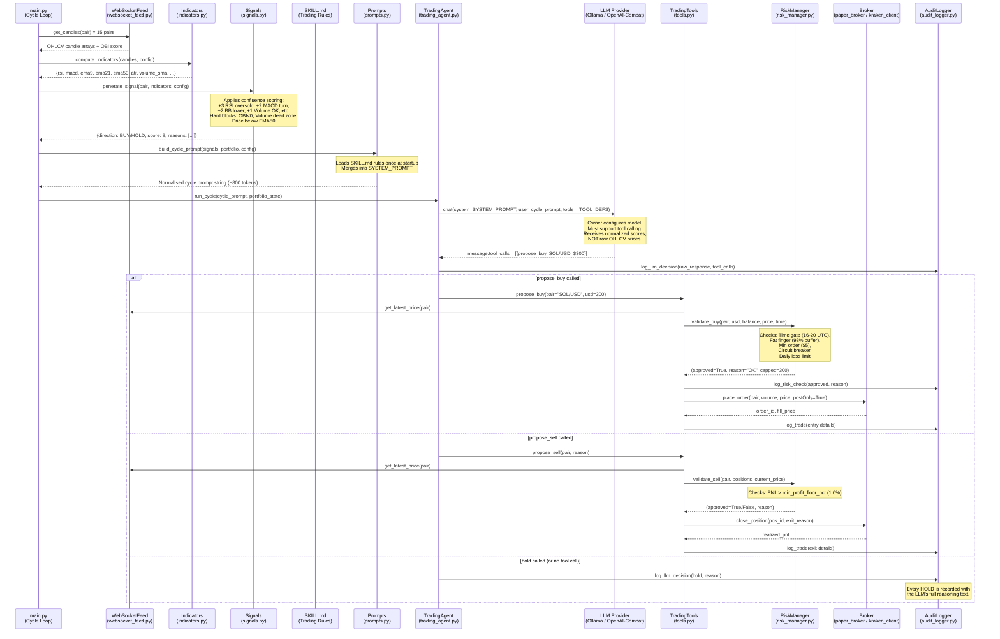

**Key insights from the sequence:**
1. The LLM sees only **normalized scores** — never raw prices or candle arrays.
2. A **JIT price re-fetch** happens inside `propose_buy/sell` to close the 2-5 second LLM inference gap before any order is placed.
3. The **Risk Manager intercepts every tool call** — the LLM cannot bypass it.
4. **Every branch** (buy, sell, hold, rejection) is permanently written to the audit database.

---

### 3a.9 Summary of LLM Design Decisions

| Decision | Choice | Rationale |
| :--- | :--- | :--- |
| **Model provider** | Local Ollama (default) | Zero data leakage, sub-100ms latency, no API costs |
| **Model** | Owner's choice (configured in `config.yaml`) | Must support tool calling; specific model is human owner's decision |
| **Fallback** | Owner's choice (configured in `config.yaml`) | Lighter model ensures cycle completes even under GPU load; must also support tool calling |
| **Prompt strategy** | Static system + dynamic cycle | KV-cache benefits on system prompt; fresh data each cycle |
| **Data format** | Normalized scores/booleans | 56x token reduction; eliminates price-hallucination risk |
| **Output format** | Strict JSON tool calling | Eliminates free-text parsing; makes `ValueError` crashes impossible |
| **Rules location** | `SKILL.md` (external file) | Single source of truth; hot-swappable; agentic tooling compatible |
| **Risk enforcement** | Python-side only (never LLM) | LLMs hallucinate risk; deterministic math never does |
| **Audit logging** | Every call, including HOLDs | Full traceability; regulatory-grade audit trail |
| **Model compatibility** | Tool calling required | Non-negotiable; free-text-only models are rejected at startup |

---

## 4. Database Design (Data Access Layer)

Data is segregated to maintain performance between fast execution reads vs deep historical auditing writes.

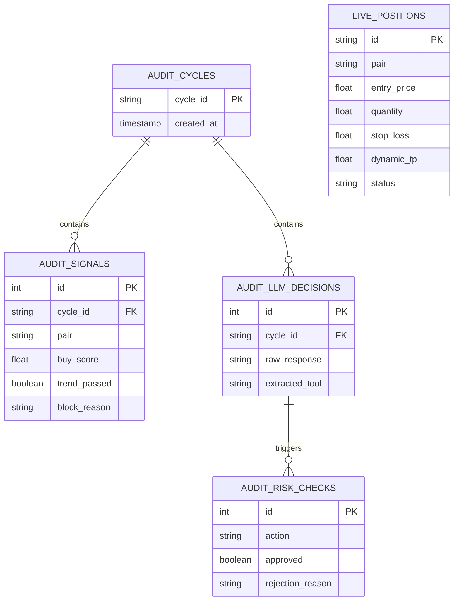

---

## 5. Exception Management
Kryptos implements a layered defensive grid:
1.  **Global Execution Loop (`main.py`):** Top-level `try/except` blocks guarantee that unhandled exceptions (e.g., DNS failure, severe LLM SDK crash) log the stack trace and directly call `notifier.send_error_alert()`, followed by an emergency fallback.
2.  **API Rate Limiting & Network Resilience:** Network calls via `ccxt/kraken_client.py` catch `NetworkError` and `RateLimitExceeded`. They apply exponential backoff before throwing upstream.
3.  **Fallback Stop-Loss Executions:** If native Kraken TP/SL triggers fail to poll gracefully, the application falls back to `fallback_stop_loss` classification—generating an instant market-sell instead of assuming the exchange will resolve the ticket.
4.  **"Fat Finger" Overflows:** `RiskManager.validate_buy` catches `<$5` minimum limitations and `>98%` available balance usage limitations prior to submitting API traffic, bypassing Kraken's native 400 validation errors completely.

---

## 6. Notification Framework
The `Notifier` class coordinates multi-channel observability.
*   **Start/Stop:** Generates Telegram messages defining `[LIVE]` or `[PAPER]` mode.
*   **Trade Alerts:** Formatted alerts containing Pair, Action (Buy/Sell), PNL%, PNL$, and specific reasons (e.g. `agent_sell`, `stop_loss`).
*   **The 2-Hour Heartbeat:** Pushes summarized runtime statistics to guarantee operational peace of mind.
*   **The 6-Hour P&L Report:** Generates a full portfolio tracking summary comparing Current USD to Start-of-Day USD.
*   **External Liveliness (healthchecks.io):** A silent HTTP `GET` sent explicitly at the end of every 15-minute loop verifies thread non-blocking.

---

## 7. Sequence Diagrams

### 7.1 Autonomous Buy Flow (Live Trades)
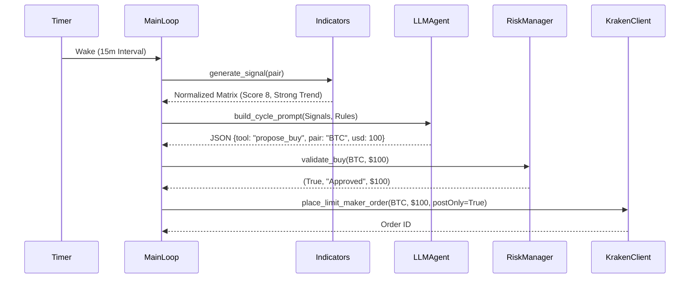

### 7.2 Paper Buy Flow
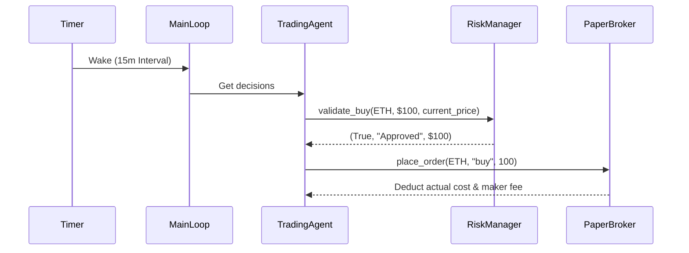

### 7.3 Hold Flow
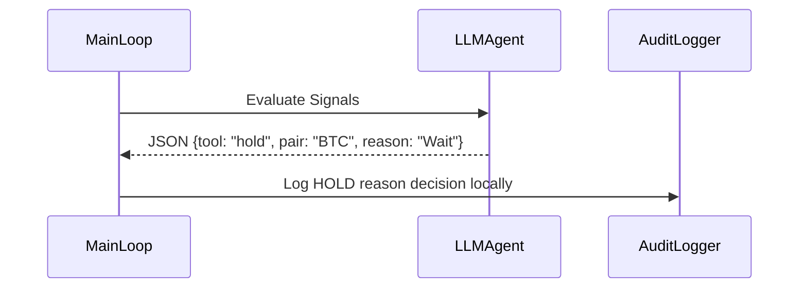

### 7.4 Sell Flow
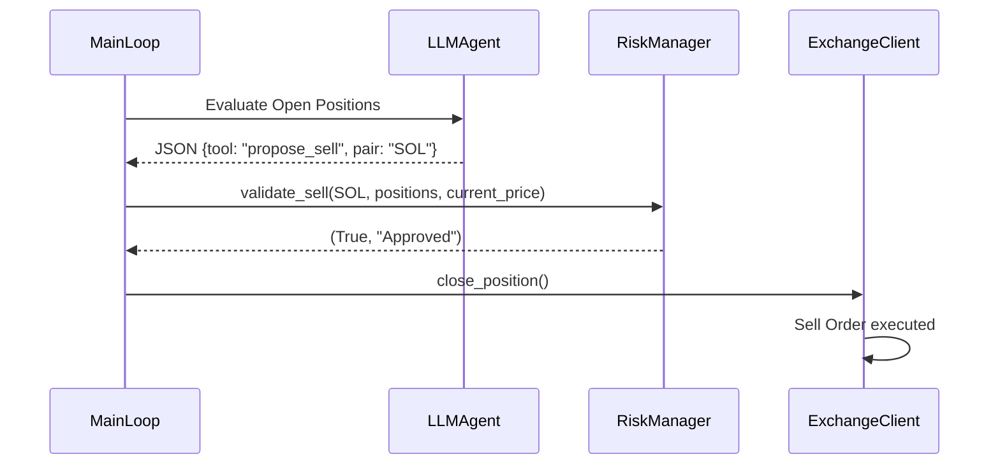

### 7.5 Stop Loss & Take Profit (Live/Fallback)
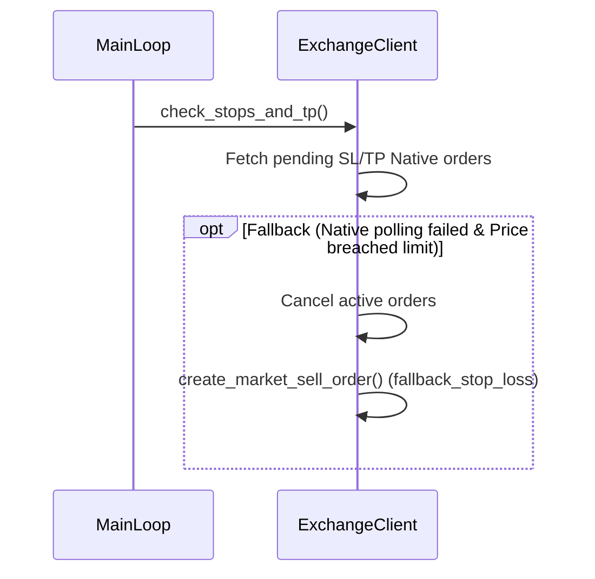

### 7.6 Global Kill Switch
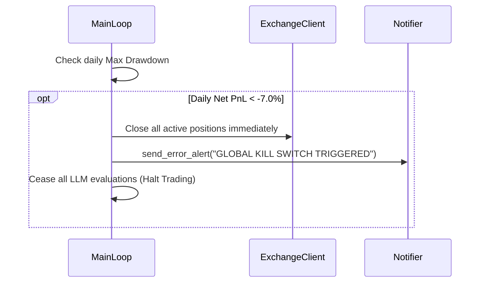

### 7.7 Circuit Breaker
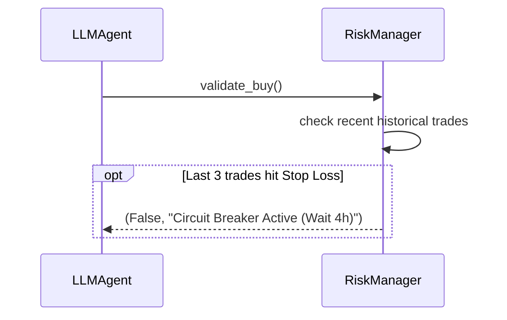

### 7.8 Notification Framework Flow
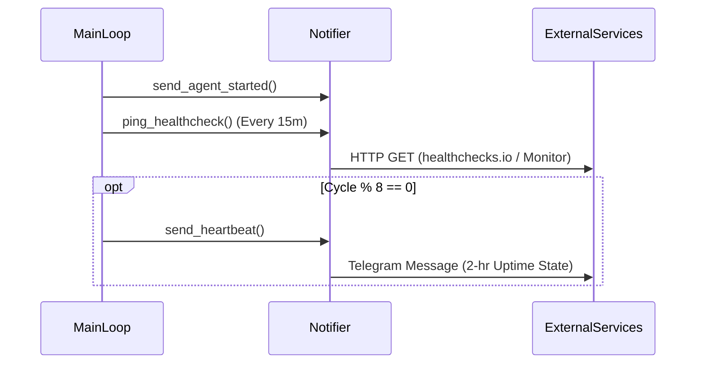

### 7.9 Maker Feature Limit Order Chase
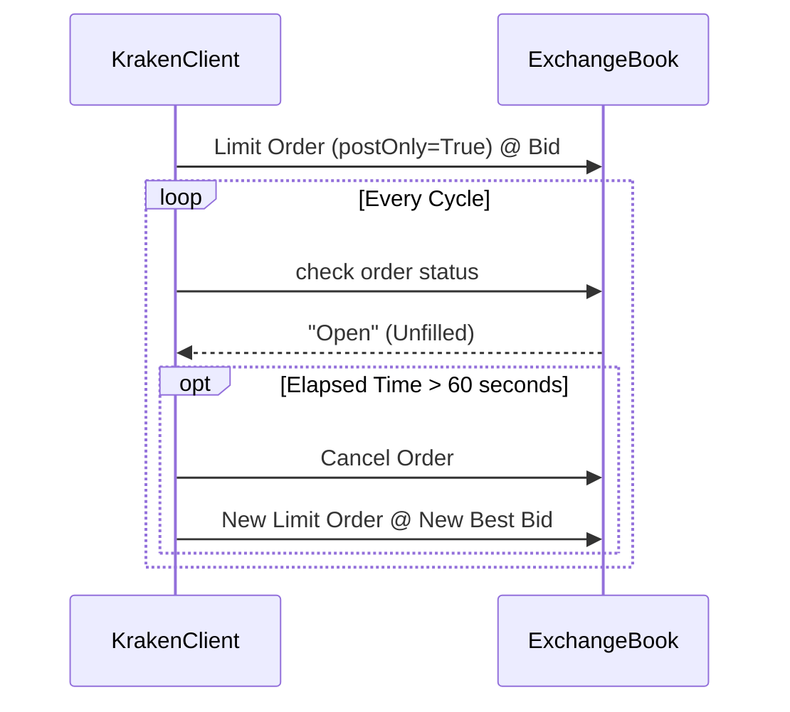

---

## 8. Detailed Component Dependencies & Traceability

### 8.1 Component Drilldown
*   **`risk_manager.py` (FR4):** The deterministic firewall. Ensures Capital Preservation (NFR). Uses strict boundaries for absolute safety outside the LLM context. Implements: Minimum Profit Floor (1.0%), Fat Finger/Balance Guard (Leaves 2% buffer), Global Max Drawdown (-7.0%), Time-of-Day Constraints (16-20 UTC).
*   **`signals.py` (FR2.3):** Aggregates indicators to produce the LLM input matrix. Generates a normalized 0-10 Buy Score based on RSI oversold conditions, MACD convergence, and bollinger bounds. NFR Support: Ensures prompt size remains small by synthesizing hundreds of raw data points into clear categorical facts.
*   **`features.py` (FR2.2 & FR4.2):** Contains advanced mathematical parameters dynamically matching the market condition. Exposes `compute_dynamic_sl_values()` calculating absolute 5% caps mapped against Volatility ATR limits, alongside dynamic TP calculations `(Entry + K * ATR)`.
*   **`prompts.py` (FR3):** Merges dynamic strategy rules linked directly to `.claude/skills/trading-rules/SKILL.md`. Decouples instructional prompts (holding logic rules, NFR determinism mapping, tool output formatting) from runtime variables.

### 8.2 Traceability to Acceptance Criteria
*   **Business Requirement (FR1 Paper Trading):** Met by `paper_broker.py` & Sequence 7.2.
*   **Business Requirement (FR4 5% Stop Loss / Determinism):** Met by `features.py` calculation + `risk_manager.py` gatekeeping. LLM is intentionally excluded from SL placement logic.
*   **Business Requirement (FR5 Maker Fees Mitigations):** Met by `kraken_client.py` and Limit Order Chase logic Sequence 7.9. Maker (0.16%) natively prioritized.
*   **Business Requirement (FR6 CLI & Autonomy):** Maintained through asynchronous LLM calls and logging all Hold, Buy, Sell reasoning strings directly into local SQLite mapping tables.

---

## 9. Non-Functional Requirements (NFRs)
1. **Determinism:** LLM hallucinations are tightly sandboxed. Structural validation within the Python components guarantees the Agent conforms securely to portfolio limits.
2. **Execution Latency:** Live prices form the exchange book are 're-fetched' exactly at the point of tool execution internally inside `propose_buy()`, effectively wiping out the 2-5 second artificial gap generated by LLM reasoning inference time.
3. **Resilience:** Dual HTTP webhooks (15m pings to external site monitors) and internally looping WebSockets robustly defend against silent process death or OS lockups.

---

## 10. Agent Skill System

Kryptos uses a structured **Skill System** stored under `.claude/skills/` to provide reusable, version-controlled operational workflows for both human operators and AI agents. Skills are Markdown files with YAML frontmatter that define step-by-step procedures, automated shell commands, and checklists. They serve as the single source of truth for operational procedures, eliminating duplication between LLM prompts, documentation, and code.

### 10.1 Skill: `trading-rules`
**File:** `.claude/skills/trading-rules/SKILL.md`  
**Purpose:** Defines the non-negotiable quantitative trading constraints injected dynamically into the LLM's `SYSTEM_PROMPT` at agent startup via `src/agent/prompts.py`. This skill file is the **single source of truth** for all LLM behavioral constraints.

**Design Decision:** Rules are externalized here rather than hardcoded in `prompts.py` to:
1. Allow human operators to tune constraints (e.g., OBI threshold, time window) without touching Python source code.
2. Ensure AI coding assistants working on the codebase also read and respect the same rules.
3. Prevent rule duplication between documentation, prompt templates, and code comments.

**Key Rules Enforced via this Skill:**

| Rule | Enforcement Layer | Config Key |
| :--- | :--- | :--- |
| Max 3 simultaneous positions | `risk_manager.validate_buy` | `risk.max_open_positions` |
| Stop-loss ≤ 5% (ATR-adjusted) | `features.compute_dynamic_sl_values` | `trading.stop_loss_pct` |
| TP = Entry + (k × ATR) | `features.compute_dynamic_tp` | `dynamic_tp.multiplier_*` |
| Post-Only Limit orders only | `kraken_client.place_order` | hardcoded |
| OBI must be positive | `signals.generate_signal` | `signals.obi_min` |
| 16:00–20:00 UTC window only | `risk_manager.validate_buy` | `trading.allowed_trading_hours` |
| Volume > 50% of 20-period SMA | `signals.generate_signal` | `signals.min_volume_ratio` |
| Minimum Profit Floor ≥ 1.0% | `risk_manager.validate_sell` | `trading.min_profit_floor_pct` |
| Fat Finger: Max 98% cash | `risk_manager.validate_buy` | `risk.fat_finger_buffer_pct` |
| Global Kill Switch at -7% | `main.run_agent` | `risk.global_max_daily_loss_pct` |
| Circuit Breaker: 3 SLs in 4h | `risk_manager.is_circuit_open` | `risk.circuit_breaker.*` |

**How it is loaded at runtime:**
```python
# src/agent/prompts.py
SKILL_PATH = ".claude/skills/trading-rules/SKILL.md"
with open(SKILL_PATH) as f:
    TRADING_RULES = f.read().strip()

SYSTEM_PROMPT = f"""You are Kryptos, a quantitative AI crypto trading agent...
{TRADING_RULES}
"""
```

---

### 10.2 Skill: `add-pair`
**File:** `.claude/skills/add-pair/SKILL.md`  
**Purpose:** A step-by-step operational workflow for onboarding a new trading pair into the Kryptos ecosystem. This skill is invoked by AI coding assistants when a user requests to add a new asset.

**Architecture Insight — Config-Driven Design:**  
Adding a pair requires changes in only **one source of truth**: `config.yaml`. All downstream components (`websocket_feed.py`, `kraken_client.py`, `paper_broker.py`) are fully config-driven and automatically pick up new pairs on restart. The skill reinforces this by documenting exactly which files still need manual updates (prompt docstrings, CLI display banners) and which do not.

**Skill Execution Steps:**

| Step | Action | File(s) Touched |
| :--- | :--- | :--- |
| 1 | Parse pair name and Kraken REST name from user argument | — |
| 2 | Verify pair exists via Kraken public API and fetch WS name | Kraken API (read-only) |
| 3 | Determine `take_profit_pct` based on volatility profile | — |
| 4a | Add pair block to `trading.pairs` list | `config.yaml` |
| 4b | Update pair count and list in `SYSTEM_PROMPT` | `src/agent/prompts.py` |
| 4c | Add pair to `propose_buy` docstring | `src/agent/tools.py` |
| 4d | Update welcome banner pairs list | `src/cli/display.py` |
| 4e | Add symbol aliases to NLP parser | `src/cli/nl_parser.py` |
| 5 | Verify all 5 files are consistent via checklist | All above |

**Take-Profit Assignment Policy (from skill):**

| Volatility Profile | TP% | Example Pairs |
| :--- | :--- | :--- |
| Low volatility | 8% | BTC, LTC |
| Moderate volatility | 12% | ETH, BNB, XRP |
| High volatility | 15–16% | SOL, AVAX, INJ, SUI |
| Meme / extreme | 20% | DOGE, RAILS, HYPE |

**No code changes needed in:** `websocket_feed.py`, `kraken_client.py`, `paper_broker.py`, `rsi_verifier.py` — all are config-driven.

---

### 10.3 Skill: `commit`
**File:** `.claude/skills/commit/SKILL.md`  
**Purpose:** A 10-step Git workflow skill enforcing safe, auditable commits. Used by AI coding assistants to ensure every code change is paired with session notes, CHANGELOG entries, documentation updates, and memory updates before being pushed to GitHub.

**Key Safety Constraints:**
- Never stages `.env`, `data/`, `logs/`, `__pycache__/`, or `*.pyc`.
- Always writes a new `docs/sessions/session_<date>_<part>.md` file before committing.
- Always updates `CLAUDE.md`, `README.md`, `plan.md`, `CHANGELOG.md`, and `business-requirement.md`.
- Commit messages follow `fix:` / `feat:` / `docs:` / `refactor:` conventions with a `Co-Authored-By: Claude Sonnet 4.6` trailer.

**Why this matters for the system:**  
Trading bots accumulate complex state. Without strict commit discipline, it becomes impossible to bisect bugs that caused real financial losses. The commit skill creates an unbroken audit trail from business requirements to code changes to deployed behaviour.

---

### 10.4 Skill System Architecture Summary

```
.claude/skills/
├── trading-rules/
│   └── SKILL.md    ← Injected into LLM SYSTEM_PROMPT at runtime
├── add-pair/
│   └── SKILL.md    ← Operational guide for onboarding new assets
└── commit/
    └── SKILL.md    ← Git hygiene and release management workflow
```

**Traceability to NFRs:**
- **Determinism (NFR1):** `trading-rules` skill is the single source of truth for LLM constraints, eliminating drift between prompt and documentation.
- **Maintainability:** `add-pair` skill ensures no pair is added inconsistently (e.g., in config but missing from NLP parser).
- **Auditability:** `commit` skill guarantees every deployed change has a human-readable session note and CHANGELOG entry, supporting post-incident review.
