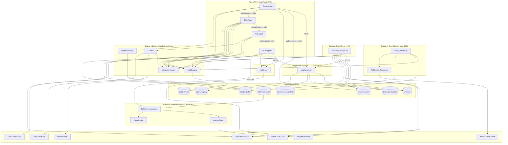
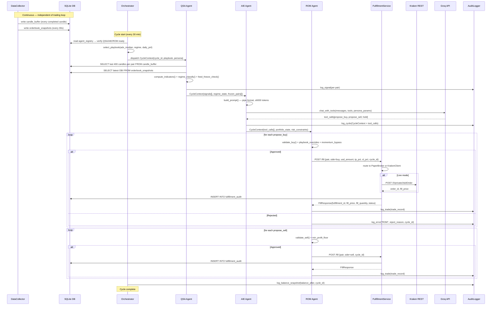

# Kryptos v3 — Conceptual and Detailed Architecture Design

**Document Type:** Architecture & Solution Design  
**Version:** 3.0  
**Date:** 19 April 2026  
**Reference:** docs/v2-agentic/BRD-v3.md, docs/detailed_solution_design.md  
**Status:** Draft

---

## 1. Conceptual Design Overview

### 1.1 Design Philosophy Shift

Kryptos v2 operated as a **sequential, unidirectional pipeline**:

```
Signal Engine ──▶ LLM Advisor ──▶ Risk Manager ──▶ Executor
```

Each layer operated without awareness of the others' state. The April 18 failure proved this is structurally inadequate. The LLM squandered its quota on positions that were already blocked; the Risk Manager enforced rules blind to the opportunity cost.

Kryptos v3 operates as a **coordinated, feedback-driven multi-agent mesh**:

```
                    ┌─────────────────────────────┐
                    │       ORCHESTRATOR           │
                    │  (Meta-Planner / Playbook)   │
                    └──┬──────────┬────────────────┘
                       │          │         ▲
              delegate  │          │ results  │ playbook
                       ▼          ▼          │
           ┌─────────────┐  ┌─────────────┐  │
           │  QSA Agent  │  │  AIE Agent  │  │
           │  (Data /    │◀─│  (Context / │──┘
           │   Signals)  │  │   Routing)  │
           └──────┬──────┘  └──────┬──────┘
                  │ regime          │ ranked candidates
                  │ signals         ▼
                  └────────▶ ┌─────────────┐
                             │  ROM Agent  │
                             │  (Risk /    │
                             │  Pruning)   │
                             └──────┬──────┘
                                    │ approved orders
                                    ▼
                              ┌───────────┐
                              │ Executor  │
                              │ (Broker)  │
                              └───────────┘
```

### 1.2 Persona Parameterisation

The persona is a **configuration profile** that overrides specific thresholds across all three agent layers. The system does not decide which persona is active — **the user selects their risk level** through configuration or the CLI/UI. No persona is ever auto-promoted to live trading by the system itself.

**Concurrent paper testing:** All three personas can run simultaneously, each as an **independent process** with its own isolated database (`paper_trading_conservative.db`, `paper_trading_medium.db`, `paper_trading_high.db`). The notifier includes the active persona name in every Telegram message so the user can distinguish activity across runtimes.

**Single active persona (live or focused paper):** One persona is active, using the standard `live_trading.db` or `paper_trading.db`.

```
Persona Profile → Orchestrator (injects into CycleContext)
                      ├── QSA: no changes (data is persona-agnostic)
                      ├── AIE: LLM temperature, system role, max_tokens
                      └── ROM: buy_min_score, max_positions, reallocation_enabled,
                               momentum_bypass_threshold, velocity_circuit_breaker_pct
```

**Database naming convention:**

| Mode | Conservative | Medium | High |
|---|---|---|---|
| Concurrent paper | `paper_trading_conservative.db` | `paper_trading_medium.db` | `paper_trading_high.db` |
| Single paper | `paper_trading.db` | `paper_trading.db` | `paper_trading.db` |
| Live | `live_trading.db` | `live_trading.db` | `live_trading.db` |

### 1.3 Token Budget Architecture

All LLM communication moves from JSON to pipe-separated key-value format. This reduces per-pair tokens from ~350 to ~90, enabling all 29 pairs to theoretically fit in 2,800 tokens — well within the 6,000 budget.

**Token budget breakdown per cycle (target):**

| Component | Format | Estimated Tokens |
|---|---|---|
| System prompt (persona role + rules) | Condensed prose | ~400 |
| Risk constraints block | Pipe-separated, 1 row | ~60 |
| Portfolio state (open positions, max 10) | Pipe-separated, 10 rows × 25 tokens | ~250 |
| Per-pair signal blocks (BUY+SELL only, max 15) | Pipe-separated, 15 rows × 90 tokens | ~1350 |
| Instruction trailer | Condensed prose | ~100 |
| **Total prompt** | | **~2160** |
| LLM completion (tool calls) | Tool call JSON | ~800–1500 |
| **Total per cycle** | | **~3000–3700** |
| **Budget headroom** | | **~2300–3000** |

---

## 2. Agent Definitions

### 2.1 Orchestrator Agent

**Role:** Meta-Planner — the "control plane" of the system.

**Responsibilities:**
- Reads QSA regime output and selects the active playbook (`ranging`, `momentum`, `risk_off`)
- Injects persona parameters and playbook into `CycleContext`
- Coordinates sequencing: QSA → AIE → ROM → Executor
- Monitors agent response times; triggers exception handler if any agent exceeds 30s
- Persists `playbook_state`, `active_persona`, `regime_state` to `agent_state` table
- Sends Telegram alert on playbook transitions

**Inputs:**
```
cycle_id | {uuid}
persona | {conservative/medium/high}
qsa_regime | {stable/trending_up/trending_down/turbulent}
daily_pnl_pct | {n}
adx_median | {n}  ← median ADX across all non-frozen pairs
```

**Outputs:**
```
playbook | {ranging/momentum/risk_off}
cycle_context | CycleContext dataclass (injected into subsequent agents)
```

**Playbook Selection Matrix:**

| Condition | Playbook |
|---|---|
| ADX median < 20 AND regime = stable | `ranging` |
| ADX median ≥ 25 AND regime = trending_up | `momentum` |
| regime = turbulent OR daily_pnl_pct ≤ -3% OR kill_switch_active | `risk_off` |
| Default | `ranging` |

**Exception Handler (Coordination Doctor pattern):**
- On agent timeout: log `[ORCH] {agent} timeout after 30s — skipping cycle`
- On consecutive timeouts (2+): trigger `Risk-Off` playbook, halt new entries
- On data integrity error (e.g., QSA returns malformed regime): use last-known regime from `agent_state`

---

### 2.2 QSA Agent (Quantitative Systems Architect)

**Role:** Data Resilience and Signal Normalisation.

**Responsibilities:**
- Computes all technical indicators (unchanged from v2 except volume floor)
- Replaces SMA-20 volume floor with **Winsorized EMA-14**
- Detects feed freeze via OHLCV 3-cycle variance check
- Triggers failover to secondary price source on freeze
- Classifies each pair into a regime state
- Injects `regime_state`, `adx_14`, `winsorized_vol_ema`, `feed_status` into signal dict

**Winsorized EMA-14 Volume Floor:**

> Standard EMA-14 but each candle's volume is capped at the 95th percentile of the last 100 candles before entering the EMA calculation. This neutralises liquidation spikes without removing them from the raw data.

```
winsorized_vol[t] = min(vol[t], percentile_95(vol[-100:]))
vol_ema[t] = winsorized_vol[t] × alpha + vol_ema[t-1] × (1 - alpha)
alpha = 2 / (14 + 1) = 0.1333
```

Volume Dead Zone veto: `vol[_vol_idx] < vol_ema * min_volume_ratio`

**Volume Dead Zone Momentum Bypass (Medium/High personas only):**

When both conditions are simultaneously true for a pair:
1. `price[current] > bb_upper` — current price is above the upper Bollinger Band
2. `macd_hist[prev] < 0 AND macd_hist[current] >= 0` — fresh positive MACD histogram crossover (prior candle was negative)

→ Volume Dead Zone veto is suspended for this pair this cycle.

```
if persona in [medium, high]:
    momentum_geometry = (price > bb_upper) and (macd_hist_prev < 0 and macd_hist >= 0)
    if momentum_geometry:
        vol_veto_active = False  # bypass the dead zone check
        log [QSA] VOL_BYPASS {pair} — MACD crossover + price > BB upper; veto suspended
    else:
        vol_veto_active = (vol < vol_ema * min_volume_ratio)
# Conservative persona: vol_veto_active = (vol < vol_ema * min_volume_ratio) always
```

This bypass is orthogonal to the Winsorized EMA fix:
- Winsorized EMA corrects the **floor value** (data quality layer — prevents spike inflation)
- The bypass overrides the **veto decision** (logic quality layer — permits entry when momentum geometry confirms breakout regardless of volume level)

Rationale: during a hard momentum breakout, smart money accumulates quietly before retail participation. Volume is intentionally low in this "quiet-before-the-wave" phase. The MACD crossover + BB breach geometry gives a structural confirmation that the volume gap is transient, not a lack of conviction.

**OHLCV Variance Heartbeat:**

```python
# Pseudo-logic (design intent, no code change in this document)
variance = sum(
    stdev([candles[-1][col], candles[-2][col], candles[-3][col]])
    for col in ['open', 'high', 'low', 'close', 'volume']
)
feed_status = 'FROZEN' if variance == 0.0 else 'OK'
```

If `FEED_FROZEN`:
1. Suppress pair's signal from current cycle
2. If pair = BTC/USD: trigger Orchestrator failover request
3. Log `[QSA] FEED_FROZEN {pair} — cycle suppressed`
4. Send Telegram alert if freeze persists > 3 cycles

**Regime Classification (per pair):**

| Condition | Regime |
|---|---|
| ATR% < p25 AND ADX < 20 | `stable` |
| ADX > 25 AND price > EMA-21 | `trending_up` |
| ADX > 25 AND price < EMA-21 | `trending_down` |
| ATR% > p75 OR sudden volume spike | `turbulent` |

**LLM — QSA does NOT make LLM calls.** It is purely deterministic.

**Outputs into CycleContext:**
```
{pair}: feed_status | regime | winsorized_vol_ema | adx_14
        | rsi_14 | macd_hist | bb_pos | obv_trend | score
        | direction | tp_pct | max_buy_usd
```

---

### 2.3 AIE Agent (AI Integration Engineer)

**Role:** Context Engineering and LLM Routing.

**Responsibilities:**
- Builds the state-aware prompt (portfolio state + risk constraints + unfilled clusters + per-pair signals)
- Formats all data as pipe-separated key-value
- Enforces token budget (≤ 6,000); trims signal list if over budget
- Injects persona-specific system role and LLM parameters
- Calls the LLM (Groq qwen3-32b or llama fallback)
- Parses LLM tool calls: `propose_buy`, `propose_sell`, `hold`
- Produces `ranked_reallocation_strategy` when ROM reports capital gridlock

**Prompt Construction (AIE responsibilities):**

**Step 1 — System Prompt (persona role, ≤ 400 tokens):**
```
Conservative: "You are a Capital Preservation Advisor managing a defensive crypto portfolio. 
Priority 1: protect capital. Priority 2: slow, consistent growth. Action rules: [condensed rules]"

Medium: "You are a Balanced Portfolio Manager. Capture measured upside while guarding capital.
Rotate sector exposure based on momentum. Action rules: [condensed rules]"

High: "You are an Alpha-Seeking Fund Manager. Capture breakout momentum aggressively.
Capital reallocation is authorised when high-conviction signals emerge. Action rules: [condensed rules]"
```

**Step 2 — Risk Constraints Block (pipe format):**
```
cash_usd|265.63|positions_open|13|positions_max|10|kill_switch|0
|circuit_open|0|playbook|momentum|persona|medium|prune_slots|0
```

**Step 3 — Portfolio State Block (pipe format, one row per open position):**
```
pos|ETH/USD|entry|2310.00|pnl_pct|+0.42|pnl_usd|+3.21|tp_dist_pct|11.58
|sl_dist_pct|5.42|adx|31|cluster|eth_ecosystem
pos|SOL/USD|entry|142.50|pnl_pct|+0.61|pnl_usd|+2.18|...
```

**Step 4 — Signal Blocks (pipe format, BUY + SELL only):**
```
pair|SUI/USD|score|9/28|direction|BUY|rsi|44|adx|28|macd_hist|0.31
|bb_pos|0.32|regime|trending_up|price|3.41|tp_pct|16|sl_pct|5|max_buy_usd|48.20
pair|PENDLE/USD|score|8/28|direction|BUY|rsi|51|adx|33|...
```

**Step 5 — Instruction Trailer (condensed, ≤ 100 tokens):**
```
Propose up to {max_buys} buys from signals above. If positions_open >= positions_max,
only propose replacements via reallocation. Call propose_buy, propose_sell, or hold.
Do NOT propose buys for pairs already in portfolio.
```

**LLM Parameters per Persona:**

| Parameter | Conservative | Medium | High |
|---|---|---|---|
| `temperature` | 0.1 | 0.3 | 0.5 |
| `max_tokens` | 1500 | 2000 | 2500 |
| `reasoning_effort` | none | none | none |
| `reasoning_format` | hidden | hidden | hidden |
| `tool_choice` | auto | auto | auto |
| Model | qwen3-32b (Groq) | qwen3-32b (Groq) | qwen3-32b (Groq) |
| Fallback | llama-3.3-70b | llama-3.3-70b | llama-3.3-70b |

**Capital Gridlock Handling:**

When ROM reports `positions_open >= positions_max` AND `cash_usd < min_order_usd`, the AIE builds a reallocation strategy:

```
Reallocation candidates (pipe format injected into prompt):
prune_candidate|TRX/USD|adx|14|pnl_pct|+0.38|value_usd|68.40|reason|low_momentum
prune_candidate|JUP/USD|adx|16|pnl_pct|+0.61|value_usd|71.20|reason|stagnant
Target slot for: SUI/USD (score=9, momentum playbook)
```

When `reallocation_enabled = false` (Conservative), the AIE sends the gridlock state but does NOT offer prune candidates — it tells the LLM "portfolio is at capacity; hold all positions".

**Outputs:**
- LLM tool calls: `propose_buy(pair, usd)`, `propose_sell(pair)`, `hold(pair)`
- `ranked_reallocation_strategy` list (if gridlock)
- Token usage metrics → `agent-llm-prompts.log`

---

### 2.4 ROM Agent (Risk Operations Manager)

**Role:** Capital Protection and Liquidity Management.

**Responsibilities:**
- Validates all LLM-proposed buys/sells (existing `validate_buy`, `validate_sell` logic)
- Activates the correct playbook rule set (injected by Orchestrator)
- Executes Capital Reallocation Subroutine if authorised
- Applies Momentum Bypass RSI rules per persona
- Monitors loss velocity for velocity-based circuit breaker
- Returns approved/rejected decisions with reasons

**Capital Reallocation Subroutine:**

```
Trigger conditions (Medium/High personas only):
  1. positions_open >= max_open_positions
  2. incoming signal score >= reallocation_trigger_score (8)
  3. incoming signal ADX > 25
  4. at least one prune candidate exists (low ADX + low gain, not in deep loss)

  Medium persona — additional constraint:
  5. Total value reallocated in past 6 hours < 20% of current portfolio value
     (rolling 6h window; prevents runaway churn during ranging markets)

Action:
  1. Identify prune candidate (lowest ADX, PnL within [-SL, +floor*1.5])
  2. Execute close_position(prune_candidate, exit_reason='reallocation')
  3. Update cash balance
  4. Re-run validate_buy on incoming signal
  5. Log [ROM] REALLOCATION: sold {candidate} to fund {new_pair}
     (no Telegram alert for Medium — silent auto-execution)
     (High persona also silent — no confirmation, no alert)
```

**Medium persona 6-hour reallocation cap:**

```
reallocation_value_6h = sum(
    trade.usd_value for trade in closed_trades
    where exit_reason == 'reallocation'
    AND closed_at >= now - 21600s
)
cap_usd = portfolio_value * reallocation_max_pct_6h  # default 0.20 (20%)
if reallocation_value_6h + prune_candidate.usd_value > cap_usd:
    skip reallocation; log [ROM] REALLOCATION cap reached for 6h window
```

**Momentum Bypass Rule:**

```
Standard rule: if rsi >= 70 → veto BUY

Momentum Bypass (Medium, playbook=momentum):
  if rsi >= 75 AND adx > 25 AND adx rising → allow BUY
  (rsi 70–74 passes through as before; only 75+ is newly permitted)

Momentum Bypass (High, playbook=momentum):
  if rsi >= 80 AND adx > 30 AND adx rising → allow BUY
  (rsi 70–79 passes through as before; only 80+ is newly permitted)
```

**Profit Factor Escalation Suspension (Momentum Playbook, Medium/High personas):**

```
Standard behaviour: signals.py applies PF escalation
  PF < 1.0 → effective_min_score += 1
  PF < 0.7 → effective_min_score += 2

Suspension rule (Medium and High, playbook=momentum):
  effective_min_score = persona.buy_min_score  # no delta applied
  log [ROM] PF_ESCALATION SUSPENDED — momentum playbook active; using persona default {score}

Resumption: PF escalation resumes when playbook reverts to 'ranging' or 'risk_off'
```

Rationale: pairs with depressed PF are, by definition, beaten-down altcoins that have been underperforming. These are disproportionately the first to recover in a V-shaped momentum rally. Applying +2 to their entry bar during the momentum onset phase creates a policy collision — the Orchestrator says "momentum", but the ROM raises the bar precisely for the pairs most likely to move. Suspending PF escalation in momentum removes this contradiction while Conservative persona retains it as a capital-preservation safeguard.

**Early Momentum Accumulation Score Reduction (Medium/High personas):**

Applied per-pair after base score computation and after PF suspension decision:

```
Conditions (both required):
  pair.rsi >= 50 AND pair.rsi <= 65   # neutral-to-rising RSI zone, not overbought
  pair.adx > 25                        # locally trending (not just portfolio-wide)

Effect:
  effective_min_score = max(1, effective_min_score - 1)
  log [ROM] EARLY_MOMENTUM {pair} RSI={rsi:.0f} ADX={adx:.0f} — min_score -{1 if eligible else 0}

Conservative persona: no reduction applied
Medium persona: -1 applied when both conditions met
High persona: -1 applied when both conditions met
```

Example (April 18 failure reconstruction):
- ARB/USD: RSI=52, ADX=27, score=5, persona_default=4, playbook=momentum
- After PF suspension: effective_min_score = 4 (no PF delta)
- After early momentum reduction: effective_min_score = 3
- Score 5 >= 3 → **BUY** (would have entered; was blocked on April 18 with effective threshold 6)

**ADX Ranging Penalty — Design Decision (retained in all playbooks):**

The per-pair ADX ranging penalty (−1 to signal score when pair ADX < 20) is **deliberately retained** in all playbooks, including `momentum`. Macro momentum (portfolio-wide ADX median ≥ 25) does not guarantee local pair trend quality — an individual pair can be ranging locally even while the broader market trends. Suspending this penalty in momentum playbook would force entries into pairs with genuinely choppy local structure purely on portfolio-wide grounds, increasing exposure to consolidation traps. The QSA layer maintains per-pair signal integrity independently of Orchestrator playbook state.

**Velocity Circuit Breaker:**

```
Per-cycle check (after every trade close):
  losses_last_hour = sum(pnl_usd for closed trades where
                         closed_at > now - 3600s AND pnl_usd < 0)
  portfolio_value   = get_balance().total_usd
  loss_rate_pct     = abs(losses_last_hour) / portfolio_value * 100

  if loss_rate_pct >= velocity_circuit_breaker_pct_per_hour:
    halt trading for velocity_halt_hours
    log [ROM] VELOCITY CIRCUIT OPEN: {loss_rate_pct:.1f}%/hr
    send Telegram alert
```

**Playbook Rule Mappings:**

| Playbook | buy_min_score | RSI veto | Profit floor | Stop loss |
|---|---|---|---|---|
| `ranging` | persona default + 1 | Strict (70) | persona default | Standard |
| `momentum` | persona default | Bypass per persona | persona default × 0.8 | Wide (allow more room) |
| `risk_off` | persona default + 2 | Strict (70) | persona default × 1.5 | Tight (persona default × 0.8) |

**Outputs:**
```
approved_buys: [(pair, usd_amount)]
approved_sells: [(pair, exit_reason)]
rejected: [(pair, reason)]
reallocation_executed: bool
velocity_circuit_state: open/closed
```

---

### 2.5 RAA Agent (Research Analyst Agent)

**Role:** Universe Scout & Manager — a dedicated background agent that continuously evaluates the broader crypto universe to identify emerging pairs with persistent relative strength and manages the set of tradeable pairs over time.

**File:** `src/runtime/research_analyst.py`  
**Process:** Independent process container (polls every 30 minutes; aligned with the trading cycle cadence; fully decoupled from the agent mesh)

**Responsibilities:**
- Polls Kraken `AssetPairs` and `Ticker` REST APIs for liquidity depth and spread metrics
- Polls CoinGecko `Trending` and `Social` REST APIs for velocity metrics and narrative sentiment
- Computes a rolling **Persistence Score (Ps)** per candidate pair across 30-minute poll cycles
- Classifies each candidate as `FOUNDATIONAL` (L1/L2 commodities) or `MEME` (socially-driven collectibles)
- Submits `PROPOSE(pair, replace_target?)` to the Risk Manager API when all gates are satisfied
- Writes universe change events to `universe_events` SQLite table (polling bus for Orchestrator)
- Stores a PSV context vector and LLM-generated rationale in `audit_events` per proposal

**Persistence Gate:**

> Ps > 1.5 sustained for ≥ 4 consecutive 30-minute cycles (≥ 2 hours) before a proposal is submitted.

The Persistence Score is a composite of normalised liquidity rank, price momentum, and volume acceleration. Any cycle where Ps drops below 1.5 resets the consecutive counter to zero.

**Alpha Spread Gate:**

> Projected alpha must exceed +2.0% over the replacement target's rolling 30-day return before a proposal is accepted.

If no replacement target is specified (N < 35), the gate compares against the current worst-performing pair in the universe.

**Universe Cap:**

| Universe state | `replace_target` required? |
|---|---|
| N < 35 pairs | Optional — new pair added without displacement |
| N = 35 pairs | **Mandatory** — PROPOSE blocked if `replace_target` absent |

**Asset Classification:**

| Asset type | Classification |
|---|---|
| BTC, ETH, SOL, established L1s, significant L2s | `FOUNDATIONAL` |
| Social-sentiment tokens, meme coins, narrative-driven alts | `MEME` |

**Telemetry Vectors (PSV format per persona):**

```
Medium persona:  Pair|Price|RSI|ADX|IBS|Sector|State
High persona:    Pair|Price|RSI|ADX|VWMA_Slope|Sector|State
```

**Persona-Specific Guardrails:**

| Parameter | Medium | High |
|---|---|---|
| RSI range for new entry | 35–65 | ≤ 85 (bypass if ADX > 35 AND VWMA_Slope > 0) |
| Pruning trigger | ADX < 15 for > 12 consecutive cycles | Score > 8/28 (aggressive immediate prune) |
| Position size | 1.5% fixed | 3.0% with volatility scaling |

**RAI Meme-Block (hard-coded; cannot be overridden by LLM or config):**

```
IF target_class == MEME AND replace_class == FOUNDATIONAL:
    REJECT → log [RAA] MEME_BLOCK_REJECT: {pair}/{replace_target}
```

Foundational anchors (BTC, ETH, SOL) are never liquidated to fund speculative meme assets. This rule is evaluated deterministically in Python before the proposal reaches the Risk Manager.

**SHIELDA Exception Management:**

| Exception | Trigger | Response |
|---|---|---|
| Malformed pipe-data | Risk Manager API returns `422 Unprocessable Entity` | Self-correction prompt sent to RAA; up to 3 retry attempts |
| Self-correction exhausted | 3 consecutive 422 rejections | Proposal dropped; log `[RAA] SELF_CORRECT_FAILED: {pair}` |
| Stale feed | Kraken `Ticker` OHLCV variance = 0 for candidate pair | All RAA proposals halted for current cycle; log `[RAA] STALE_FEED_HALT: {pair}` |

**Inter-Agent Synchronisation:**

Universe changes are written to the `universe_events` table (`event_type`: `ADD_PAIR` / `REMOVE_PAIR` / `PROPOSE_REJECTED`). The Orchestrator polls this table at each cycle start. When pending events exist, the Orchestrator broadcasts a universe change notification to QSA, AIE, and ROM so they re-evaluate their configuration before the cycle runs.

> **See ADR-011** — SQLite polling vs Pub/Sub. Redis/NATS was considered but violates the "shared state only via SQLite DB" architectural principle; SQLite polling is used in v3 with Redis deferred to a future scale-out phase.

**LLM Usage in RAA:**

The RAA uses the LLM exclusively for classification reasoning and rationale generation. All gate checks (Ps threshold, alpha spread, universe cap, meme-block) are deterministic pre/post-LLM validations — the LLM cannot override any gate.

**Inputs:**

```
kraken_asset_pairs:    list of AssetPair objects (pair, wsname, quote, base, lot_decimals)
kraken_ticker:         dict of last 30-min OHLCV per candidate
coingecko_trending:    list of trending coin slugs + metadata
coingecko_social:      social score per coin (last 24h)
universe_current:      current tradeable pairs with classification
persistence_db:        rolling Ps per tracked candidate (read from trend_persistence table)
```

**Outputs:**

```
proposals:            [(pair, replace_target?, classification, ps, alpha_spread_pct, rationale)]
rejected_candidates:  [(pair, reason)]                  -- meme-block / alpha / insufficient Ps
universe_events:      written to universe_events table  -- ADD_PAIR | REMOVE_PAIR
audit_events:         PSV context vector + rationale    -- one record per proposal
```

**DB tables written:** `trend_persistence`, `universe`, `universe_events` (see §12)  
**Libraries used:** `mocha_python_audit`, `mocha_python_logging`, `mocha_python_ai`

---

### 2.6 Per-Agent Reference: Dependencies, Error Handling, and Audit

**Quick-reference matrix:**

| Agent | Calls LLM | External APIs / Data Sources | DB Tables Read | DB Tables Written | LLM Tool Names |
|---|---|---|---|---|---|
| Orchestrator | No | None (SQLite-only) | `agent_registry`, `agent_state`, `universe_events` | `agent_state`, `audit_events` | — |
| QSA | No | Kraken REST (OHLCV failover), CoinGecko REST (price failover), CoinGlass REST (MVRV/NUPL) | `candle_buffer`, `orderbook_snapshots` | `audit_events` | — |
| AIE | Yes (qwen3-32b / llama-3.3-70b) | Groq API (primary), Ollama (fallback) | `agent_state` | `audit_events`, `agent-llm-prompts.log` | `propose_buy`, `propose_sell`, `hold` |
| ROM | No | FulfillmentService REST (127.0.0.1:8090) | `fulfillment_audit` | `audit_events` | — |
| RAA | Yes (classification + rationale only) | Kraken REST (AssetPairs, Ticker), CoinGecko REST (Trending, Social) | `trend_persistence`, `universe` | `trend_persistence`, `universe`, `universe_events`, `audit_events` | `classify_pair`, `generate_rationale` |

---

#### 2.6.1 Orchestrator — Error Handling and Audit

**Error handling:**

| Failure scenario | Detection | Response |
|---|---|---|
| Sub-agent IPC timeout (> 30s) | `socket.timeout` on Unix socket call | Skip cycle; log `[ORCH] {agent} IPC timeout — cycle skipped`; increment skip counter |
| 2 consecutive skipped cycles | Internal counter | Force `risk_off` playbook; halt new entries; Telegram alert |
| QSA returns malformed regime | Schema validation on `CycleContext` | Use last-known regime from `agent_state`; log `[ORCH] invalid QSA regime — using cached` |
| `universe_events` processing fails | Exception in event loop | Log error; mark event `processed=1` anyway (prevents stuck queue) |
| SQLite write failure | `sqlite3.OperationalError` | Single retry after 500ms; if repeated, log and continue (audit loss is non-fatal) |

**Audit events written (component = `Orchestrator`):**

| `event_type` | Trigger |
|---|---|
| `CYCLE_START` | Every cycle — includes `cycle_id`, `playbook`, `persona`, `regime` |
| `PLAYBOOK_CHANGED` | Playbook transitions (e.g., `ranging` → `momentum`) |
| `CYCLE_SKIP` | Sub-agent timeout forces cycle bypass |
| `UNIVERSE_CHANGE` | Pending `universe_events` processed and broadcast |

---

#### 2.6.2 QSA — External APIs, Error Handling, and Audit

**External API dependencies:**

| API | Purpose | Failover |
|---|---|---|
| Kraken WebSocket (via DataCollector/`candle_buffer`) | 30-min OHLCV candle data | DataCollector maintains WS independently; QSA reads table only |
| Kraken REST `/0/public/OHLC` | On-demand OHLCV if `candle_buffer` is stale | CoinGecko REST `/coins/{id}/ohlc` (critical pairs only) |
| CoinGecko REST `/api/v3/global` | BTC dominance | 24h in-memory cache; carry-forward on failure |
| CoinGlass REST | MVRV Z-Score / NUPL (cycle-top guard) | 24h DB cache; 1h backoff on 5xx; `None` → treat as neutral |

**Error handling:**

| Failure scenario | Detection | Response |
|---|---|---|
| `candle_buffer` < 30 rows for pair | `len(df) < 30` | Suppress pair from cycle; log `[QSA] insufficient candles: {pair}` |
| Feed freeze detected | OHLCV variance = 0 for last 3 candles | Mark `feed_status=FROZEN`; trigger DataCollector failover for BTC; suppress pair |
| Kraken REST 429 | HTTP 429 | Exponential backoff (1s → 2s → 4s); skip pair after 3rd failure |
| CoinGlass 5xx | HTTP 5xx | Record `failed_at`; 1h silent backoff; return `None` |
| Indicator computation error (NaN / ZeroDivision) | `try/except` per-pair block | Log `[QSA] indicator error {pair}: {e}`; suppress pair; continue others |

**Audit events written (component = `QSA`):**

| `event_type` | Trigger |
|---|---|
| `SIGNAL` | Per pair per cycle — score, direction, reasons list |
| `FEED_FROZEN` | Variance check detects freeze on a pair |
| `FAILOVER_TRIGGERED` | DataCollector failover requested for BTC/USD |

---

#### 2.6.3 AIE — Prompt Structure, LLM Tools, Error Handling, and Audit

**LLM tools registered:**

| Tool | Description | Key arguments |
|---|---|---|
| `propose_buy` | Propose a new buy order | `pair: str`, `usd_amount: float` |
| `propose_sell` | Propose closing an existing position | `pair: str` |
| `hold` | Explicit hold — no action | `pair: str` |

**System prompt per persona (condensed to ≤ 400 tokens):**

| Persona | Role opener | Key instruction constraints |
|---|---|---|
| Conservative | "Capital Preservation Advisor managing a defensive portfolio" | Protect principal; BUY only at score ≥ 5; strict RSI 70 veto; no reallocation |
| Medium | "Balanced Portfolio Manager capturing measured upside" | Rotate on momentum; BUY at score ≥ 4; RSI bypass to 75 in momentum; reallocation ≤ 20%/6h |
| High | "Alpha-Seeking Fund Manager capturing breakout momentum" | Chase high-conviction signals; BUY at score ≥ 3; RSI bypass to 80; uncapped reallocation |

**User message construction (5 blocks, pipe-separated):**

| Block | Content | Token budget |
|---|---|---|
| Risk constraints | `cash_usd\|{n}\|positions_open\|{n}\|positions_max\|{n}\|...` | ~60 tokens |
| Portfolio state | One pipe row per open position | ~250 tokens |
| Signal blocks | BUY + SELL pairs only (HOLD pairs filtered) | ~1,350 tokens (15 pairs × 90) |
| Instruction trailer | Plain prose — max buys, reallocation rules | ~100 tokens |
| **Total** | | **~1,760 tokens** |

**Error handling:**

| Failure scenario | Detection | Response |
|---|---|---|
| Groq timeout (> 30s) | `groq.APITimeoutError` | Retry once at reduced `max_tokens` (−20%); on 2nd failure switch to Ollama fallback |
| Groq rate limit (429) | `groq.RateLimitError` | Backoff 5s → 15s; 3rd failure → fallback model |
| Token budget exceeded | Pre-call estimate > 5,800 tokens | Trim BUY signals from lowest score up; log `[AIE] trimmed {n} signals to fit budget` |
| LLM returns zero tool calls | `tool_calls == []` | Retry with explicit "You MUST call at least one tool" trailer; on 2nd retry log warning + hold all |
| `<think>` block in output | `re.search("<think>", raw)` | Strip before tool call parsing — always active; prevents `tool_use_failed` |
| Malformed tool call args | `KeyError` / `TypeError` | Log `[AIE] malformed tool call skipped: {call}`; continue with valid calls |

**Audit events written (component = `AIE`):**

| `event_type` | Trigger |
|---|---|
| `CYCLE` | Per cycle — full prompt, tool calls, token usage, latency in `payload_json`; also written to `agent-llm-prompts.log` |
| `LLM_FALLBACK` | Primary Groq model fails; Ollama fallback activated |
| `TOKEN_TRIM` | Signal list pruned to meet token budget |

---

#### 2.6.4 ROM — External APIs, Error Handling, and Audit

**External API dependencies:**

| API | Purpose | Failure mode |
|---|---|---|
| FulfillmentService `POST /fill` | Execute buy / sell order | 5xx → halt trading (fail safe); 4xx → log reject reason, skip pair |
| FulfillmentService `GET /balance` | Pre-trade cash check | Unavailable → use last cached balance; log `[ROM] FS balance unavailable — using cached` |
| FulfillmentService `GET /positions` | Pre-reallocation position read | Unavailable → skip reallocation this cycle |

**Error handling:**

| Failure scenario | Detection | Response |
|---|---|---|
| FulfillmentService unreachable | `ConnectionRefusedError` on REST call | Halt all new trades for cycle; log `[ROM] FulfillmentService unavailable`; Telegram alert |
| `/fill` returns 400 | HTTP 400 | Log reject reason from response body; skip pair; continue |
| `/fill` returns 5xx | HTTP 5xx | Retry once after 2s; on repeat halt cycle |
| Kill switch active | `daily_pnl_pct ≤ −7%` in portfolio state | Block ALL proposals; log `[ROM] KILL SWITCH ACTIVE` |
| Velocity circuit open | `loss_rate_pct ≥ circuit_threshold` | Block new entries only; exits (SL/TP) still allowed; log `[ROM] VELOCITY CIRCUIT OPEN` |
| Deployable cash < `min_order_usd` | Pre-validation guard (Guard 0.5) | Reject with `BELOW_MIN_ORDER` before any REST call |

**Audit events written (component = `ROM`):**

| `event_type` | Trigger |
|---|---|
| `TRADE` | Per approved buy or sell — via `AuditLogger.log_trade` |
| `CIRCUIT_BREAKER` | Velocity circuit opens or closes |
| `REALLOCATION` | Capital reallocation subroutine executes |
| `ERROR` | Per rejected proposal — includes reason string |

---

#### 2.6.5 RAA — Prompt Structure, LLM Tools, Error Handling, and Audit

**LLM tools registered:**

| Tool | Description | Key arguments |
|---|---|---|
| `classify_pair` | Classify a candidate as FOUNDATIONAL or MEME | `pair: str`, `metadata: dict` (sector, mcap_rank, description) |
| `generate_rationale` | 2-sentence rationale for a proposal | `psv_vector: str`, `classification: str`, `ps: float`, `alpha_spread_pct: float` |

**RAA system prompt:**
```
You are a Crypto Universe Research Analyst. Evaluate candidate trading pairs for inclusion.

Classifications:
- FOUNDATIONAL: Established L1/L2 chains and major utility tokens with sustained institutional adoption.
- MEME: Social-sentiment driven; value derives primarily from narrative and community.

Rules:
- Never classify as FOUNDATIONAL if the primary value driver is social narrative.
- Generate rationale in exactly 2 sentences: (1) evidence summary, (2) risk caveat.
```

**Error handling:**

| Failure scenario | Detection | Response |
|---|---|---|
| Kraken REST 429 | HTTP 429 | Exponential backoff (2s → 4s → 8s); after 3 retries Ps computed from cached data only |
| CoinGecko Trending unavailable | 5xx / connection error | Skip trending enrichment; social velocity factor set to 0 (conservative; prevents false inflation) |
| CoinGecko Social 404 for specific coin | HTTP 404 | Skip social score for that coin; log `[RAA] social unavailable: {coin}` |
| LLM `classify_pair` returns unexpected value | Value not in `{FOUNDATIONAL, MEME}` | Default to name heuristic; log `[RAA] LLM class ambiguous — using heuristic` |
| Risk Manager API 422 (malformed PSV) | HTTP 422 | Self-correction prompt (max 3 retries); exhausted → drop proposal + log `[RAA] SELF_CORRECT_FAILED: {pair}` |
| Kraken OHLCV variance = 0 (stale) | Variance check pre-proposal | Halt proposal for pair this cycle; log `[RAA] STALE_FEED_HALT: {pair}` |

**Audit events written (component = `RAA`):**

| `event_type` | Trigger |
|---|---|
| `UNIVERSE_PROPOSAL` | Accepted proposal — PSV vector, classification, Ps, alpha spread, rationale in `payload_json` |
| `UNIVERSE_REJECT` | Rejected candidate — pair, reason (MEME_BLOCK / INSUFFICIENT_PS / ALPHA_SPREAD / STALE_FEED / SELF_CORRECT_FAILED) |
| `MEME_BLOCK` | Hard meme-block guardrail fires — separate event for easy audit filtering |
| `ERROR` | Kraken / CoinGecko API failures |

---

### 2.7 Agent IPC: A2A Protocol over Authenticated Unix Sockets

The agent mesh uses the **A2A (Agent-to-Agent) protocol** over Unix domain sockets. Communication is strictly hub-and-spoke: the Orchestrator dispatches to each sub-agent in sequence; sub-agents never call each other directly.

**Socket registry:**

| Agent | Socket path | Inbound calls from |
|---|---|---|
| QSA | `$KRYPTOS_RUN_DIR/qsa.sock` | Orchestrator only |
| AIE | `$KRYPTOS_RUN_DIR/aie.sock` | Orchestrator only |
| ROM | `$KRYPTOS_RUN_DIR/rom.sock` | Orchestrator only |
| Orchestrator | `$KRYPTOS_RUN_DIR/orchestrator.sock` | No inbound (caller only) |
| DataCollector | No socket — SQLite bus only | n/a |
| FulfillmentService | REST 127.0.0.1:8090 | ROM only |
| RAA | No socket — SQLite bus only | n/a |
| kryptos-mcp | HTTP 127.0.0.1:8092 | Orchestrator, ROM, RAA, external read clients |

**Unix socket security (three-layer defence):**

1. **Directory permissions:** `$KRYPTOS_RUN_DIR` created with `chmod 700` (owner-only). No other OS user can list, read, or connect to socket files.
2. **Socket file permissions:** Each `.sock` file created with `chmod 600`. Only the runtime OS user can connect.
3. **HMAC-SHA256 per-message authentication:** Every JSON-RPC call carries an `x_agent_token` field:
   ```
   token = HMAC-SHA256(
       key  = KRYPTOS_AGENT_IPC_SECRET,      # 32-byte random hex from environment
       data = sha256(canonical_json_body)     # prevents replay: token is body-specific
   )
   ```
   - `KRYPTOS_AGENT_IPC_SECRET` is generated via `secrets.token_hex(32)` at Orchestrator startup and written to `agent_state` for sub-agent retrieval on registration
   - Receiving agents validate `x_agent_token` before processing; mismatch → `{"error": {"code": -32099, "message": "authentication failed"}}`
   - Secret is rotated on every Orchestrator restart (sub-agents re-read from `agent_state`)

**A2A message format (JSON-RPC 2.0):**

```json
{
  "jsonrpc": "2.0",
  "method": "dispatch_cycle",
  "params": {
    "cycle_id": "abc123-uuid4",
    "playbook": "momentum",
    "persona": "medium",
    "regime": "trending_up"
  },
  "id": "orchestrator-req-001",
  "x_agent_token": "<HMAC-SHA256 hex>"
}
```

**Agent Card (A2A discovery) — registered via `AgentBootstrap.start()`:**

```json
{
  "agent_id": "qsa-agent",
  "version": "3.0.0",
  "capabilities": ["signal_scoring", "regime_detection", "volume_floor", "feed_freeze"],
  "listen_socket": "/run/kryptos/qsa.sock",
  "health_url": null,
  "status": "ready",
  "registered_at": "2026-04-19T00:00:00Z",
  "last_heartbeat": "2026-04-19T00:30:00Z"
}
```

**A2A RPC methods — all agents:**

| Agent | Method | Parameters | Returns |
|---|---|---|---|
| QSA | `dispatch_cycle` | `cycle_id`, `playbook`, `persona` | `CycleContext` with per-pair signals |
| AIE | `dispatch_cycle` | Full `CycleContext` (signals + portfolio) | `CycleContext` with LLM tool calls |
| ROM | `dispatch_cycle` | Full `CycleContext` (tool calls + risk state) | Approved / rejected order list |

**ADR-012 — Agent IPC: A2A over Unix Sockets vs gRPC vs HTTP REST**

**Date:** 2026-04-19  
**Status:** Accepted

**Context:** The agent mesh (Orchestrator → QSA → AIE → ROM) requires a secure, fast, local IPC mechanism.

**Decision:** Unix domain sockets with JSON-RPC 2.0 and HMAC-SHA256 per-message authentication.

**Rationale:**
- Unix sockets bypass the TCP/IP stack entirely — sub-millisecond dispatch latency; no kernel network traversal
- File-system access control (`chmod 600` socket + `chmod 700` directory) provides OS-enforced isolation without a firewall rule
- HMAC-SHA256 per-message token prevents spoofed connections if the socket path is guessed
- JSON-RPC 2.0 is language-agnostic and requires no IDL compilation step (unlike gRPC)
- HTTP REST over TCP would expose agent ports to other local processes; adds unnecessary overhead for a 4-agent local mesh

**Consequences:**
- Positive: Zero network-layer attack surface; OS-enforced access control; sub-ms dispatch latency; every IPC call logged via `IntegrationLogger`
- Negative: Cannot be called remotely — by design; requires socket directory cleanup on restart
- Risks: If `KRYPTOS_RUN_DIR` is symlinked to a world-writable path, socket files could be replaced — mitigation: validate at startup that `KRYPTOS_RUN_DIR` is not a symlink and is owned by the current effective UID

---

### 2.8 Closed-Loop Optimization: Audit Agent and Per-Agent Feedback

#### 2.8.0 Problem: Static Agents Have No Memory of Their Mistakes

Without feedback, every agent in the mesh repeats errors cycle after cycle. QSA may continue weighting a signal driver that consistently precedes losses. AIE may keep proposing the same pair types that the ROM rejects. RAA may repeatedly propose meme-labelled pairs that drain alpha spread. The Closed-Loop Optimization framework transforms each agent from a static executor into an evolving learner.

**Design pattern:** Actor-Critic. Each trading agent is an **Actor** executing decisions. A dedicated **Audit Agent** serves as the **Critic**, evaluating outcomes and publishing structured feedback that each Actor ingests at the start of its next cycle.

---

#### 2.8.1 Audit Agent (Feedback Generator)

**File:** `src/runtime/audit_agent.py`  
**Launch:** Independent OS process (same pattern as DataCollector, RAA)  
**Port (REST health):** 8094 (configurable: `services.audit_agent.port`)

**Responsibilities:**
1. Every 24 hours: compute trend accuracy outcomes — compare RAA persistence predictions against actual pair performance
2. On every Risk Manager rejection: immediately write a "reprimand vector" to `audit_feedback` for the proposing agent
3. Every 6 hours: compute per-agent performance metrics (signal accuracy, playbook PF, LLM decision accuracy, SL/TP calibration)
4. Detect confidence drift — when an agent's 5-trade rolling actual alpha deviates > 3σ from expected, trigger `ConfidenceResetException`
5. Maintain HITL queue — when RAA accumulates 3 guardrail violations in 24 hours, lock its substitution tool and queue proposals for human approval

**Trigger model:**
| Trigger | Frequency | Coverage |
|---|---|---|
| Trend validation window | 24h rolling | RAA persistence accuracy, playbook PF |
| Guardrail reprimand | Immediate (on Risk Manager 422/REJECT) | Per-agent violation summary |
| Performance rollup | 6h | All five agents |

**REST API contract:**

| Endpoint | Method | Auth | Response |
|---|---|---|---|
| `/health` | GET | None | `{"status": "ok", "last_rollup_ts": T}` |
| `/feedback/{agent_id}` | GET | None | Last 50 outcome vectors for agent as JSON |
| `/hitl_queue` | GET | None | Pending HITL proposals as JSON |
| `/hitl_queue/{id}/approve` | POST | None | Approve a HITL-queued proposal |
| `/hitl_queue/{id}/reject` | POST | None | Reject a HITL-queued proposal |

**Failure mode:** If Audit Agent is unavailable, all Actors fall back to their last-written `agent_performance_metrics` row. Trading is not blocked — feedback is advisory, not a hard gate.

---

#### 2.8.2 Orchestrator Feedback Loop

**What it learns:** Which playbook selection was most profitable in each market regime?

**Feedback source:** Audit Agent aggregates closed-trade outcomes per `(playbook, regime)` pair from `fulfillment_audit` + `audit_events`.

**Mechanism:** Orchestrator reads `playbook_performance` table at cycle start (before playbook selection). If current regime has ≥ 10 closed trades, it boosts playbooks with PF > 1.2 and suppresses playbooks with PF < 0.8 using a scoring multiplier.

**Feedback vector (pipe-separated):**
```
Playbook|Regime|Win_Rate|Profit_Factor|Avg_Hold_Hours|Sample_Count|Last_Updated
momentum|trending_up|0.62|1.45|4.2|23|2026-04-19T06:00:00Z
ranging|stable|0.48|0.95|2.1|14|2026-04-19T06:00:00Z
```

**Metrics tracked:** `win_rate`, `profit_factor`, `avg_hold_hours`, `max_drawdown_pct` per `(playbook, regime)`.

---

#### 2.8.3 QSA Feedback Loop

**What it learns:** Which signal drivers were accurate predictors? Which are contributing noise?

**Feedback source:** Audit Agent correlates which signal components scored BUY at entry against subsequent trade outcome. Per-driver accuracy = `(profitable trades where driver fired) / (total trades where driver fired)`.

**Mechanism:** QSA reads `signal_accuracy` table at cycle start. Drivers with accuracy < 40% over ≥ 15 trades receive a `0.7×` weight multiplier; drivers with accuracy > 70% receive `1.2×`. Multipliers are advisory — they shift scores but cannot suppress hard vetoes (RSI ≥ 70, volume floor).

**Feedback vector:**
```
Signal_Driver|Pair|Fire_Count|Accuracy_Pct|Weight_Multiplier|Last_Updated
rsi_oversold|SOL/USD|18|72.2|1.2|2026-04-19T06:00:00Z
bb_squeeze_release|PEPE/USD|6|33.3|0.7|2026-04-19T06:00:00Z
macd_histogram_turn|ETH/USD|31|65.4|1.0|2026-04-19T06:00:00Z
```

**Metrics tracked:** Per-driver, per-pair: `fire_count`, `accuracy_pct`, `false_positive_count`.

---

#### 2.8.4 AIE Feedback Loop

**What it learns:** What LLM decision patterns preceded losses? Which pairs produce systematically poor LLM proposals?

**Feedback source:** Audit Agent matches `audit_events.CYCLE` records (LLM tool calls) against `fulfillment_audit` outcomes. It writes "negative example" records to `llm_reflection_log` when AIE proposed a trade that resulted in an SL hit.

**Mechanism:** AIE system prompt is dynamically extended with ≤ 3 recent negative examples from `llm_reflection_log` per persona. Example:
```
[RECENT LOSS PATTERN] On 2026-04-17: proposed WIF/USD BUY at score=6 during ranging regime → SL hit at -5.1% within 2h.
Lesson: avoid BUY proposals for Tier-4 meme pairs during ranging playbook.
```

**Feedback vector:**
```
Pair|Regime|Playbook|Signal_Score|LLM_Confidence|Outcome|Hold_Duration_h|Lesson_Tag
WIF/USD|stable|ranging|6|high|SL_HIT|2.1|meme_during_ranging
ETH/USD|trending_up|momentum|9|high|TP_HIT|6.3|positive_example
```

**Metrics tracked:** Per-pair, per-playbook: `decision_accuracy_pct`, `avg_score_at_entry`, `negative_examples_in_prompt`.

---

#### 2.8.5 ROM Feedback Loop

**What it learns:** Are SL/TP levels well-calibrated per pair? Are exits happening too early (partial TP inefficiency) or too late (trailing SL dragging)?

**Feedback source:** Audit Agent computes per-pair SL/TP statistics from `fulfillment_audit` over rolling 30 days.

**Mechanism:** ROM reads `risk_decision_outcomes` table. Recommendations for SL/TP re-calibration are injected as a comment into the CycleContext (`suggested_tp_adjustments`). ROM does NOT auto-adjust — suggestions are shown in the Kryptos UI for human review.

**Feedback vector:**
```
Pair|SL_Hit_Rate|TP_Hit_Rate|Avg_Exit_Pct|Partial_TP_Efficiency|Trailing_Stop_Efficiency|Recommendation
BTC/USD|0.15|0.68|+6.2|0.82|0.91|OK
BONK/USD|0.55|0.21|-1.8|0.31|0.44|TIGHTEN_SL or RAISE_MIN_SCORE
```

**Metrics tracked:** Per-pair: `sl_hit_rate`, `tp_hit_rate`, `avg_exit_pct`, `partial_tp_efficiency`, `trailing_stop_efficiency`.

---

#### 2.8.6 RAA Feedback Loop (Closed-Loop Optimization)

Based on the Closed-Loop Optimization framework designed for the Research Analyst Agent.

**Audit Agent validates RAA accuracy across two feedback channels:**

**A. Trend Accuracy Feedback (24h validation window)**

After a pair is added, the Audit Agent tracks its performance over a configurable Validation Window (default 24 hours). It writes a PSV outcome vector to `audit_feedback`:

```
Pair|RAA_Expected_Alpha|Actual_Alpha|RAA_Persistence_Score|Actual_Persistence|Outcome
SUI/USD|+3.5%|+4.2%|1.8|2.1|SUCCESS
PEPE/USD|+8.0%|-12.4%|2.5|0.4|FAIL_PUMP_DETECTION
```

**B. Policy and Guardrail Feedback (immediate on rejection)**

When a proposal is blocked by a Risk Manager guardrail, the Audit Agent immediately writes a "reprimand vector":

```
Pair|Action|Violation_Type|Rule_Reference|Penalty_Weight
DOGE/USD|ADD_PAIR|RAI_VIOLATION|FOUNDATIONAL_REPLACEMENT_BLOCK|-2.0
```

**RAA Self-Reflection Loop (four-step agentic workflow):**

| Step | RAA Action | Technical Implementation |
|---|---|---|
| **Ingestion** | `GET_FEEDBACK` | Reads last 50 outcome vectors from `audit_feedback` at poll cycle start |
| **Reflection** | `SELF_CRITIQUE` | LLM call with `classify_pair` \+ feedback context; identifies missed pump detection, RAI violations, sector accuracy patterns |
| **Memory Update** | `DB_UPSERT` | Updates `confidence_state` — sector multipliers, blacklisted source tags, sustainability window overrides |
| **Heuristic Shift** | `META_PROMPT` | Dynamically adjusts internal confidence threshold (e.g., requiring Ps > 2.0 instead of 1.5 for meme pairs after pump failure) |

**Example reflection output written to `confidence_state`:**
```python
{
  "pair": "PEPE/USD",
  "sector_accuracy_multiplier": 0.8,     # AI sector below 20% → apply 0.8× to all AI-sector scores
  "sustainability_window_hours": 3,       # increased from 1h after Asian-session trap
  "ps_threshold_override": 2.0           # dynamic threshold raised from 1.5
}
```

---

#### 2.8.7 SHIELDA Confidence Reset and HITL Lock

**Confidence Reset (triggered by Audit Agent):**

When an agent's 5-trade rolling actual-alpha deviates > 3 standard deviations from its expected-alpha, the Audit Agent writes a `ConfidenceResetException` event to `audit_feedback`:
1. Agent reads the event at next cycle start
2. Agent clears all short-term `confidence_state` records for the affected scope
3. Agent reverts to conservative "Balanced Intent" heuristics (base config values; no multiplier adjustments)
4. Recovery: heuristic adjustments re-enabled after 10 consecutive cycles without a further `ConfidenceResetException`

**HITL Lock (triggered after 3 guardrail violations in 24h):**

When RAA accumulates 3 guardrail-violation reprimand vectors in a 24-hour window:
1. Audit Agent writes `SUBSTITUTION_TOOL_LOCKED` event to `audit_feedback` + `hitl_queue`
2. RAA substitution tool (universe displacement proposals) is programmatically blocked
3. All subsequent universe proposals routed to `hitl_queue` table — visible in Kryptos UI
4. Human approves or rejects each proposal via Kryptos UI or CLI
5. Lock is released automatically after 10 consecutive approved proposals (no further HITL required)

**HITL queue visual in Kryptos UI:** A banner appears on the Universe screen when `hitl_queue` has pending items.

---

#### 2.8.8 Audit Agent — DB Tables Read/Written and Service Registry Addition

**Tables written:** `audit_feedback`, `agent_performance_metrics`, `signal_accuracy`, `llm_reflection_log`, `risk_decision_outcomes`, `playbook_performance`, `confidence_state`, `hitl_queue`  
**Tables read:** `audit_events`, `fulfillment_audit`, `universe`, `trend_persistence`

Add to service registry table (§11):

| Component | File | Port | Auth | Role |
|---|---|---|---|---|
| Audit Agent | `src/runtime/audit_agent.py` | 8094 | None (health only) | Post-trade feedback generator; HITL queue manager |

---


All agents read from and write to a `CycleContext` dataclass that flows through the pipeline:

```python
@dataclass
class CycleContext:
    cycle_id: str              # UUID4
    session_id: str            # UUID4 (agent lifetime)
    timestamp: datetime
    persona: str               # conservative | medium | high

    # Orchestrator sets
    playbook: str              # ranging | momentum | risk_off
    regime_state: str          # stable | trending_up | trending_down | turbulent

    # QSA sets
    signals: Dict[str, SignalData]   # per-pair signal dicts
    frozen_pairs: List[str]          # FEED_FROZEN pairs this cycle

    # AIE sets
    prompt_tokens: int
    llm_raw_output: str
    tool_calls: List[ToolCall]
    reallocation_strategy: List[PruneCandidate]

    # ROM sets
    approved_buys: List[Tuple[str, float]]
    approved_sells: List[Tuple[str, str]]
    reallocation_executed: bool

    # Metrics
    cycle_duration_ms: float
```

---

## 4. Agent Runtime Model

**Separate process container architecture** — QSA, AIE, and ROM are separate process containers. The Orchestrator remains the coordinating entry point, calling each container in sequence via IPC.

### 4.1 Single-Persona Runtime (Live or Focused Paper)

```
main.py  (Orchestrator process)
  └── asyncio.run(run_agent(config, mode))
        └── while True:
              ├── [0] SL/TP checks (PaperBroker.check_stops_and_tp)   ← unchanged
              ├── [1] orchestrator.select_playbook(cycle_context)
              ├── [2] → QSA Process: run(cycle_context) → signals, regime
              ├── [3] → AIE Process: run(cycle_context) → LLM tool calls
              ├── [4] → ROM Process: run(cycle_context) → approved orders
              ├── [5] executor.run(cycle_context)                     ← unchanged
              ├── [6] audit_logger.log(cycle_context)                 ← extended
              └── sleep(cycle_interval)
```

### 4.2 Concurrent Multi-Persona Runtime (Paper Testing All Three)

```
Persona: Conservative                 Persona: Medium                    Persona: High
  main.py --persona conservative        main.py --persona medium            main.py --persona high
  DB: paper_trading_conservative.db     DB: paper_trading_medium.db         DB: paper_trading_high.db
  Port/IPC: QSA-C / AIE-C / ROM-C      Port/IPC: QSA-M / AIE-M / ROM-M    Port/IPC: QSA-H / AIE-H / ROM-H
  Telegram: [CONSERVATIVE] prefix       Telegram: [MEDIUM] prefix            Telegram: [HIGH] prefix
```

Three fully independent process trees run simultaneously. They share no state, no DB, and no IPC channel — isolation is complete.

### 4.3 IPC Between Orchestrator and Agent Containers

Each agent container exposes a Unix socket (or named pipe on macOS). The Orchestrator serialises `CycleContext` to JSON, sends to the container's socket, and awaits the response. Expected latency per agent: QSA < 2s, AIE < 30s (LLM), ROM < 100ms.

```
Orchestrator ──send(CycleContext JSON)──▶ QSA Container
             ◀────return(signals JSON)────
             ──send(CycleContext + signals)──▶ AIE Container
             ◀────return(tool_calls JSON)──────
             ──send(CycleContext + tool_calls)──▶ ROM Container
             ◀────return(approved_orders JSON)───
```

Timeout per agent: 30 seconds. On timeout, Orchestrator logs error, triggers `risk_off` playbook, and skips the cycle's new entries (stop-loss checks still run).

### 4.4 Notifier Persona Awareness

All `notifier.py` messages include the persona prefix when running in multi-persona mode. The prefix is injected at `Notifier.__init__` time:

```
[MEDIUM] 🟢 BOUGHT PENDLE/USD — $48.20 at $5.34 | Score: 9/28 | TP: 20% | SL: 5%
[CONSERVATIVE] ⚪ HELD — 3 BUY signals suppressed (buy_min_score not met)
```

**Macro data fetches remain parallel** (unchanged from v2 — `asyncio.gather` for Fear&Greed, BTC dominance, CoinGlass).

---

## 5. MCP Server Design

### 5.1 Overview

`kryptos-mcp` (`src/mcp/server.py`) is an **integral runtime component** of the agent mesh, not an optional external inspection tool. It exposes read-only query tools over a locally-bound HTTP endpoint consumed by agents during cycle execution.

**Why HTTP, not stdio:** stdio transport supports only a single concurrent caller (one parent-process connection). Multiple agents (Orchestrator, RAA, ROM) must query `kryptos-mcp` simultaneously; HTTP supports this without any locking or connection serialisation.

**Callers:**

| Caller | Tools used | Frequency |
|---|---|---|
| Orchestrator | `get_agent_status`, `get_regime_state` | Every trading cycle (30 min) |
| RAA Agent | `get_portfolio_state`, `get_universe_state` | Every poll cycle (30 min) |
| ROM Agent | `get_portfolio_state` (pre-reallocation check) | On demand, mid-cycle |
| External (audit tooling) | Any read tool | On demand (optional) |

### 5.2 Transport and Security

- **Transport:** HTTP — Streamable HTTP / JSON-RPC 2.0 over POST
- **Bind address:** `127.0.0.1:8092` (configurable via `services.mcp_server.port`; never `0.0.0.0`)
- **Authentication:** None — kryptos-mcp binds to `127.0.0.1` only; OS network namespace enforces that only local processes can connect
- **Concurrency:** Multiple simultaneous callers supported — all operations are read-only SQLite; no mutual exclusion needed

### 5.3 MCP Tools Exposed

| Tool Name | Description | Parameters | Returns |
|---|---|---|---|
| `get_portfolio_state` | Open positions, cash, total value | `mode: paper\|live` | Pipe-separated rows |
| `get_signal_snapshot` | Latest signal scores per pair | `pairs: comma-list (optional)` | Pipe-separated rows |
| `get_regime_state` | Regime + playbook + persona + daily P&L + circuit state | — | Single pipe-separated row |
| `get_agent_status` | All agents' status, last heartbeat, last cycle ts | — | Pipe-separated rows |
| `get_universe_state` | Active pairs + classification + when added + by whom | — | Pipe-separated rows from `universe` table |
| `get_persistence_scores` | RAA candidate Ps values and sustained cycle counts | `min_ps: float (optional)` | Pipe-separated rows from `trend_persistence` |

### 5.4 Example Tool Outputs

**`get_portfolio_state`:**
```
pos|ETH/USD|entry|2310.00|pnl_pct|+0.42|pnl_usd|+3.21|sl|2194.50|tp|2587.20
pos|SOL/USD|entry|142.50|pnl_pct|-0.23|pnl_usd|-0.84|sl|135.38|tp|165.30
cash_usd|398.40|total_usd|1042.53|positions|2/10
```

**`get_agent_status`:**
```
agent|orchestrator|status|ready|last_heartbeat|2026-04-19T12:00:00Z|last_cycle|2026-04-19T11:30:00Z
agent|qsa|status|ready|last_heartbeat|2026-04-19T12:00:00Z
agent|aie|status|ready|last_heartbeat|2026-04-19T12:00:00Z
agent|rom|status|ready|last_heartbeat|2026-04-19T12:00:00Z
agent|raa|status|ready|last_heartbeat|2026-04-19T11:58:00Z
```

**`get_universe_state`:**
```
pair|BTC/USD|class|FOUNDATIONAL|added_by|bootstrap|added_at|2026-01-01
pair|BONK/USD|class|MEME|added_by|raa|added_at|2026-04-15|alpha_at_entry|3.2
```

**`get_regime_state`:**
```
persona|conservative|playbook|ranging|regime|stable|adx_median|18.4
|daily_pnl_pct|-0.32|kill_switch|0|circuit|0|btc_dom_trend|rising
```

### 5.5 HTTP API Contract

**Base URL:** `http://127.0.0.1:8092`

| Endpoint | Method | Auth | Description |
|---|---|---|---|
| `/mcp` | POST | None | JSON-RPC 2.0 MCP tool call |
| `/health` | GET | None | `{"status": "ok", "mode": "paper\|live", "version": "3.0.0"}` |

**Example request:**
```json
POST /mcp HTTP/1.1
Content-Type: application/json

{
  "jsonrpc": "2.0",
  "method": "tools/call",
  "params": {"name": "get_portfolio_state", "arguments": {"mode": "paper"}},
  "id": "req-001"
}
```

### 5.6 Security Constraints

- No write tools — all operations are read-only SQLite queries
- No credentials, API keys, or LLM call content exposed via MCP tools
- HTTP server binds exclusively to `127.0.0.1`; never to `0.0.0.0`
- Database connection is read-only (`sqlite3.connect(path, uri=True)` with `?mode=ro`)
- No network exposure outside localhost — OS-layer access control; no application-layer auth needed

---

## 6. Config Schema Changes

New sections added to `config.yaml`:

```yaml
# === PERSONAS ===
agent:
  persona: conservative   # conservative | medium | high

personas:
  conservative:
    buy_min_score: 5
    max_open_positions: 10
    max_position_pct: 0.20
    min_profit_floor_pct: 1.0
    rsi_overbought_veto: 70
    momentum_bypass_rsi: 70      # no change for conservative
    momentum_bypass_adx: 999     # effectively disabled
    reallocation_enabled: false   # capital reallocation disabled
    llm_temperature: 0.1
    llm_max_tokens: 1500
    llm_system_role: "Capital Preservation Advisor"
    velocity_circuit_breaker_pct: 2.0
    velocity_halt_hours: 4
    volume_bypass_enabled: false       # conservative: volume veto always enforced
    pf_escalation_momentum_suspend: false  # conservative: PF penalty active in all playbooks
    early_momentum_score_reduction: 0  # conservative: no per-pair score reduction
    early_momentum_rsi_min: 50
    early_momentum_rsi_max: 65
    early_momentum_adx_min: 25

  medium:
    buy_min_score: 4
    max_open_positions: 12
    max_position_pct: 0.25
    min_profit_floor_pct: 0.5
    rsi_overbought_veto: 70
    momentum_bypass_rsi: 75
    momentum_bypass_adx: 25
    reallocation_enabled: true
    reallocation_max_pct_6h: 0.20   # max 20% of portfolio reallocated per rolling 6h window
    llm_temperature: 0.3
    llm_max_tokens: 2000
    llm_system_role: "Balanced Portfolio Manager"
    velocity_circuit_breaker_pct: 3.0
    velocity_halt_hours: 2
    volume_bypass_enabled: true        # medium: bypass volume veto on MACD crossover + price > BB upper
    pf_escalation_momentum_suspend: true   # medium: suppress PF +1/+2 delta in momentum playbook
    early_momentum_score_reduction: 1  # medium: -1 to min_score when RSI 50-65 AND ADX > 25
    early_momentum_rsi_min: 50
    early_momentum_rsi_max: 65
    early_momentum_adx_min: 25

  high:
    buy_min_score: 3
    max_open_positions: 15
    max_position_pct: 0.30
    min_profit_floor_pct: 0.0
    rsi_overbought_veto: 70
    momentum_bypass_rsi: 80
    momentum_bypass_adx: 25
    reallocation_enabled: true
    reallocation_max_pct_6h: null   # no cap for high persona
    llm_temperature: 0.5
    llm_max_tokens: 2500
    llm_system_role: "Alpha-Seeking Fund Manager"
    velocity_circuit_breaker_pct: 5.0
    velocity_halt_hours: 1
    volume_bypass_enabled: true        # high: bypass volume veto on MACD crossover + price > BB upper
    pf_escalation_momentum_suspend: true   # high: suppress PF +1/+2 delta in momentum playbook
    early_momentum_score_reduction: 1  # high: -1 to min_score when RSI 50-65 AND ADX > 25
    early_momentum_rsi_min: 50
    early_momentum_rsi_max: 65
    early_momentum_adx_min: 25

# === QSA AGENT ===
qsa:
  volume_floor:
    algorithm: winsorized_ema   # winsorized_ema | sma (backward compat)
    period: 14
    winsorize_percentile: 95
    winsorize_lookback: 100
  feed_heartbeat:
    enabled: true
    variance_check_candles: 3
    freeze_alert_cycles: 3        # Telegram alert after N frozen cycles
  failover:
    enabled: true
    primary: kraken
    secondary: coingecko          # coingecko | binance
    failover_pairs: [BTC/USD]     # only failover for these critical pairs

# === ORCHESTRATOR ===
orchestrator:
  exception_timeout_seconds: 30
  playbook_momentum_adx_threshold: 25
  playbook_risk_off_daily_pnl_pct: -3.0

# === CONCURRENT PERSONA MODE ===
agent:
  persona: conservative           # active persona when running single instance
  concurrent_mode: false          # true = all 3 personas run as separate processes
  persona_db_format: "paper_trading_{persona}.db"  # used when concurrent_mode=true
  telegram_prefix: true           # prepend [CONSERVATIVE]/[MEDIUM]/[HIGH] to messages

# === MCP SERVER ===
mcp:
  enabled: true
  transport: http
  port: 8092
  bind: "127.0.0.1"
  mode: paper                        # paper | live; concurrent_mode uses per-persona db

# === AGENT IPC ===
agent_ipc:
  run_dir: "/run/kryptos"            # socket directory; chmod 700 on creation
  secret_env: KRYPTOS_AGENT_IPC_SECRET  # HMAC key; auto-generated at Orchestrator startup; stored in agent_state

# === SERVICES (port registry) ===
services:
  data_collector:
    port: 8091                       # REST health only; no auth
  fulfillment_service:
    port: 8090
    token_env: FULFILLMENT_SERVICE_TOKEN
  mcp_server:
    port: 8092
  raa:
    port: 8093                       # REST health only; no auth

# === RESEARCH ANALYST AGENT ===
raa:
  enabled: true
  poll_interval_minutes: 30          # aligned to 30-min trading cycle cadence
  universe_cap: 35                    # maximum tradeable pairs (hard ceiling)
  persistence_threshold: 1.5          # Ps must exceed this value
  persistence_cycles: 4              # consecutive cycles Ps must be sustained
  alpha_spread_min_pct: 2.0          # minimum projected alpha over replacement target (%)
  meme_block_enabled: true           # hard-coded; kept as config for observability only
  classification:
    foundational: [BTC/USD, ETH/USD, SOL/USD, BNB/USD, ADA/USD, AVAX/USD]
    # any pair not in foundational list is evaluated by LLM for MEME classification
  shielda:
    max_self_correction_retries: 3   # 422 retry limit before proposal is dropped
    stale_variance_halt: true        # halt proposals for pair when variance == 0
  telemetry_format:
    medium: "Pair|Price|RSI|ADX|IBS|Sector|State"
    high:   "Pair|Price|RSI|ADX|VWMA_Slope|Sector|State"
```

---

## 7. Data Flow Diagram

```
┌────────────────────────────────────────────────────────────┐
│  External Data Sources                                       │
│  Kraken WS ──▶ WebSocketFeed  CoinGecko ──▶ Macro Fetchers │
└────────────────────────────────────────────────────────────┘
                          │                        │
                          ▼                        ▼
┌─────────────────────────────────────────────────────────────┐
│  QSA AGENT                                                   │
│  compute_indicators() → Winsorized EMA → regime_classify()  │
│  → OHLCV variance check → feed_status per pair              │
│  Outputs: signals{}, frozen_pairs[], regime_state           │
└──────────────────────────────┬──────────────────────────────┘
                               │ CycleContext (partial)
                               ▼
┌─────────────────────────────────────────────────────────────┐
│  ORCHESTRATOR                                                │
│  select_playbook(adx_median, regime, daily_pnl)             │
│  inject persona parameters into CycleContext                │
└──────────────────────────────┬──────────────────────────────┘
                               │ CycleContext + playbook
                               ▼
┌─────────────────────────────────────────────────────────────┐
│  AIE AGENT                                                   │
│  build_prompt(portfolio_state, risk_constraints,            │
│               unfilled_clusters, signals[BUY+SELL])         │
│  → pipe-format payload → token budget check                 │
│  → Groq LLM call (persona temperature/tokens)              │
│  → parse tool calls → reallocation_strategy (if gridlock)   │
│  Outputs: tool_calls[], reallocation_strategy[]             │
└──────────────────────────────┬──────────────────────────────┘
                               │ tool_calls
                               ▼
┌─────────────────────────────────────────────────────────────┐
│  ROM AGENT                                                   │
│  For each propose_buy:                                       │
│    validate_buy() + playbook overrides + momentum_bypass    │
│  For each propose_sell:                                      │
│    validate_sell() + min_profit_floor (persona)             │
│  Capital Reallocation Subroutine (if Medium/High + trigger) │
│  Velocity circuit breaker check                             │
│  Outputs: approved_buys[], approved_sells[]                 │
└──────────────────────────────┬──────────────────────────────┘
                               │ approved orders
                               ▼
┌─────────────────────────────────────────────────────────────┐
│  EXECUTOR (PaperBroker / KrakenClient)                      │
│  place_order() / close_position() — unchanged from v2       │
└──────────────────────────────┬──────────────────────────────┘
                               │
                               ▼
┌─────────────────────────────────────────────────────────────┐
│  AUDIT LAYER                                                 │
│  audit_logger: cycles, signals, trades, balance_snapshots   │
│  llm_logger: full prompt + response → agent-llm-prompts.log │
│  agent_state: playbook, persona, regime, velocity_circuit   │
└─────────────────────────────────────────────────────────────┘
```

---

## 8. LLM Decision Parameters — Impact Analysis

| Parameter | What It Controls | Impact (Conservative) | Impact (Medium) | Impact (High) |
|---|---|---|---|---|
| `temperature` | Randomness in LLM token sampling | 0.1 → near-deterministic; near-identical decisions each cycle if signals are similar | 0.3 → mild variation; tries slightly different pairs | 0.5 → more creative; may surface less obvious signals |
| `max_tokens` | Hard cap on LLM completion length | 1500 → tightly constrained tool calls | 2000 → room for longer reasoning | 2500 → may include explanation in completion |
| `buy_min_score` | Signal confluence threshold | 5 → moderate filter; most BUY signals pass | 4 → more aggressive; more pairs qualify | 3 → very permissive; nearly all non-HOLD pairs eligible |
| `momentum_bypass_rsi` | RSI ceiling when ADX is strong | 70 → no bypass; overbought = hard stop | 75 → allows entry mid-rally up to RSI 74 | 80 → allows strong momentum continuation above RSI 79 |
| `reallocation_enabled` | Whether portfolio gridlock triggers pruning | false → gridlock = total halt | true → stagnant positions sold for high-conviction trades | true (auto) → aggressive reallocation without confirmation |
| `velocity_circuit_breaker_pct` | Max loss rate per hour before trading halts | 2% → very sensitive; halts on minor velocity | 3% → balanced | 5% → only halts on rapid drawdown |
| `min_profit_floor_pct` | Minimum gain to authorise AI sell | 1.0% → conservative exits; less early selling | 0.5% → moderate exit flexibility | 0.0% → LLM can exit at any gain (fee cover only) |

---

## 10. Shared Libraries Design

The four cross-cutting libraries are **independent repositories** — each with its own `pyproject.toml`, semver versioning, CI pipeline, and changelog. They are not embedded inside any consuming project's source tree. Every agent and every runtime component installs them as regular Python packages via `requirements.txt`. This makes them reusable across the entire project ecosystem (Kryptos, future trading systems, or any other Python project that needs audit, structured logging, an LLM client, or agent discovery).

```
# requirements.txt (consuming project — pin to exact version)
mocha-python-audit==1.0.0
mocha-python-logging==1.0.0
mocha-python-ai==1.0.0
mocha-python-agent==1.0.0
```

> **Usage in code:** `from mocha_python_audit import AuditLogger` — no path manipulation, no local file imports.

### 10.1 mocha-python-audit — Audit Library

**Repo:** `github.com/{org}/mocha-python-audit` | **Package:** `mocha_python_audit` | **Latest:** `mocha-python-audit==1.0.0`

**Purpose:** Single-writer, structured audit trail. All significant events (signals, trades, decisions, errors, fulfillment records) are funnelled through this library. No agent writes directly to any audit table.

**Class interface:**

```python
class AuditLogger:
    def __init__(self, db_path: str, component: str): ...

    # Trading cycle
    def log_cycle(self, ctx: CycleContext) -> None: ...
    def log_signal(self, pair: str, score: int, direction: str,
                   reasons: List[str], cycle_id: str) -> None: ...
    def log_trade(self, trade: TradeRecord) -> None: ...
    def log_balance_snapshot(self, balance: float, cycle_id: str) -> None: ...

    # Risk events
    def log_error(self, component: str, error: str, cycle_id: str) -> None: ...
    def log_circuit_breaker(self, reason: str, tier: int,
                             cycle_id: str) -> None: ...

    # Fulfillment
    def log_fulfillment(self, record: FulfillmentRecord) -> None: ...

    # Agent lifecycle
    def log_agent_card(self, card: AgentCard) -> None: ...
```

**Design rules:**
- All writes are synchronous; 500ms SQLite write timeout
- Uses a single write-lock (`threading.Lock`) per `AuditLogger` instance
- `db_path` is injected at construction (never read from config inside library)
- `component` tag on every record for easy filtering (QSA / AIE / ROM / Orchestrator / FulfillmentService / DataCollector)

**DB tables written:** `audit_events`, `fulfillment_audit` (see §12)

---

### 10.2 mocha-python-logging — Integration Logging Library

**Repo:** `github.com/{org}/mocha-python-logging` | **Package:** `mocha_python_logging` | **Latest:** `mocha-python-logging==1.0.0`

**Purpose:** Capture every outbound network call — Groq API, Kraken REST, Kraken WebSocket messages, CoinGecko, CoinGlass, Telegram, healthchecks.io — with request payload, response summary, status code, and latency.

**Class interface:**

```python
class IntegrationLogger:
    def __init__(self, log_file: str, component: str): ...

    def log(self,
            service: str,          # e.g. "GROQ" | "KRAKEN_REST" | "COINGECKO"
            operation: str,        # e.g. "chat_completions" | "get_ohlcv"
            request_payload: dict, # sanitised — no API keys
            response_status: int,
            response_summary: dict,
            duration_ms: int,
            cycle_id: str = None,
            error: str = None) -> None: ...

# Decorator form:
def log_integration(service: str, operation: str):
    """Usage: @log_integration("GROQ", "chat_completions")"""
    ...
```

**Output:** `/logs/integration.log` — rotating, 100 MB × 5 files, JSON lines format.

**Fields per record:**

| Field | Type | Description |
|---|---|---|
| `timestamp` | ISO-8601 | UTC |
| `component` | str | Caller (e.g. AIE, DataCollector) |
| `service` | str | External system name |
| `operation` | str | API operation name |
| `request_summary` | dict | Top-level keys only (not full payload) |
| `response_status` | int | HTTP status or 0 for WS |
| `duration_ms` | int | Wall-clock latency |
| `status` | str | OK / ERROR / TIMEOUT |
| `error_detail` | str | Exception message if status ≠ OK |
| `cycle_id` | str | Propagated from CycleContext |

**Sanitisation rule:** Any field named `api_key`, `secret`, `token`, `password`, or `authorization` is replaced with `"[REDACTED]"` before serialisation.

---

### 10.3 mocha-python-ai — AI Client Library

**Repo:** `github.com/{org}/mocha-python-ai` | **Package:** `mocha_python_ai` | **Latest:** `mocha-python-ai==1.0.0`

**Purpose:** Single abstraction over all LLM providers. No agent or component instantiates its own `groq.Groq()` or `ollama.Client()` — all LLM calls go through `AIClient`.

**Class interface:**

```python
@dataclass
class ModelConfig:
    provider: str          # "groq" | "ollama"
    model: str             # e.g. "qwen/qwen3-32b"
    fallback_model: str
    temperature: float
    max_tokens: int
    disable_thinking: bool
    reasoning_effort: str  # "none" | "default"

class AIClient:
    def __init__(self, config: ModelConfig,
                 integration_logger: IntegrationLogger): ...

    def chat_with_tools(
        self,
        messages: List[dict],
        tools: List[dict],
        persona_params: dict = None
    ) -> ToolCallResponse: ...

    # Internal — not called by agents:
    def _call_groq(self, messages, tools) -> ToolCallResponse: ...
    def _call_ollama(self, messages, tools) -> ToolCallResponse: ...
    def _strip_thinking(self, raw: str) -> str: ...
```

**Retry and fallback logic:**

```
attempt 1: primary model (Groq)
  → OK: return response
  → Timeout (>30s) / rate_limit (429): attempt 2 after exponential backoff
attempt 2: primary model (Groq)
  → OK: return response
  → Any error: attempt 3 with fallback model
attempt 3: fallback model (Ollama or secondary Groq)
  → OK: return response with fallback=True flag
  → Error: raise AIClientError, log to AuditLogger as ERROR event
```

**Groq-specific guards:**
- qwen3 models: injects `reasoning_effort: none` + `reasoning_format: hidden` in `extra_body`
- All models: strips `<think>…</think>` blocks from raw_output before returning
- Logs every call via `IntegrationLogger.log("GROQ", "chat_completions", ...)` automatically

---

### 10.4 mocha-python-agent — Agent Bootstrap Library

**Repo:** `github.com/{org}/mocha-python-agent` | **Package:** `mocha_python_agent` | **Latest:** `mocha-python-agent==1.0.0`

**Purpose:** Standardised startup handshake. Every agent process registers itself on launch, making it discoverable by the Orchestrator and by MCP clients.

**Data types:**

```python
@dataclass
class AgentCard:
    agent_id: str          # e.g. "qsa-agent"
    version: str           # semver
    capabilities: List[str]  # e.g. ["signal_scoring", "regime_detection"]
    listen_socket: str     # Unix socket path or TCP address
    health_url: str        # HTTP endpoint for health checks
    status: str            # "starting" | "ready" | "degraded" | "stopped"
    registered_at: str     # ISO-8601 UTC
    last_heartbeat: str    # ISO-8601 UTC, updated every cycle

class AgentBootstrap:
    def __init__(self, db_path: str, audit_logger: AuditLogger): ...

    def start(self, card: AgentCard) -> None:
        """Register card in agent_registry table; write AGENT_STARTED audit event."""

    def heartbeat(self, agent_id: str) -> None:
        """Update last_heartbeat in agent_registry; called once per cycle."""

    def stop(self, agent_id: str) -> None:
        """Set status=stopped; write AGENT_STOPPED audit event."""

    @staticmethod
    def get_live_agents(db_path: str) -> List[AgentCard]:
        """Return all agents with status=ready and heartbeat < 5min ago."""
```

**DB table written:** `agent_registry` (see §12)

**Service discovery:** The Orchestrator calls `get_live_agents()` at each session start to verify all four agents are healthy before issuing the first cycle. If any agent is absent or degraded, the Orchestrator logs the error and defers trading until the agent recovers.

---

### 10.5 Library Governance

**Repository structure (each library follows this template):**

```
mocha-python-{name}/
  mocha_python_{name}/     — package source; no imports from any consuming project
    __init__.py
    ...
  tests/                   — pytest suite; no Kryptos-specific fixtures
  pyproject.toml           — build system: hatchling; package metadata; dependencies
  CHANGELOG.md             — semver-tagged release notes
  README.md                — usage guide, not Kryptos-specific
  .github/
    workflows/ci.yml       — lint (ruff) + type-check (mypy) + tests on every push/PR
```

**Versioning:** Semantic versioning (`MAJOR.MINOR.PATCH`).

| Change type | Version bump | Action required in consuming project |
|---|---|---|
| Removed or renamed public method | MAJOR | Update pin + migrate call sites |
| New backward-compatible method | MINOR | Update pin (optional) |
| Bug fix, internal refactor | PATCH | Update pin (recommended) |

**Consuming project setup:**

```toml
# pyproject.toml or requirements.txt — always pin to exact version
mocha-python-audit==1.0.0
mocha-python-logging==1.0.0
mocha-python-ai==1.0.0
mocha-python-agent==1.0.0
```

**Cross-project reuse contract (enforced):**
- No library imports from `src/`, `config.yaml`, or any project-specific module
- All dependencies (DB path, log file path, model config) are injected at construction — never read from environment or disk inside the library
- Each library's test suite runs in complete isolation using `pytest` with no Kryptos fixtures
- API key extraction is the sole exception: `mocha_python_ai` reads `GROQ_API_KEY` from environment — this is the standard 12-factor pattern for secrets and is acceptable

**ADR-010 — Libraries as separate repos**

**Date:** 2026-04-19  
**Status:** Accepted

**Context:** The four cross-cutting libraries (audit, logging, AI, agent bootstrap) were initially designed to live in `src/lib/` within the Kryptos repo. The product owner requested they be independently reusable across all current and future projects.

**Decision:** Each library is a standalone repository, versioned independently, installed via `pip install` from a package registry or a git tag. Kryptos pins to specific semver versions.

**Consequences:**
- Positive: Full reuse across projects; independent versioning; each library can be improved without a Kryptos release
- Negative: 4 extra repos to maintain; version pin updates are a manual step when a library releases a patch
- Risks: Version skew across projects — mitigated by pinning to exact versions (never `>=` ranges) and documenting breaking changes in CHANGELOG

---

**ADR-011 — Universe Pub/Sub: SQLite Polling vs Redis/NATS**

**Date:** 2026-04-19  
**Status:** Accepted

**Context:** The RAA specification called for Redis or NATS Pub/Sub to broadcast universe change events to QSA, AIE, and ROM agents. This would allow real-time push notifications when a pair is added or removed.

**Decision:** Implement using a `universe_events` SQLite table with `processed BOOLEAN DEFAULT 0`. The Orchestrator polls this table at the start of each 30-minute cycle. When unprocessed events exist (`processed = 0`), the Orchestrator reads them, marks them `processed = 1`, and broadcasts the universe change to sub-agents before the cycle begins.

**Rationale:**
- The "shared state only via SQLite DB" principle (established in v1/v2) eliminates an entire class of distributed-systems failure modes
- Universe changes are not time-critical at sub-second resolution; a 30-minute polling window is acceptable because the trading cycle itself is 30 minutes
- Introducing Redis/NATS would add a new infrastructure dependency, operational complexity (server setup, connection management, reconnect logic), and a new failure mode that could stall all three sub-agents
- SQLite polling is zero-dependency and consistent with the rest of the architecture

**Consequences:**
- Positive: No new infrastructure; universe changes are auditable (event row persists); agents always see consistent state at cycle start
- Negative: Up to 30-minute lag between RAA proposal acceptance and agent awareness (acceptable given trading cycle length)
- Future: If RAA runs at sub-5-minute cadence in a future version, Redis/NATS migration should be evaluated. The `universe_events` table schema is forward-compatible — the Orchestrator dispatch logic can be swapped without changing the RAA write path.

---

## 11. Separate Runtime Components

**Service registry — all runtime processes.** All REST endpoints bind to `127.0.0.1` only.

| Component | File | Port | Auth | Role |
|---|---|---|---|---|
| DataCollector | `src/runtime/data_collector.py` | 8091 | None (health only) | Writes `candle_buffer`, `orderbook_snapshots`; feed-freeze detection |
| FulfillmentService | `src/runtime/fulfillment_service.py` | 8090 | Bearer (`FULFILLMENT_SERVICE_TOKEN`) | Executes orders; writes `fulfillment_audit` |
| kryptos-mcp | `src/mcp/server.py` | 8092 | None (127.0.0.1 only) | Read-only portfolio / universe queries for agents |
| RAA Runtime | `src/runtime/research_analyst.py` | 8093 | None (health only) | Universe scout; writes `trend_persistence`, `universe`, `universe_events` |
| Agent Mesh | 4 Python processes via A2A Unix IPC | — | HMAC-SHA256 per-message | Orchestrator → QSA → AIE → ROM cycle execution |

---

### 11.1 DataCollector Runtime

**File:** `src/runtime/data_collector.py`  
**Launch:** `python src/runtime/data_collector.py` (independent OS process)  
**Port (REST health):** 8091 (configurable: `services.data_collector.port`)

**Responsibilities:**
1. Maintain Kraken WebSocket v2 connection for all configured pairs
2. Accumulate candle buffers; write completed candles to `candle_buffer` table
3. Write per-pair top-of-book OBI snapshots to `orderbook_snapshots` table
4. Detect feed freeze (OHLCV variance < threshold for N consecutive candles) per pair; write audit event via `AuditLogger`
5. Expose `/health` REST endpoint for Orchestrator liveness checks

**REST API contract:**

| Endpoint | Method | Description |
|---|---|---|
| `/health` | GET | `{"status": "ok", "pairs_active": N, "last_write_ts": T}` |
| `/feed_status` | GET | Per-pair status: `ok` / `frozen` / `stale` |

**Feed freeze detection:**
```
for each pair p:
    last_N = candle_buffer WHERE pair=p ORDER BY ts DESC LIMIT N
    if stdev(close_prices(last_N)) < FREEZE_VARIANCE_THRESHOLD:
        mark p as frozen
        AuditLogger.log_error("DataCollector", f"Feed frozen: {p}", cycle_id)
```

**Interaction with QSA Agent:**  
QSA no longer embeds a `WebSocketFeed` instance. Instead, it reads from the `candle_buffer` table (SQLite) populated by the DataCollector. This decoupling means the WebSocket connection survives an agent restart and historical candle data persists across process restarts.

```
DataCollector (always running)
    │  writes OHLCV every candle
    ▼
candle_buffer table (SQLite)
    │  reads last N rows per pair
    ▼
QSA Agent._fetch_candles(pair, n) → pd.DataFrame
```

**Dependency libraries used:**
- `mocha_python_audit` — feed freeze events
- `mocha_python_logging` — every WebSocket message batch (1 record per `ping_interval`)

---

### 11.2 FulfillmentService Runtime

**File:** `src/runtime/fulfillment_service.py`  
**Launch:** `python src/runtime/fulfillment_service.py`  
**Bind:** `http://127.0.0.1:8090` (configurable: `services.fulfillment_service.port`)  
**Auth:** Bearer token from `FULFILLMENT_SERVICE_TOKEN` environment variable

**Responsibilities:**
1. Accept REST buy/sell/cancel requests from ROM Agent
2. Route to `KrakenClient` (live) or `PaperBroker` (paper) based on `--mode` flag at launch
3. Maintain SL/TP monitoring loop (runs independently every 60s)
4. Write full `fulfillment_audit` record for every order attempt (success or failure)
5. Expose `/positions` and `/balance` for Orchestrator and ROM Agent reads

**REST API contract:**

| Endpoint | Method | Auth | Request body | Response |
|---|---|---|---|---|
| `/fill` | POST | Bearer | `FillRequest` JSON | `FillResponse` JSON |
| `/cancel` | POST | Bearer | `{"order_id": str}` | `{"status": "cancelled"}` |
| `/positions` | GET | Bearer | — | `List[PositionRecord]` |
| `/balance` | GET | Bearer | — | `BalanceSummary` |
| `/health` | GET | None | — | `{"status": "ok", "mode": "paper|live"}` |

**FillRequest schema:**
```json
{
  "cycle_id": "uuid",
  "agent": "rom-agent",
  "persona": "Conservative",
  "pair": "ETH/USD",
  "side": "buy",
  "usd_amount": 150.00,
  "tp_pct": 12.0,
  "sl_pct": 5.0,
  "trailing_stop": false
}
```

**FillResponse schema:**
```json
{
  "fulfillment_id": "uuid",
  "status": "filled",
  "fill_price": 2345.67,
  "fill_quantity": 0.0639,
  "fill_usd": 150.02,
  "fee_usd": 0.39,
  "slippage_pct": 0.05,
  "kraken_order_id": "OX12345",
  "duration_ms": 421
}
```

**Mode-agnostic execution:**
```
FulfillmentService.__init__(mode: "live" | "paper")
    if mode == "live":
        self._executor = KrakenClient(...)
    else:
        self._executor = PaperBroker(...)

POST /fill → self._executor.place_order(request)
           → write fulfillment_audit record
           → return FillResponse
```

**SL/TP monitoring loop:**
```
while True:
    sleep(60)
    for position in self._executor.get_open_positions():
        triggered = self._executor.check_stops_and_tp(position)
        if triggered:
            AuditLogger.log_trade(triggered_trade)
            # Fulfilled via internal executor — no external REST call needed
```

**Dependency libraries used:**
- `mocha_python_audit` — all fulfillment audit records, stop/TP events, error events
- `mocha_python_logging` — every Kraken REST call (via `@log_integration` decorator)

---

### 11.3 RAA Runtime

**File:** `src/runtime/research_analyst.py`  
**Launch:** `python src/runtime/research_analyst.py`  
**Port (REST health):** 8093 (configurable: `services.raa.port`)  
**Poll interval:** 30 minutes (configurable: `raa.poll_interval_minutes`)  
**No auth required** (health endpoints only; all writes go directly to SQLite; no inbound REST commands)

**Responsibilities:**
1. Poll Kraken `AssetPairs` + `Ticker` REST every 30 minutes
2. Poll CoinGecko `Trending` + `Social` REST every 30 minutes
3. Compute and persist Persistence Score per candidate in `trend_persistence`
4. When gates pass (Ps > threshold for ≥ 4 consecutive 30-min cycles): call LLM to classify pair and generate rationale
5. Write accepted proposals to `universe` and `universe_events` tables
6. Expose `/health`, `/universe_state`, and `/persistence_scores` REST endpoints for monitoring

**REST API contract:**

| Endpoint | Method | Auth | Response |
|---|---|---|---|
| `/health` | GET | None | `{"status": "ok", "last_poll_ts": T, "candidates_tracked": N, "proposals_pending": N}` |
| `/universe_state` | GET | None | Current `universe` table rows as JSON |
| `/persistence_scores` | GET | None | `trend_persistence` rows with `status=CANDIDATE`, sorted by `cycles_sustained DESC` |

**Startup sequence:**
```
1. Register AgentCard in agent_registry
   agent_id="raa-agent", capabilities=["universe_scout","pair_classification"]
2. Load current universe from universe table → self._active_universe
3. Load existing persistence scores from trend_persistence → self._candidates{}
4. Enter 30-minute poll loop
```

**Poll cycle logic (condensed):**
```python
async def _run_poll_cycle():
    kraken_pairs  = await _fetch_kraken_asset_pairs()
    kraken_ticker = await _fetch_kraken_ticker(kraken_pairs)
    cg_trending   = await _fetch_coingecko_trending()
    cg_social     = await _fetch_coingecko_social()
    for candidate in _prioritise_candidates(kraken_pairs, cg_trending):
        ps = _compute_persistence_score(candidate, kraken_ticker, cg_social)
        _update_trend_persistence(candidate, ps)
        if ps > config.persistence_threshold and not meme_block_applies(candidate):
            if _cycles_sustained(candidate) >= config.persistence_cycles:
                alpha = _compute_alpha_spread(candidate)
                if alpha > config.alpha_spread_min_pct:
                    _submit_proposal(candidate, alpha)
```

**IPC model:** RAA does NOT connect to the A2A Unix socket mesh. It writes exclusively to `universe_events`. The Orchestrator polls this table at cycle start and broadcasts universe changes before the cycle runs. This preserves the "pull over push" principle and avoids circular IPC dependencies.

**Dependency libraries used:**
- `mocha_python_audit` — every proposal and rejection event
- `mocha_python_logging` — every Kraken REST and CoinGecko REST call
- `mocha_python_ai` — LLM classification (`classify_pair`) and rationale (`generate_rationale`)

---

## 12. DB Schema — New Tables

Nine new tables support the shared libraries, separate runtimes, and RAA. All tables are added to the existing `paper_trading_{persona}.db` (paper mode) or `live_trading.db` (live mode). The `integration_log` write destination is the file system only — not SQLite — to avoid I/O contention on the hot write path.

### 12.1 `candle_buffer`

Written by DataCollector. Read by QSA Agent.

```sql
CREATE TABLE IF NOT EXISTS candle_buffer (
    id          INTEGER PRIMARY KEY AUTOINCREMENT,
    pair        TEXT    NOT NULL,
    ts          TEXT    NOT NULL,   -- ISO-8601 candle open time
    open        REAL    NOT NULL,
    high        REAL    NOT NULL,
    low         REAL    NOT NULL,
    close       REAL    NOT NULL,
    volume      REAL    NOT NULL,
    is_closed   INTEGER NOT NULL DEFAULT 1,  -- 0 = partial in-progress candle
    inserted_at TEXT    DEFAULT (strftime('%Y-%m-%dT%H:%M:%SZ','now')),
    UNIQUE(pair, ts)
);
CREATE INDEX IF NOT EXISTS idx_candle_buffer_pair_ts ON candle_buffer(pair, ts DESC);
```

### 12.2 `orderbook_snapshots`

Written by DataCollector on each OBI poll.

```sql
CREATE TABLE IF NOT EXISTS orderbook_snapshots (
    id             INTEGER PRIMARY KEY AUTOINCREMENT,
    pair           TEXT    NOT NULL,
    ts             TEXT    NOT NULL,
    best_bid       REAL    NOT NULL,
    best_ask       REAL    NOT NULL,
    bid_volume_top3 REAL,
    ask_volume_top3 REAL,
    obi            REAL,    -- (bid_vol - ask_vol) / (bid_vol + ask_vol)
    inserted_at    TEXT    DEFAULT (strftime('%Y-%m-%dT%H:%M:%SZ','now'))
);
CREATE INDEX IF NOT EXISTS idx_ob_snapshots_pair_ts ON orderbook_snapshots(pair, ts DESC);
```

### 12.3 `audit_events`

Written exclusively by `AuditLogger`. Replaces / extends the existing `audit_cycles`, `audit_signals`, and `audit_errors` tables with a unified event-log model.

```sql
CREATE TABLE IF NOT EXISTS audit_events (
    id           INTEGER PRIMARY KEY AUTOINCREMENT,
    timestamp    TEXT    NOT NULL,
    event_type   TEXT    NOT NULL,  -- CYCLE|SIGNAL|TRADE|BALANCE|ERROR|CIRCUIT_BREAKER
                                    -- AGENT_STARTED|AGENT_STOPPED|FEED_FROZEN|REALLOCATION
    component    TEXT    NOT NULL,  -- QSA|AIE|ROM|Orchestrator|DataCollector|FulfillmentService
    cycle_id     TEXT,
    persona      TEXT,
    pair         TEXT,
    direction    TEXT,              -- BUY|SELL|HOLD (signals/trades only)
    score        INTEGER,           -- signal score, null for other event types
    payload_json TEXT,              -- full serialised event data
    created_at   TEXT    DEFAULT (strftime('%Y-%m-%dT%H:%M:%SZ','now'))
);
CREATE INDEX IF NOT EXISTS idx_audit_events_cycle_id ON audit_events(cycle_id);
CREATE INDEX IF NOT EXISTS idx_audit_events_event_type ON audit_events(event_type);
CREATE INDEX IF NOT EXISTS idx_audit_events_pair ON audit_events(pair, timestamp DESC);
```

### 12.4 `fulfillment_audit`

Written exclusively by FulfillmentService before returning any response.

```sql
CREATE TABLE IF NOT EXISTS fulfillment_audit (
    id              INTEGER PRIMARY KEY AUTOINCREMENT,
    fulfillment_id  TEXT    NOT NULL UNIQUE,  -- UUID4
    requested_at    TEXT    NOT NULL,
    pair            TEXT    NOT NULL,
    side            TEXT    NOT NULL,   -- buy|sell|cancel
    cycle_id        TEXT,
    agent           TEXT,               -- consumer agent (e.g. rom-agent)
    persona         TEXT,
    execution_mode  TEXT    NOT NULL,   -- live|paper
    requested_usd   REAL,
    fill_price      REAL,
    fill_quantity   REAL,
    fill_usd        REAL,
    fee_usd         REAL,
    slippage_pct    REAL,
    tp_pct          REAL,
    sl_pct          REAL,
    kraken_order_id TEXT,               -- null for paper mode
    execution_status TEXT   NOT NULL,   -- filled|partial|rejected|timeout|error
    reject_reason   TEXT,
    request_json    TEXT,               -- full FillRequest
    response_json   TEXT,               -- full FillResponse
    duration_ms     INTEGER,
    created_at      TEXT    DEFAULT (strftime('%Y-%m-%dT%H:%M:%SZ','now'))
);
CREATE INDEX IF NOT EXISTS idx_fulfillment_audit_pair ON fulfillment_audit(pair, requested_at DESC);
CREATE INDEX IF NOT EXISTS idx_fulfillment_audit_cycle  ON fulfillment_audit(cycle_id);
```

### 12.5 `agent_registry`

Written by `AgentBootstrap`; read by Orchestrator and MCP server.

```sql
CREATE TABLE IF NOT EXISTS agent_registry (
    agent_id        TEXT    PRIMARY KEY,
    version         TEXT    NOT NULL,
    capabilities    TEXT    NOT NULL,   -- JSON array
    listen_socket   TEXT,
    health_url      TEXT,
    status          TEXT    NOT NULL    DEFAULT 'starting',
    registered_at   TEXT    NOT NULL,
    last_heartbeat  TEXT    NOT NULL,
    updated_at      TEXT    DEFAULT (strftime('%Y-%m-%dT%H:%M:%SZ','now'))
);
```

### 12.6 `trend_persistence`

Written by RAA every 30-minute poll cycle. Tracks per-candidate Persistence Score and consecutive gate count.

```sql
CREATE TABLE IF NOT EXISTS trend_persistence (
    id                INTEGER PRIMARY KEY AUTOINCREMENT,
    pair              TEXT    NOT NULL UNIQUE,
    classification    TEXT    NOT NULL,   -- FOUNDATIONAL | MEME
    persistence_score REAL    NOT NULL,   -- current Ps value (composite 0–∞)
    cycles_sustained  INTEGER NOT NULL DEFAULT 0,  -- consecutive cycles where Ps > threshold
    first_seen_at     TEXT    NOT NULL,   -- ISO-8601, when pair first entered tracking
    last_updated_at   TEXT    NOT NULL,   -- ISO-8601, last poll that updated this row
    status            TEXT    NOT NULL DEFAULT 'CANDIDATE'  -- CANDIDATE | PROPOSED | REJECTED
);
CREATE INDEX IF NOT EXISTS idx_trend_persistence_status ON trend_persistence(status, cycles_sustained DESC);
```

### 12.7 `universe`

Written by the Risk Manager when a RAA proposal is accepted. Represents the canonical list of active tradeable pairs managed by the RAA.

```sql
CREATE TABLE IF NOT EXISTS universe (
    id                    INTEGER PRIMARY KEY AUTOINCREMENT,
    pair                  TEXT    NOT NULL UNIQUE,
    classification        TEXT    NOT NULL,   -- FOUNDATIONAL | MEME
    added_at              TEXT    NOT NULL,   -- ISO-8601
    added_by              TEXT    NOT NULL DEFAULT 'raa',   -- raa | manual | bootstrap
    alpha_spread_at_entry REAL,              -- alpha spread % at time of acceptance
    replace_target_if_any TEXT               -- pair displaced to make room (nullable)
);
```

### 12.8 `universe_events`

Written by RAA; polled by Orchestrator at each cycle start. Provides a lightweight pub/sub bus without introducing a Redis/NATS dependency. See ADR-011.

```sql
CREATE TABLE IF NOT EXISTS universe_events (
    id           INTEGER PRIMARY KEY AUTOINCREMENT,
    pair         TEXT    NOT NULL,
    event_type   TEXT    NOT NULL,  -- ADD_PAIR | REMOVE_PAIR | PROPOSE_REJECTED
    ts           TEXT    NOT NULL,  -- ISO-8601 when event was written
    processed    INTEGER NOT NULL DEFAULT 0,  -- 0=pending, 1=processed by Orchestrator
    payload_json TEXT                -- full proposal context (ps, alpha_spread, rationale)
);
CREATE INDEX IF NOT EXISTS idx_universe_events_processed ON universe_events(processed, ts ASC);
```

---

### 12.9 `audit_feedback`

Written by Audit Agent. Stores PSV outcome vectors for RAA trend validation and per-agent guardrail reprimand vectors.

```sql
CREATE TABLE IF NOT EXISTS audit_feedback (
    id               INTEGER PRIMARY KEY AUTOINCREMENT,
    agent            TEXT    NOT NULL,        -- Orchestrator | QSA | AIE | ROM | RAA
    feedback_type    TEXT    NOT NULL,        -- TREND_OUTCOME | REPRIMAND | SIGNAL_ACCURACY | PLAYBOOK_PERF
    pair             TEXT,                    -- NULL for non-pair feedback
    psv_vector       TEXT    NOT NULL,        -- pipe-separated value string (format varies by type)
    outcome          TEXT,                    -- SUCCESS | FAIL_PUMP_DETECTION | RAI_VIOLATION | SL_HIT | TP_HIT
    penalty_weight   REAL,                    -- NULL for non-reprimand rows
    validation_window_h REAL,                -- hours elapsed before outcome assessed; NULL for immediate feedback
    ts               TEXT    NOT NULL         -- ISO-8601
);
CREATE INDEX IF NOT EXISTS idx_audit_feedback_agent ON audit_feedback(agent, feedback_type, ts DESC);
```

---

### 12.10 `playbook_performance`

Written by Audit Agent (24h rollup). Read by Orchestrator at cycle start for bias-aware playbook selection.

```sql
CREATE TABLE IF NOT EXISTS playbook_performance (
    playbook         TEXT    NOT NULL,
    regime           TEXT    NOT NULL,
    cycle_count      INTEGER NOT NULL DEFAULT 0,
    win_rate         REAL    NOT NULL DEFAULT 0.0,
    profit_factor    REAL    NOT NULL DEFAULT 0.0,
    avg_hold_hours   REAL    NOT NULL DEFAULT 0.0,
    max_drawdown_pct REAL    NOT NULL DEFAULT 0.0,
    last_updated_at  TEXT    NOT NULL,
    PRIMARY KEY (playbook, regime)
);
```

---

### 12.11 `signal_accuracy`

Written by Audit Agent (6h rollup). Read by QSA for per-driver weight multipliers.

```sql
CREATE TABLE IF NOT EXISTS signal_accuracy (
    driver           TEXT    NOT NULL,        -- e.g., rsi_oversold, adx_trending, obv_rising
    pair             TEXT    NOT NULL,
    fire_count       INTEGER NOT NULL DEFAULT 0,
    accuracy_pct     REAL    NOT NULL DEFAULT 0.0,   -- % where driver fired AND trade was profitable
    false_positive_count INTEGER NOT NULL DEFAULT 0,
    weight_multiplier REAL   NOT NULL DEFAULT 1.0,   -- computed by Audit Agent; bounded [0.5, 1.5]
    last_updated_at  TEXT    NOT NULL,
    PRIMARY KEY (driver, pair)
);
```

---

### 12.12 `llm_reflection_log`

Written by Audit Agent. Stores SELF_CRITIQUE results and negative few-shot examples for AIE/RAA. `injected=1` rows are actively prepended to system prompts.

```sql
CREATE TABLE IF NOT EXISTS llm_reflection_log (
    id               INTEGER PRIMARY KEY AUTOINCREMENT,
    agent            TEXT    NOT NULL,        -- RAA | AIE
    pair             TEXT,
    regime           TEXT,
    playbook         TEXT,
    proposal_context TEXT    NOT NULL,        -- summary of the original proposal/decision context
    outcome          TEXT    NOT NULL,        -- what actually happened (SL_HIT, PUMP_MISSED, RAI_VIOLATION)
    lesson_text      TEXT    NOT NULL,        -- actionable lesson for prompt injection (≤ 2 sentences)
    injected         INTEGER NOT NULL DEFAULT 0,  -- 1 = currently active in AIE/RAA system prompt
    ts               TEXT    NOT NULL
);
CREATE INDEX IF NOT EXISTS idx_llm_reflection_active ON llm_reflection_log(agent, injected, ts DESC);
```

---

### 12.13 `confidence_state`

Written by Audit Agent and RAA. Tracks per-agent (per-pair-optional) confidence parameters, HITL lock state, and SHIELDA confidence-reset counter.

```sql
CREATE TABLE IF NOT EXISTS confidence_state (
    agent                    TEXT    NOT NULL,
    pair                     TEXT,            -- NULL for agent-level state; pair-level for per-pair overrides
    ps_threshold_override    REAL,            -- NULL = use config default Ps
    sector_multiplier_json   TEXT,            -- JSON: {"DeFi": 0.85, "AI_token": 0.70}; NULL = defaults
    driver_multiplier_json   TEXT,            -- JSON: {"rsi_oversold": 0.8}; NULL = defaults
    sustainability_window_h  REAL,            -- NULL = use config default
    reprimand_count          INTEGER NOT NULL DEFAULT 0,
    substitution_tool_locked INTEGER NOT NULL DEFAULT 0,  -- 1 = HITL lock active
    locked_until_ts          TEXT,            -- NULL if not locked; ISO-8601 expiry
    confidence_reset_count   INTEGER NOT NULL DEFAULT 0,
    last_updated_at          TEXT    NOT NULL,
    PRIMARY KEY (agent, COALESCE(pair, ''))
);
```

---

### 12.14 `hitl_queue`

Written by Audit Agent when HITL lock activates. Read by kryptos-api for the UI approval workflow. Human operator approves or rejects proposals via kryptos-ui while RAA substitution tool remains locked.

```sql
CREATE TABLE IF NOT EXISTS hitl_queue (
    id               INTEGER PRIMARY KEY AUTOINCREMENT,
    agent            TEXT    NOT NULL,        -- RAA
    action_type      TEXT    NOT NULL,        -- PROPOSE_ADD | PROPOSE_REPLACE | PROPOSE_REMOVE
    pair             TEXT    NOT NULL,
    replace_target   TEXT,                    -- pair being displaced; NULL for pure additions
    persistence_score REAL,                  -- Ps value at time of proposal
    alpha_spread_pct REAL,                    -- RAA estimated alpha spread
    rationale_json   TEXT    NOT NULL,        -- full RAA proposal classification context
    reprimand_context TEXT,                   -- prior violation summary (why HITL is required)
    status           TEXT    NOT NULL DEFAULT 'PENDING',  -- PENDING | APPROVED | REJECTED
    reviewed_by      TEXT,                    -- human operator identifier
    reviewed_at      TEXT,                    -- ISO-8601
    created_at       TEXT    NOT NULL
);
CREATE INDEX IF NOT EXISTS idx_hitl_pending ON hitl_queue(status, created_at ASC);
```

---

### 12.15 `risk_decision_outcomes`

Written by Audit Agent (24h rollup). Advisory input to ROM — never auto-adjusts parameters.

```sql
CREATE TABLE IF NOT EXISTS risk_decision_outcomes (
    pair                   TEXT    NOT NULL PRIMARY KEY,
    sl_hit_rate            REAL    NOT NULL DEFAULT 0.0,  -- fraction of trades where SL fired
    tp_hit_rate            REAL    NOT NULL DEFAULT 0.0,  -- fraction of trades where TP fired
    avg_exit_pct           REAL    NOT NULL DEFAULT 0.0,  -- average realized P&L %
    partial_tp_efficiency  REAL    NOT NULL DEFAULT 0.0,  -- avg fraction of TP captured at partial close
    trailing_stop_efficiency REAL  NOT NULL DEFAULT 0.0,
    sample_count           INTEGER NOT NULL DEFAULT 0,
    recommendation         TEXT,                          -- OK | TIGHTEN_SL | RAISE_MIN_SCORE | REVIEW_TP
    last_updated_at        TEXT    NOT NULL
);
```

---

## 13. Component Diagram



---

## 14. Sequence Diagram — Full Trade Cycle



---

## 9. Differences from v2 Architecture

| Component | v2 | v3 |
|---|---|---|
| Volume floor | SMA-20 (`rolling_volume_p15`) | Winsorized EMA-14 (`winsorized_vol_ema`) |
| Feed validation | Periodic heartbeat (60-min) | Per-cycle OHLCV variance check (per pair) |
| LLM prompt format | JSON objects | Pipe-separated key-value |
| LLM context | Static portfolio summary | Dynamic: portfolio_state + risk_constraints + unfilled_clusters |
| Risk parameters | Single global config | Persona-overrideable profile |
| RSI veto | Hard 70 | Hard 70 (Conservative) + Momentum Bypass for Medium/High |
| Capital gridlock | Hard stop (no new entries) | Reallocation Subroutine (Medium/High) |
| Circuit breaker | Consecutive stop-loss count (graduated 1h/2h/4h) | Adds velocity-based circuit breaker (loss rate per hour) |
| Agent structure | Single `_run_cycle_decision()` | Orchestrator → QSA Agent → AIE Agent → ROM Agent |
| Persona | Single (implicit conservative) | Three explicit personas switchable at runtime |
| MCP | Not present | `kryptos-mcp` HTTP server (127.0.0.1:8092, no auth — local-only) — integral agent-mesh component |
| Token budget | Not enforced | Hard 6,000 token cap with estimator |
| Feedback loops | None — agents do not learn from outcomes | Dedicated Audit Agent (§2.8); Actor-Critic pattern; PSV outcome vectors per agent; SHIELDA Confidence Reset; HITL lock (3-strike rule) |
| Research / Universe | Fixed 28-pair universe | RAA agent (§2.5) — dynamic universe management with persistence gate, correlation cluster guard, and sector caps |
